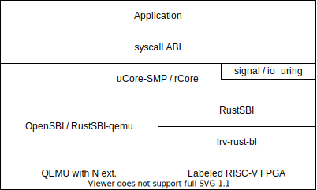

# 软硬协同的用户态中断

[题目地址](https://github.com/oscomp/proj6-RV64N-on-NutShell)

## 目标

本项目旨在提供一种符合 [RISC-V 用户态中断扩展规范（草案）](https://five-embeddev.com/riscv-isa-manual/latest/n.html) 的模拟器和 FPGA 实现，并基于用户态中断在内核中实现优化的信号和 io_uring 等跨进程通信机制，展示其设计和性能优势。

## 项目设计

项目架构设计如下：

- 模拟器：修改 QEMU ，在其中添加 N 扩展支持
- FPGA：基于中科院计算所的[标签化 RISC-V 架构](https://github.com/LvNA-system/labeled-RISC-V/tree/master/fpga)，添加 N 扩展支持
- 启动器与SBI：在 FPGA 平台上使用基于RustSBI开发的 [lrv-rust-bl](https://github.com/Gallium70/lrv-rust-bl) ，在 QEMU 上 uCore-SMP 系统使用 OpenSBI ，rCore 系统使用 RustSBI
- 操作系统：选择 [uCore-SMP](https://github.com/TianhuaTao/uCore-SMP) 和 [rCore](https://github.com/rcore-os/rCore)

## 开发进展

### QEMU 与 FPGA

- [x] 在 QEMU 中添加 N 扩展支持
- [x] 在 FPGA 开发板上部署标签化 RISC-V 架构
- [ ] 增加 N 扩展的 Chisel 代码

### 操作系统

- rCore
  - [ ] 添加 N 扩展支持
  - [ ] 适配 FPGA 平台
  - [ ] 适配标签机制
  - [ ] 实现信号机制
  - [ ] 实现 io_uring
- uCore-SMP
  - [ ] 添加 N 扩展支持
  - [x] 适配 FPGA 平台
  - [x] 适配标签机制
  - [ ] 实现信号机制
  - [ ] 实现 io_uring

### 应用程序

- [x] 验证 N 扩展正常工作
- [ ] 信号机制测例
- [ ] io_uring 测例
