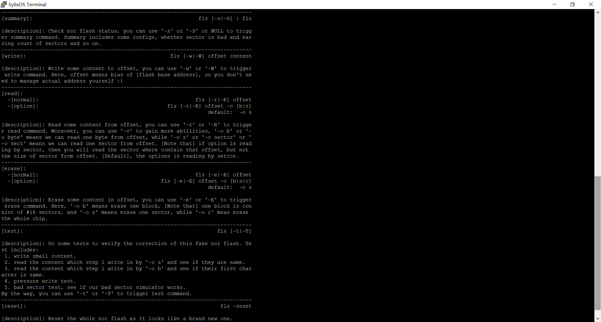
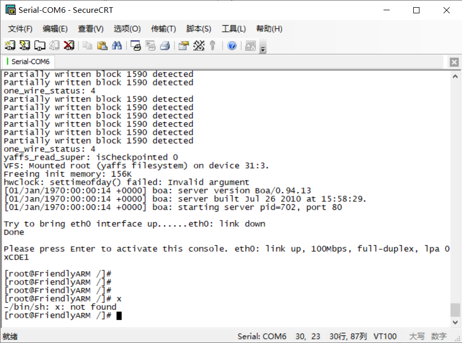
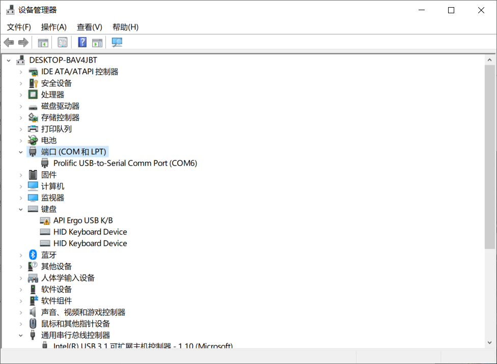
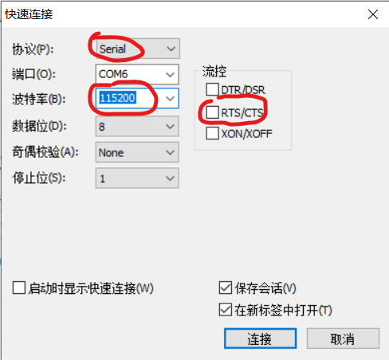

# 2021-02-23 ~ 2021-03-02 SylixOS Practice

> 本周主要任务：
>
> 1. 本周尝试研究将BSP烧录至mini2440开发板上；
>
> 2. 根据蒋老师的回复，我们在虚拟机上模拟Norflash的想法破灭了（似乎），需要想个办法来模拟；
>
> 参考文献：
>
> 1. [mini2440 SST39VF1601 读、写与擦除](https://blog.csdn.net/lizuobin2/article/details/50381791?utm_source=app&app_version=4.5.2)
> 2. [NorFlash坏块管理？](https://www.amobbs.com/thread-5682965-1-1.html)
> 3. [NorFlash坏块检测？](https://bbs.csdn.net/topics/90214060)
> 4. [NorFlash寿命及失效模式](https://www.cnblogs.com/xilentz/archive/2010/05/27/1745634.html)
> 5. [NorFlash Bad Block Management？](https://community.cypress.com/t5/Knowledge-Base-Articles/Bad-Blocks-in-NOR-Flash-Devices-KBA219740/ta-p/247343)
> 6. [Bad Block on NorFlash](http://www.infradead.org/pipermail/linux-mtd/2002-August/005769.html)
> 7. [How-to-decide-whether-a-nor-flash-have-bad-segment](https://e2e.ti.com/support/microcontrollers/msp430/f/166/t/523868?How-to-decide-whether-a-nor-flash-have-bad-segment)
>
> 涉及源码：
>
> 1. [nor](../../Src/nor)
>
> 第五阶段会议PPT：
>
> [第五阶段-基于SylixOS的实践研究(2021-03-02)](../Files/PPT/sylixos-practice.pptx)

## 蒋老师的回复

**Q：**咱们realevo-simulator中的mini2440中，如何模拟norflash设备呢?我们根据simulator手册新建了一个pflash(手册中说是norflash文件)文件，但是新建后，我用网上的0x00作为norflash base address并不能成功扫描到norflash，kernel报错是can not write。由于在虚拟机上模拟开发比较方便，所以想请问一下老师该怎么进行配置。

**A：**

pflash选项是qemu的标准参数，我们把它加到界面上，只会将其原样传给qemu，没有验证过是否在2440上可行噢。可能还是需要你们基于2440开发板开发，可以通过jlink调试bsp。

如果暂时没有开发板，建议你们在内存中根据norflash页规格模拟norflash，最终只是写入算法不一样。

## Fake Nor Flash

为了模拟NorFlash，我们只需在**内存中**模拟一个**NorFlash**的**读、写与擦除**操作。为了便于观察读写平衡，还要标记每个Sector的擦写次数。

模拟目标参考mini2440的一种NorFlash——**SST39VF1601**。

### 使用方法

#### 初始化

1. 首先将[nor文件夹](../../Src/nor)导入BSP工程，建议放在**xxBSP/SylixOS/drivers/mtd/**（即与nand并列）下；
2. 在**bspInit.c**中导入nor文件夹下的`fake_nor.h`，并按下`ctrl + F`搜索`nand_init()`函数，在`createDevEx('\n')`下写上`nor_init()`和`scan_nor()`；
3. 编译BSP工程并运行mini2440虚拟机，即可完成**fake nor flash**的初始化；


#### API

`fake_nor.c`的API访问方式有两种，一是通过命令行，二是通过`fake_nor.h`的函数头进行代码访问。

##### 命令行

`fake_nor`的命令前缀为`fls`，键入`fls -h`即可获取所有命令：



- **概貌（summary）：**`fls [-s|-S]`、`fls`；
- **写（write）：**`fls [-w|-W] offset content`；
- **读（read）：**`fls [-r|-R] offset`、`fls [-r|-R] offset -o [b|byte]`、`fls [-r|-R] offset -o [s|sect|sector]`；
- **擦除（erase）：**`fls [-e|-E] offset`、`fls [-e|-E] offset -o [b|block]`、`fls [-e|-E] offset -o [s|sect|sector]`、`fls [-e|-E] offset -o [c|chip]`
- **重置（reset）**`fls -reset`
- **测试（test）**`fls [-t|-T]`

其中，`[xx|yy]`代表既可以是`xx`也可以是`yy`。

##### 代码访问

可供使用的API包括一些有用的宏定义以及一些与`fake nor flash`的方法：

**宏定义：**

- **GET_NOR_FLASH_ADDR**(offset)：根据片内偏移`offset`获取**真实地址**；
- **GET_NOR_FLASH_BLK_ADDR**(block_no)：根据`block编号`获取**block的真实地址**；
- **GET_NOR_FLASH_SECTOR_ADDR**(sector_no)：根据`sector编号`获取**sector的真实地址**；
- **GET_NOR_FLASH_SECTOR**(offset)：根据片内偏移`offset`获取该`offset`对应的**sector的编号**，在**SST39VF1601**中，sector编号为**0~511**；
- **GET_NOR_FLASH_BLK**(offset)：根据片内偏移`offset`获取该`offset`对应的**block的编号**，在**SST39VF1601**中，block编号为**0~31**；

**方法：**

- **VOID**  **nor_init**(**VOID**)：初始化`fake nor flash`；

  用例：

  ```c
  nor_init();
  ```

- **VOID**  **scan_nor**(**VOID**)：模拟扫描`fake nor flash`；

  用例：

  ```c
  scan_nor();
  ```

- **VOID**  **erase_nor**(**UINT** offset, **ERASE_OPTIONS** ops)：擦除`offset`处的内容，有三种选项：

  - ERASE_SECTOR：计算`offset`处所在的sector，擦除该sector；
  - ERASE_BLOCK：计算`offset`处所在的block，擦除该block（在**SST39VF1601**中，一个block由16个sector构成）；
  - ERASE_CHIP：擦除整个`fake nor flash`，此时`offset`参数无效；

  用例：

  ```c
  UINT offset = 0;
  /* 擦除Sector */
  erase_nor(offset, ERASE_SECTOR);
  /* 擦除Block */
  erase_nor(offset, ERASE_BLOCK);
  /* 擦除Chip */
  erase_nor(offset, ERASE_CHIP);
  ```

- **VOID**  **write_nor**(**UINT** offset, **PCHAR** content, **UINT** size)：向`offset`处写入大小为`size`的`content`；

  用例：

  ```c
  PCHAR conetnt = "hello power nor, and you know deadpool loves his star!";
  UINT offset = 0;
  /* 写入content */
  write_nor(offset, content, lib_strlen(content));
  ```

- **read_content_t**  **read_nor**(**UINT** offset, **READ_OPTIONS** ops)：读取`offset`出的内容，有两种选项：

  - READ_BYTE：读取`offset`处的一个字节；
  - READ_SETCOR：计算`offset`处所在的sector，读取该sector；

  返回值定义：

  ```c
  typedef struct read_content
  {
      PCHAR content;											/* 指向内容的指针 */
      UINT  size;												/* 内容大小 */
      BOOL  is_success;										/* 是否读取成功 */
  } read_content_t;
  ```

  用例：

  ```c
  UINT i, offset = 0;
  /* 读Sector */
  read_content_t content = read_nor(offset, READ_SECTOR);
  if(content.is_success){
  	for(i = 0; i < content.size; i++){
          printf("%c", *(content.content + i));
      }
  }    
  else
  {
      pretty_print("[read failed]", "read error");
  }
  ```

### 实现原理

#### 初始化

初始化部分有两个关键点：

1. 既然要模拟nor flash，我们必须得**开辟一段内存**，这段内存用于模拟nor flash的存储空间，**内存的首地址**即**nor flash的首地址**`nor_flash_base_addr`。在裸机开发时，该地址应该为0x00000000，但在模拟过程中，该地址也许会随虚拟机状态不同而发生一定的变化；
2. 为了进行坏扇区模拟，我们还需要**开辟一段内存来记录每个扇区的擦写以及损坏情况**，这段内存的首地址为`sector_infos`；

**关键代码如下**：

```c
if((nor_flash_base_addr = (PCHAR)malloc(NOR_FLASH_SZ)) < 0){
    printf("[Low Memory] can't create nor flash\n");
    return;
}
lib_memset(nor_flash_base_addr, 0, NOR_FLASH_SZ);

if((sector_infos = (sector_info_t *)malloc(NOR_FLASH_NSECTOR * sizeof(sector_info_t))) < 0){
    printf("[Low Memory] can't create sector summary\n");
    return;
}
lib_memset(sector_infos, 0, NOR_FLASH_NSECTOR * sizeof(sector_info_t));

printf("base addr: %p; sector_infos: %p\n", nor_flash_base_addr, sector_infos);
```

其中，malloc函数需要引入`stdio.h`库，值得一提的是，该库中包含了`SylixOS.h`库的部分内容，因此，可以获得诸如`PCHAR`这样的宏定义。

在SylixOS中，P开头的就代表指针，于是`PCHAR`意味着`char *`；

#### 读

读部分较为简单，只需要构造`read_content_t`结构体即可。这部分一开始是用`malloc`构造返回结果字符串，但由于返回之后需要用户自行释放，否则会发生**内存溢出**，因此，`read_content_t`中只包含指向对应地址的指针`content`，而为了体现READ_BYTE和READ_SECTOR的差异，设置`size`字段用于标记该内容的大小；最后`is_success`则表明是否读取成功。

另外，需要注意的是，如果是采用READ_SECTOR选项读，那么需要根据`offset`去寻找对应的sector编号，然后再获取该sector的起始地址，并返回从该起始地址开始的SECTOR大小的内容。

**关键代码如下：**

```c
read_content_t result;
...
switch (ops)
{
    case READ_BYTE:                                                     /* 读取1个字节 */
        printf("READ BYTE\n");
        result.content = addr;
        result.size = 1;
        break;
    case READ_SECTOR:           
        printf("READ SECT\n");                                          /* 读取1个Sector */
        UINT sector_no = GET_NOR_FLASH_SECTOR(offset);					/* 获取Sector编号 */
        result.content = GET_NOR_FLASH_SECTOR_ADDR(sector_no);			/* 获取该Sector首地址 */
        result.size = NOR_FLASH_SECTORSZ;
        break;
    default:
        break;
}
result.is_success = TRUE;
return result;
```

#### 写

写部分的关键在于模拟nor flash的写机制：**即先擦除，后写入**。简单实现思路就是每次写之前先进行擦除操作，然后再写入。现在我们就会遇到一个问题：


因为**擦除**是以**Sector**为单位进行，因此，向上图这种情况写入，原本两个**Sector**中的**DATA**都应该会被擦除掉。目前还未在真实的nor flash上做过测试，不过真实的板子上肯定做过一些额外处理措施，或者是由用户驱动来完成。

我将这个过程进行了一定的简化：**先创建Buffer，接着读取相关Sector至Buffer，再向Buffer中写入目标数据，擦除相关Sector，将Buffer写回fake nor flash，最后释放Buffer**。这样就意味着每一次写入都会至少擦除一次Buffer，所以每次写入都最好要以Sector大小写入，这样才能效益最大化。

在nor flash中，如果向坏扇区写入内容，那么在写入到Flash上内容将会和原本的内容不符。为了模拟这个过程，在将Buffer写回fake flash的过程中，如果检测到相应的扇区是**坏的**，那么我会将对应Buffer中的内容**以50%的概率进行随机修改**，然后再写入fake flash中。至于**外部如何检测坏扇区**这一内容，我将会在下一节<a href="##NorFlash坏块检测">NorFlash坏块检测</a>中进行介绍。

**关键代码如下：**

```c
...
INT start_sector_no = GET_NOR_FLASH_SECTOR(offset);
INT end_sector_no = ((offset + size) % NOR_FLASH_SECTORSZ) == 0 ?                     /* 判断是不是整数 */
    					GET_NOR_FLASH_SECTOR(offset + size) - 1 : 
						GET_NOR_FLASH_SECTOR(offset + size)     ;
INT nsectors = end_sector_no - start_sector_no + 1;                                   /* 需要擦除的sector数 */
PCHAR start_sector_addr = GET_NOR_FLASH_SECTOR_ADDR(start_sector_no);                 /* 获得起始sector地址 */
PCHAR buffer;
if((buffer = (PCHAR)malloc(nsectors * NOR_FLASH_SECTORSZ)) < 0){                      /* 回收器 */
    printf("[Buffer Init Failed]\n");
    return;
}                      
INT start_offset = addr - start_sector_addr;
for (i = 0; i < nsectors; i++)                                                         /* 先读取至Buffer */
{
    PCHAR sector_addr = GET_NOR_FLASH_SECTOR_ADDR(start_sector_no + i);
    UINT sector_offset = sector_addr - nor_flash_base_addr;
    read_content_t content = read_nor(sector_offset, READ_SECTOR);
    lib_memcpy(buffer + i * NOR_FLASH_SECTORSZ, content.content, content.size);
}
lib_memcpy(buffer + start_offset, content, size);
for (i = 0; i < nsectors; i++)                                                         /* 再擦除 */
{
    PCHAR sector_addr = GET_NOR_FLASH_SECTOR_ADDR(start_sector_no + i);
    erase_nor(sector_addr - nor_flash_base_addr, ERASE_SECTOR);
}
for (i = 0; i < nsectors; i++)                                                         /* 最后写入 */
{
    UINT sector_offset = i * NOR_FLASH_SECTORSZ;
    PCHAR p = buffer + sector_offset;
    if(get_sector_is_bad(i)){                                                          /* 随机修改 */
        printf("[sector #%d is bad, there may be some error(s), remember to check]\n", start_sector_no + i);
        PCHAR pe = p + NOR_FLASH_SECTORSZ;
        for (; p < pe; p++)
        {
            INT possibily = rand() % 100 + 1;
            INT random_change = rand() % 127;                                          /* 0 ~ 127 ascii */
            if(possibily >= 50){                                                       /* 50%的几率写错 */
                *p += random_change;
            }
        } 
    }
    lib_memcpy(start_sector_addr + sector_offset, p, NOR_FLASH_SECTORSZ);
}
free(buffer);
...
```

#### 擦除

擦除部分并不复杂，重要之处在于对`sector_infos`结构的管理。它的定义如下：

```c
typedef struct sector_info
{
    INT32 erase_cnt;
    BOOL  is_bad;
} sector_info_t;

sector_info_t* sector_infos;
```

对应三种不同的选项，修改方式各有区别：

- **ERASE_SECTOR：**只需计算对应的sector，擦除后将其`erase_cnt`增加1；
- **ERASE_BLOCK：**需要计算该Block对应的所有Sector，擦除每一个Sector，之后每个Sector的`erase_cnt`都要增加1；
- **ERASE_CHIP：**擦除`fake nor flash`上所有的Sector，每个Sector的`earse_cnt`增加1；

**关键代码如下：**

```c
switch (ops)
{
    case ERASE_CHIP:
        printf("[erasing the whole chip...]\n");
        lib_memset(nor_flash_base_addr, 0, sizeof(CHAR) * NOR_FLASH_SZ);    /* 清空整段内存 */
        for (i = 0; i < NOR_FLASH_NSECTOR; i++)                             /* 擦除次数增加 */
        {
            sector_infos[i].erase_cnt++;
        }
        printf("[erasing success]\n");
        break;

    case ERASE_BLOCK:{
        UINT block_no = GET_NOR_FLASH_BLK(offset);                          /* 获取offset对应的block号 */
        UINT sector_no = GET_NOR_FLASH_SECTOR(offset);                      /* 计算block对应的sector基本位置 */
        printf("[erasing block %d...]\n", block_no);    
        PCHAR block_addr = GET_NOR_FLASH_BLK_ADDR(block_no);                /* 获取block对应的地址 */
        lib_memset(block_addr, 0, NOR_FLASH_BLKSZ);                         /* 擦除block首地址对应的block */
        for (i = 0; i < NOR_FLASH_SECTPBLK; i++)                            /* 擦除次数增加 */
        {
            sector_infos[i + sector_no].erase_cnt++;
        }
        printf("[erasing success]\n");
        break;
    }

    case ERASE_SECTOR:{
        UINT sector_no = GET_NOR_FLASH_SECTOR(offset);
        printf("[erasing sector %d]\n", sector_no);
        PCHAR sector_addr = GET_NOR_FLASH_SECTOR_ADDR(sector_no);
        lib_memset(sector_addr, 0, NOR_FLASH_SECTORSZ);
        sector_infos[sector_no].erase_cnt++;
        printf("[erasing success]\n");
        break;
    }
    default:
        break;
}
```

#### 坏扇区模拟

坏扇区模拟的实质是一个后台线程，它将不断扫描`sector_infos`对应的空间，然后判断每一个sector与**最大擦写次数**的关系，并通过一个概率计算公式来判断各个扇区是否已经坏掉。

基本思想为：当一个Sector的擦写次数大于等于**最大擦写次数**的70%的时候，将会进行坏扇区判断，对应的，Sector的擦写次数刚好是70%次时，它变为坏块的概率为70%，如果是100%次时，那么它变为坏块的概率为100%。

事实上，这个模拟措施并不正确，根据[NorFlash寿命及失效模式](https://www.cnblogs.com/xilentz/archive/2010/05/27/1745634.html)可以知道，NorFlash的擦写次数是落脚到每一个bit，而并非如此宏观的Setcor上。不过，为了简化`nor flash`的模拟工作，这里我们采用这种方式。

**关键代码如下：**

```c
for (i = 0; i < NOR_FLASH_NSECTOR; i++)
{ 
    if(((float)NOR_FLASH_MAX_ERASE_CNT * 0.7 - sector_infos[i].erase_cnt) <= 0     /* 擦了最大次数的70% */
       && sector_infos[i].is_bad == FALSE) {                                       /* 且该Sector不是坏块 */
        srand(time(LW_NULL));
        INT percent = rand() % 170 + 70;                                           /* 产生70 - 170的随机数 */
        INT threshold = 70 * NOR_FLASH_MAX_ERASE_CNT / sector_infos[i].erase_cnt;  /* 70*10/7=100~70 */
        if(percent >= threshold) {                                                 /* 70%~100%的概率变为坏块*/
            assign_sector_bad(i);
        }
    }
}    
sleep(1);                                                                          /* 每1s检测1次 */
```

## NorFlash坏块检测

事实上，根据[NorFlash Bad Block Management？](https://community.cypress.com/t5/Knowledge-Base-Articles/Bad-Blocks-in-NOR-Flash-Devices-KBA219740/ta-p/247343)和[Bad Block on NorFlash](http://www.infradead.org/pipermail/linux-mtd/2002-August/005769.html)两个论坛，可以了解到，一般不讨论`nor flash`的坏块处理，甚至于`Linux`中`JFFS2`也没有涉及到坏块处理。有些人认为`nor flash`会自行进行坏块判断，它会自行将一些坏块用冗余的好块代替，对此，我表示怀疑。

根据查找结果，目前大概有两种方式来对`nor flash`进行坏块检测：

1. 为每个块或者扇区添加**冗余比特位**，专门用于校验数据的正确性，从而检测到坏块。但是，如何进行错误恢复，这又是另一个问题了；
2. 写入后立即读出，判断写入内容和读出内容是否相同，相同就证明块没有坏，否则证明块坏了；

事实上，两种方法具有相似之处，目前还不能简单评判二者效率孰高孰低，只有进行更多后续实验才能知道。


## Mini2440研究

### 登入FriendlyARM

折腾了半天，终于可以进入串口界面了：



具体步骤如下：

1. 连接串口线；

2. 将开关拨到Nandflash位置；

   

3. 打开SecurCRT；

4. 打开设备管理器，查看串口号；

   

5. 用SecureCRT连接COM6串口；

   

6. 打开mini2440电源即可访问FriendlyARM；

### 访问NorFlash

> 好像需要Jlink V8，目前手里没有，只有等待……