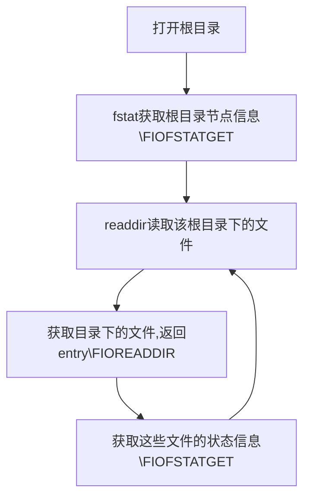

# LFS in SylixOS

这里是LFS实现的笔记，具体SylixOS文件操作流程请看：[SylixOS_fs](09-SylixOS&Driver&FS-Again-Part3.md)

## 注意事项

1. pread/pwrite可简单认为是带偏移的read/write。
2. 给文件系统添加内核（k_kernel.h）或系统头文件（s_system.h）之前一定要加"#define  \_\_SYLIXOS_STDIO"和"#define  \_\_SYLIXOS_KERNEL"，不然只能加载部分文件。
3. 在使用 ls 指令查看文件系统的目录项时，SylixOS先通过\_\_LFsOpen先打开根目录，然后再依次打开根目录下的节点。这意味着，我们的\_\_LFsOpen也要能够处理文件系统自己的根目录。

## 关于__mount中**bNeedDelete**为真为假的区别

如果让 simplefs 的 bNeedDelete = true

> mount -t simplefs  /dev/blk/simple /mnt/simple

​	当bNeedDelete = true，就会为文件系统创建一个**BlockRam**设备。在API_BlkRawCreate中的__blkRawCreate会打开第一个文件路径的文件(/dev/blk/simple)。显然没创建这个文件，所以报错。

再看了一下其他文件系统的挂载，发现了问题。

ram:

>  mount -t ramfs 10000 /mnt/ram 

nfs:

>  mount -t nfs 192.168.1.15:/ /mnt/nfs 

romfs

>  mount –t romfs ./romfile.img /mnt/rom1 

我总感觉第一个文件路径实际上是一种针对不同文件系统设置的参数位。对块设备加载文件系统（比如给U盘装载fat），那第一个文件路径就是 /dev/blk/xxx。如果不需要块设备，就只是把参数记录再pmnDev->MN_blkd.BLKD_pcName上。

再看了一下ramfs确实，在__mount中，bNeedDelete = false 就是把 10000 写入pmnDev->MN_blkd.BLKD_pcName中。然后在API_RamFsDevCreate中又把pmnDev->MN_blkd.BLKD_pcName复制到stMax（ramfs存储空间最大值）中了。

测试LFS

>  mount -t lfs 10000 /mnt/lfs

## mount和umount

要想umount文件系统一定要实现fileop.fo_release函数。以ramFs为例。

> mount -t ramfs 10000 /mnt/ram
>
> umount /mnt/ram

在\_\_ramFsRemove中，专门有一个部分负责umount ramfs。这部分

1. 先用LW_DEV_GET_USE_COUNT来看文件系统是否在被其他进程使用。
2. 然后将pramfs->RAMFS_bValid置为false（以免其他进程再打开文件）。
3. 接着调用**iosDevDelete**，把根目录底下对应的文件节点给删除，并且把_S_plineDevHdrHeader中对应的设备节点删除。
4. 另外还要调用ramfs内部的函数**__ram_unmount**去释放那些维持ramfs目录和文件结构的数据结构（PRAM_NODE）所占用的内存空间。

总之，当\_\_ramFsRemove的参数pcname为空时，就是要把整个文件系统卸载。

## 关于创建文件时iMode的细节

​	mode（或者是iMode）是SylixOS的文件模式，它包含着文件类型以及文件访问权限。如下图，

​	在SylixOS里，iMode有32位，其中最高八位用于识别文件类型，剩下24位识别文件访问权限。（详见s_stat.h 100行）。

​	在__ramFsOpen中，传进来的iMode参数仅仅指定了文件访问权限，在之后创建新的文件之后，会给文件mode添加regular file的标记。iFlags则指定了文件的打开方式和iMode是不同的。

## 关于查看文件目录需要调用__ramFsReadDir的问题

​	ls会先打开文件系统根目录，然后再打开目录下的文件。每打开一次文件，就会调用\_\_ramFsStat去获取文件的状态信息。

​	文件系统挂载在SylixOS上，首先要让它的根目录作为目录节点添加到SylixOS的Root文件系统下。所以还是得实现__LFsReadDir。

__ramFsReadDir:

​	要用ls命令展示目录下的文件，就要依次去获取该目录下每一个文件的节点。读取文件的状态以及文件名之后，记录到目录结构体DIR中，以此来让shell获得文件信息。

​	在\_\_ramFsReadDir中，一开始从pfdentry->FDENTRY_pfdnode获取的pramn是空的。所以ramfs从pramfs->RAMFS_plineSon来获取目录下的文件节点。shell通过反复调用\_\_ramFsReadDir来依次去获取这些节点，并且用dir->dir_pos来记录之前已经读到的位置。

​	我们的__LFsReadDir可以通过读取FileNameMap来依次获取我们的inode。

​	但对于检查文件系统根目录以外的其他子目录，目前尚不知道其调用\_\_ramFsReadDir的具体过程。

## 关于从文件inode中直接获取超级块的事情

​	在ramfs中，删除函数仅传文件节点这一个参数，函数原型

> INT __ram_unlink (PRAM_NODE pramn)

​	而在我的lfs中，还需要传文件系统超级块PLFS_VOLUME。因为我的lfs文件节点中没有指向PLFS_VOLUME的指针，不能通过文件节点获取。

​	我不在lfs的inode保存该指针，主要是因为我也没有在flash中保存lfs文件系统的超级块，而在inode中保存一个内存地址（即超级块的地址）并写入flash没有多大意义。

## 关于文件删除指令

​	SylixOS先检查目标文件是否正在被打开，如果没有才调用__LFsRemove进行删除。

## 关于文件卸载

### 关于pramfs->RAMFS_bValid的作用

​	pramfs->RAMFS_bValid仅用于卸载文件系统。当用户需要卸载文件系统时，就会将pramfs->RAMFS_bValid置为FALSE，然后才开始移除文件系统。这个变量目的是当进程开始卸载ramfs时，就不允许其他进程再卸载该文件系统（有点像锁）。

### 关于pramfs->RAMFS_bForceDelete

​	pramfs->RAMFS_bForceDelete = TRUE时，即使文件系统中仍有打开的文件，也会强制卸载文件系统。但问题是，ramfs中没有看见哪里把这个值置为TRUE。只有__LFsIoctl中有一个获取该值的命令。

## 关于文件lseek和ramfs中文件节点的RAMN_stVSize

 	lseek用于修改文件偏移量，这个值可以大于文件实际包含的字节数，在ramfs中保存在pramn->RAMN_stVSize中。

​	如果程序的文件偏移量已然跨越了文件结尾，然后再执行 I/O 操作，read 函数调用将返 回 0，表示文件结尾，但是 write 函数可以在文件结尾后的任意位置写入数据。 从文件结尾后到新写入数据间的这段空间被称为**文件空洞**。从编程角度看，文件空洞中 是存在字节的，读取空洞将返回以 0 填充的缓冲区。 空洞的存在意味着一个文件名义上的大小可能要比其占用的磁盘存储总量要大（有时会 大很多），当然，具体的处理方式与文件系统的实现有关。  

## 测试

​	要完成一个能用的系统，除了需要挂载专用的三个API，至少还要实现\_\_LFsOpen和\_\_LFsRemove。

1. 挂载

   > mount -t lfs 10000 /mnt/lfs
   >
   > mount -t ramfs 10000 /mnt/ram  

2. 创建文件

   > touch /mnt/lfs/newFile
   >
   > touch /mnt/ram/newFile

3. 查看目录

   > ls /mnt/lfs
   >
   > ls /mnt/ram

4. 写入（>左右不能有空格）

   > echo "Hello World!" 1>/mnt/lfs/newFile
   >
   > echo "Hello World!" 1>/mnt/ram/newFile

5. 查看文件

   > cat /mnt/lfs/newFile
   >
   > cat /mnt/ram/newFile

6. 删除文件

   > rm /mnt/lfs/newFile
   >
   > rm /mnt/ram/newFile

7. 卸载

   > umount /mnt/lfs
   >
   > umount /mnt/ram

8. 重命名

   > mv /mnt/lfs/newFile /mnt/lfs/newFileRename
   >
   > mv /mnt/ram/newFile /mnt/ram/newFileRename

9. 

## 进展

1. 创建文件有问题 iFlags 没有create位

2. 查看文件状态中（__LFsStat），LFS的根目录pfdentry里的pfdnode是空的。

   ​	ramfs根目录pfdentry的pfdnode是不是也是空的？	并不是。

   ​	什么时候把根目录的节点加到pfdentry中的？并没有看到/mnt/ram，只有/mnt/ram/newFile

   ​	原来是__lFsOpen返回值错了，应该是pfdnode。

3. 读根目录文件时，plfs->LFS_cpr，LFS_availableSector也有问题 。

4. plfsn->LFSN_pcname 没写入文件名。

5. writeOutSector的返回值sector_to_write错误。

6. writeOutSector的next_block_no是空的(line 326)，应该是plfs->LFS_curBlockNo

7. blockSummary更新有问题

8. updateImap有问题

9. summary_sec错误（原因curBlockNo和availableSector更新有问题）

10. 已写完\_\_LFsClose和\_\_LFsRemove明天测试一下。

11. PRAM_NODE里的stVSize到底是什么（应该是虚拟文件大小，会比实际文件大小大），read的时候stDataLeft又是多少。

12. ramfs中重命名调用ioFullFileNameGet要干嘛。

    

13. 

