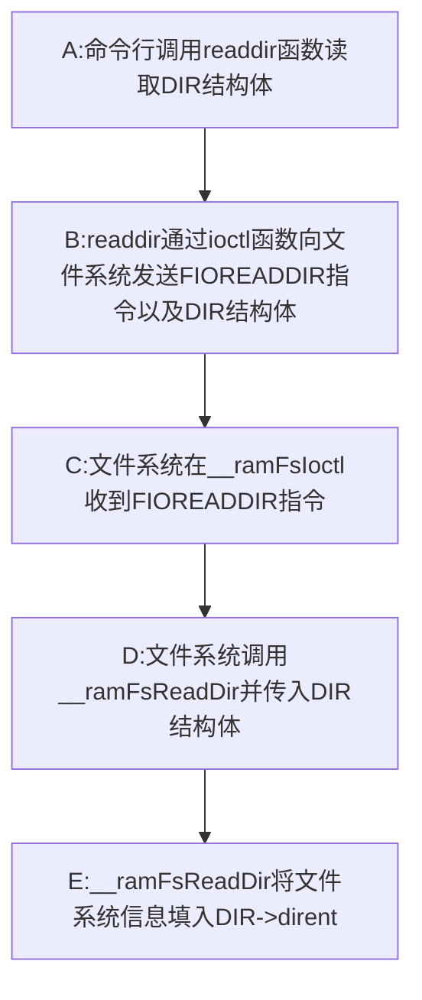
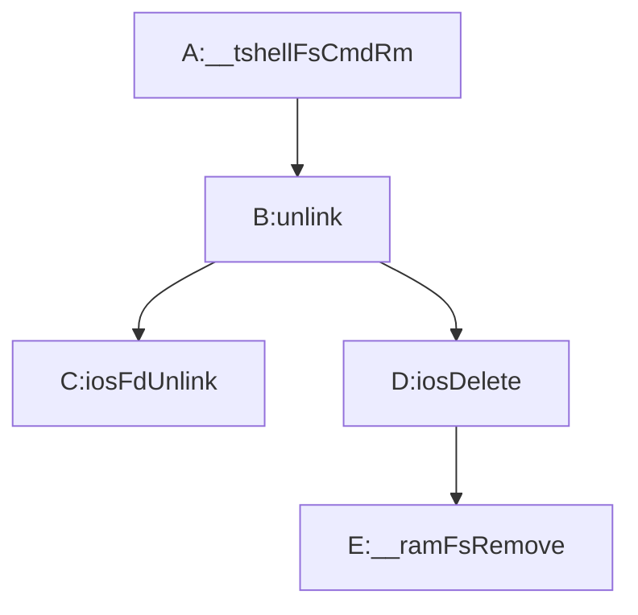
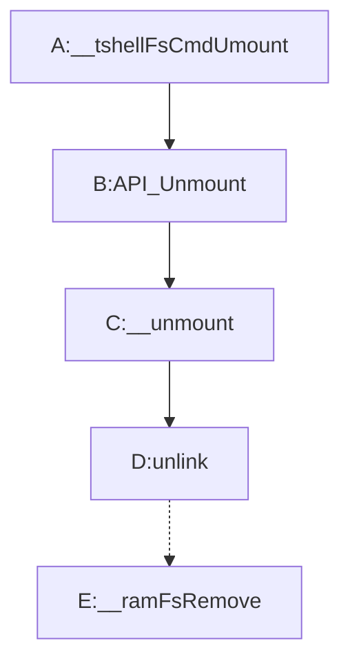
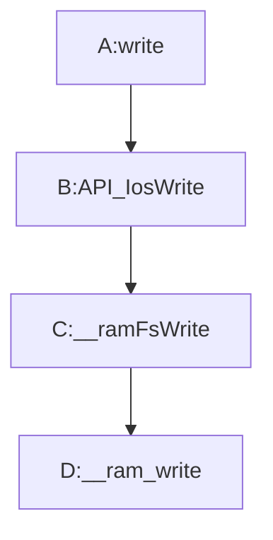
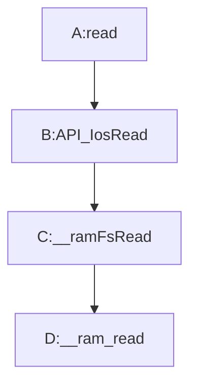

# SylixOS文件系统指令流程

> 本文以SylixOS的ramfs（simplefs）为例子。

个人笔记请看：[LFS_in_SylixOS](07-SylixOS&Driver&FS-Part3.md)

## 注册文件系统

​	注册文件系统用到的主要函数是API_SimpleFsDrvInstall，这个函数主要把文件系统各种操作函数的函数指针记录到结构体**struct file_operations**，然后通过**iosDrvInstallEx2**注册这些操作函数。最后再通过\_\_fsRegister注册挂载函数（**API_RamFsDevCreate**）。

​	

```c
/*********************************************************************************************************
** 函数名称: API_SimpleFsDrvInstall
** 功能描述: 安装 ramfs 文件系统驱动程序
** 输　入  :
** 输　出  : < 0 表示失败
** 全局变量:
** 调用模块:
                                           API 函数
*********************************************************************************************************/
LW_API
INT  API_RamFsDrvInstall (VOID)
{
    struct file_operations     fileop;
    
    if (_G_iRamfsDrvNum > 0) {
        return  (ERROR_NONE);
    }
    
    lib_bzero(&fileop, sizeof(struct file_operations));

    fileop.owner       = THIS_MODULE;
    fileop.fo_create   = __ramFsOpen;
    fileop.fo_release  = __ramFsRemove;
    fileop.fo_open     = __ramFsOpen;
    fileop.fo_close    = __ramFsClose;
    fileop.fo_read     = __ramFsRead;
    fileop.fo_read_ex  = __ramFsPRead;
    fileop.fo_write    = __ramFsWrite;
    fileop.fo_write_ex = __ramFsPWrite;
    fileop.fo_lstat    = __ramFsLStat;
    fileop.fo_ioctl    = __ramFsIoctl;
    fileop.fo_symlink  = __ramFsSymlink;
    fileop.fo_readlink = __ramFsReadlink;

    _G_iRamfsDrvNum = iosDrvInstallEx2(&fileop, LW_DRV_TYPE_NEW_1);     /*  使用 NEW_1 型设备驱动程序   */

    DRIVER_LICENSE(_G_iRamfsDrvNum,     "GPL->Ver 2.0");
    DRIVER_AUTHOR(_G_iRamfsDrvNum,      "Han.hui");
    DRIVER_DESCRIPTION(_G_iRamfsDrvNum, "simplefs driver.");

    _DebugHandle(__LOGMESSAGE_LEVEL, "ram file system installed.\r\n");
                                     
    __fsRegister("simplefs", API_RamFsDevCreate, LW_NULL, LW_NULL);        /*  注册文件系统                */

    return  ((_G_iRamfsDrvNum > 0) ? (ERROR_NONE) : (PX_ERROR));
}
```

​	代码中提到了“NEW_1 型设备驱动程序”，宏定义为LW_DRV_TYPE_NEW_1。目前已知的特点是该类型文件系统的pfdnode->FDNODE_inode64即为文件节点。因此可以从文件打开节点（pfdnode）中直接获取文件节点（pramn）。详细请看[SylixOS应用开发手册 5.1.3I/O系统结构]。


## mount挂载

ramfs可以通过一下指令进行挂载，其中10000是最大控制空间（单位字节）。

> mount -t ramfs 10000 /mnt/ram    

mount主要用到的函数是**API_RamFsDevCreate**。这个函数主要是在创建ramfs自己的文件卷（PRAM_VOLUME），可以认为是文件的超级块。文件卷主要包含了一下信息：

1. 文件IO锁。由函数API_SemaphoreMCreate分配。
2. 文件系统mode。文件系统的mode被设置成了目录，你可以通过"/mnt/lfs"目录来使用该文件系统。
3. 用户id和组id。
4. 其他信息。。。

填写完文件卷信息之后，通过iosDevAddEx在SylixOS中注册该设备（创建文件系统相当于注册设备）。


#### 关于文件系统是否为块设备的疑惑（**bNeedDelete**为真为假的区别）

这个问题出现在"\libsylixos\SylixOS\fs\mount\mount.c"中。SylixOS 的文件系统有两种装载方式：LW_BLK_DEV模式和BLOCK 设备文件模式。具体的区别不清楚。但是涉及mount指令都是BLOCK设备文件模式。已在\_\_mount中标出疑惑的地方。

```c
/*********************************************************************************************************
** 函数名称: __mount
** 功能描述: 挂载一个分区(内部函数)
** 输　入  : pcDevName         块设备名   例如: /dev/sda1
**           pcVolName         挂载目标   例如: /mnt/usb (不能使用相对路径, 否则无法卸载)
**           pcFileSystem      文件系统格式 "vfat" "iso9660" "ntfs" "nfs" "romfs" "ramfs" ... 
                               NULL 表示使用默认文件系统
**           pcOption          选项, 当前支持 ro 或者 rw
** 输　出  : < 0 表示失败
** 全局变量: 
** 调用模块: 
*********************************************************************************************************/
static INT  __mount (CPCHAR  pcDevName, CPCHAR  pcVolName, CPCHAR  pcFileSystem, CPCHAR  pcOption)
{
#define __LW_MOUNT_OPT_RO   "ro"
#define __LW_MOUNT_OPT_RW   "rw"

    REGISTER PCHAR      pcFs;
    PLW_MOUNT_NODE      pmnDev;
             FUNCPTR    pfuncFsCreate;
             BOOL       bRdOnly = LW_FALSE;
             BOOL       bNeedDelete;
             CHAR       cVolNameBuffer[MAX_FILENAME_LENGTH];
             size_t     stLen;

    if (!pcDevName || !pcVolName) {
        _ErrorHandle(EINVAL);
        return  (PX_ERROR);
    }

    if (pcOption) {                                                     /*  文件系统挂载选项            */
        if (lib_strcasecmp(__LW_MOUNT_OPT_RO, pcOption) == 0) {
            bRdOnly = LW_TRUE;
        
        } else if (lib_strcasecmp(__LW_MOUNT_OPT_RW, pcOption) == 0) {
            bRdOnly = LW_FALSE;
        }
    }

    pcFs = (!pcFileSystem) ? __LW_MOUNT_DEFAULT_FS : (PCHAR)pcFileSystem;
    pfuncFsCreate = __fsCreateFuncGet(pcFs, LW_NULL, 0);                /*  文件系统创建函数            */
    if (pfuncFsCreate == LW_NULL) {
        _ErrorHandle(ERROR_IO_NO_DRIVER);                               /*  没有文件系统驱动            */
        return  (PX_ERROR);
    }
    /****************************   疑惑的地方   ********************************/
    if ((lib_strcmp(pcFs, __LW_MOUNT_NFS_FS) == 0) ||
        (lib_strcmp(pcFs, __LW_MOUNT_SIMPLE_FS) == 0) ||
        (lib_strcmp(pcFs, __LW_MOUNT_LOG_FS) == 0) ||
        (lib_strcmp(pcFs, __LW_MOUNT_RAM_FS) == 0)) {                   /*  NFS 或者 RAM FS             */
        bNeedDelete = LW_FALSE;                                         /*  不需要操作 BLK RAW 设备     */

    } else {
        bNeedDelete = LW_TRUE;
    }
	/**************************************************************************/
    _PathGetFull(cVolNameBuffer, MAX_FILENAME_LENGTH, pcVolName);
    pcVolName = cVolNameBuffer;                                         /*  使用绝对路径                */
    
    stLen  = lib_strlen(pcVolName);
    pmnDev = (PLW_MOUNT_NODE)__SHEAP_ALLOC(sizeof(LW_MOUNT_NODE) + stLen);
    if (pmnDev == LW_NULL) {
        _DebugHandle(__ERRORMESSAGE_LEVEL, "system low memory.\r\n");
        _ErrorHandle(ERROR_SYSTEM_LOW_MEMORY);
        return  (PX_ERROR);
    }
    lib_bzero(pmnDev, sizeof(LW_MOUNT_NODE));
    lib_strcpy(pmnDev->MN_cVolName, pcVolName);                         /*  保存卷挂载名                */
    pmnDev->MN_bNeedDelete = bNeedDelete;
    
    if (bNeedDelete) {
        if (lib_strcmp(pcFs, __LW_MOUNT_ISO_FS) == 0) {
            if (API_BlkRawCreateEx(pcDevName, bRdOnly,                  /*  ISO 扇区一定为 2048 字节    */
                                   LW_TRUE, 2048, &pmnDev->MN_blkraw) < ERROR_NONE) {
                __SHEAP_FREE(pmnDev);
                return  (PX_ERROR);
            }

        } else {
            if (API_BlkRawCreate(pcDevName, bRdOnly,
                                 LW_TRUE, &pmnDev->MN_blkraw) < ERROR_NONE) {
                __SHEAP_FREE(pmnDev);
                return  (PX_ERROR);
            }
        }
    
    } else {
        pmnDev->MN_blkd.BLKD_pcName = (PCHAR)__SHEAP_ALLOC(lib_strlen(pcDevName) + 1);
        if (pmnDev->MN_blkd.BLKD_pcName == LW_NULL) {
            __SHEAP_FREE(pmnDev);
            _DebugHandle(__ERRORMESSAGE_LEVEL, "system low memory.\r\n");
            _ErrorHandle(ERROR_SYSTEM_LOW_MEMORY);
            return  (PX_ERROR);
        }
        lib_strcpy(pmnDev->MN_blkd.BLKD_pcName, pcDevName);             /*  记录设备名 (nfs ram 使用)   */
        
        pmnDev->MN_blkd.BLKD_iFlag = (bRdOnly) ? O_RDONLY : O_RDWR;
    }
    
    if (pfuncFsCreate(pcVolName, &pmnDev->MN_blkd) < 0) {               /*  挂载文件系统                */
        if (bNeedDelete) {
            API_BlkRawDelete(&pmnDev->MN_blkraw);
        
        } else {
            __SHEAP_FREE(pmnDev->MN_blkd.BLKD_pcName);
        }
        
        __SHEAP_FREE(pmnDev);                                           /*  释放控制块                  */
        return  (PX_ERROR);
    }
    
    __LW_MOUNT_LOCK();
    _List_Line_Add_Ahead(&pmnDev->MN_lineManage,
                         &_G_plineMountDevHeader);                      /*  挂入链表                    */
    __LW_MOUNT_UNLOCK();
    
    return  (ERROR_NONE);
}
```

当bNeedDelete = TRUE时，系统就会调用API_BlkRawCreate，在*/dev/blk/xxx*（即mount指令的第二个参数）上创建一个block控制块。

当bNeedDelete = FAlSE时，mount指令第二个参数仅仅是创建文件系统时需要用户输入的参数。下面是一些文件系统举例，

ram:

>  mount -t ramfs 10000 /mnt/ram 

nfs:

>  mount -t nfs 192.168.1.15:/ /mnt/nfs 

romfs

>  mount –t romfs ./romfile.img /mnt/rom1 

我个人的理解是第二个参数实际上是一种针对不同文件系统设置的参数位。对块设备加载文件系统（比如给U盘装载fat），那第一个文件路径就是 /dev/blk/xxx。如果不需要块设备，系统就只是把参数记录再pmnDev->MN_blkd.BLKD_pcName上。把pmnDev传入创建函数中（API_RamFsDevCreate），就可以在挂载文件的时候使用到这个参数。

再看了一下ramfs确实，在__mount中，bNeedDelete = false 就是把 10000 写入pmnDev->MN_blkd.BLKD_pcName中。然后在API_RamFsDevCreate中又把pmnDev->MN_blkd.BLKD_pcName复制到stMax（ramfs存储空间最大值）中了。

## touch创建文件

​	在touch指令中，系统主要调用以下函数进行创建。

> iFd = open(ppcArgV[iFileNameIndex], O_WRONLY | O_CREAT | O_TRUNC, DEFAULT_FILE_PERM);

​	其中O_TRUNC意思是如果该文件已经存在，则将源文件删除，再创建一个空文件。

​	DEFAULT_FILE_PERM是文件的默认iMode，值为0x28F。

​	在上面的open函数中（准确来说是\_\_IoOpen），系统先获取IO默认环境（具体是什么可以不用理解），经过一番检查和分离文件名称后，就调用了以下函数来获取一个新的Fd。因为SylixOS创建文件时会先打开该文件，然后再将他关闭。所以创建文件期间需要用到文件描述符。

​	随后，SylixOS才调用ramfs自己的设备创建函数**API_RamFsDevCreate**。如果创建过程不出错，则返回ERROR_NONE。

​	在ramfs创建完设备后，SylixOS接着就把新文件相应的FD状态设置成FDSTAT_OK，即文件正常。

## ls查看目录下文件

​	SylixOS查看目录下文件的过程实际是打开目录文件的过程。假设在命令行输入了下面三条条指令。

> mount -t ramfs 10000 /mnt/ram 
>
> touch /mnt/ram/newFile1
>
> touch /mnt/ram/newFile2
>
> ls /mnt/ram

​	大致过程就是，先打开ramfs的根目录文件“/mnt/ram”，然后再依次打开该目录下的文件，获取他们的文件状态和文件名称，修改访问时间，最后把文件名依次打印出来。

​	在打开ramfs目录文件时，SylixOS首先会创建一个目录结构体（DIR），用于保存ls命令需要查看的目录文件信息（主要保存已打开文件的fd）并返回。但这个DIR除了fd并没有保存其他信息，真正记录目录文件下每一个文件的文件名称和状态的结构体是（struct dirent）。那么SylixOS怎么通过DIR去SS获取struct dirent的？关键函数就是我们在文件系统内定义的**__ramFsReadDir**。

​	大致流程如下，



对于上面的流程还有以下细节补充，

### 对B步骤：

​	ioctl函数是一个IO控制函数，原型如下

> INT  ioctl (INT   iFd, INT   iFunction, ...)

​	**iFd**就是打开的目录文件fd。**iFunction**是想要执行的功能，在这里我们想要读取文件目录，因此传入FIOREADDIR。对于ioctl函数，每种功能对应着一个序号（详细宏定义请看s_option.h）。我们可以像ioctl传入特定的序号，让文件系统执行特定的功能，以此来操控文件系统。而ioctl最后那个"..."是我们要完成特定功能时，执行该功能需要传入的相应参数。在这里我们要读取目录下文件信息并填写DIR结构体，因此我们要把DIR结构体指针作为参数传入。

### 对C步骤：

​	\_\_ramFsIoctl函数的功能是文件系统中回应上边ioctl函数，执行相应的功能。该函数原型如下，

> static INT  __ramFsIoctl (PLW_FD_ENTRY  pfdentry,
>                           INT           iRequest,
>                           LONG          lArg)

​	**pfdentry**就是打开的目录文件对应的entry。**iRequest**就是上面的iFunction。**lArg**也就是传入的参数（这里是DIR结构体指针）。该函数可以通过pfdentry->FDENTRY_pfdnode获取已经打开的文件节点pfdnode。然后可以通过pfdnode->FDNODE_pvFsExtern获取文件系统文件卷，从而就能获取到打开的文件信息和整个文件系统的信息。这个函数里用到了switch结构，根据不同的iFunction来执行不同的操作。

### 对D步骤：

​	\_\_ramFsReadDir并不是一次性读取完文件目录下所有文件信息的，而是每调用一次\_\_ramFsReadDir就获取一个文件的信息。同时在第一步中readdir也不是只调用一次的，而是调用一次就显示一条目录项。DIR结构体通过**dir_pos**记录当前已经读取到第几条目录项。_\_ramFsReadDir每被调用一次，并且读到一条新的目录项，就会将dir_pos加一。


## rm移除文件

​	rm指令中最重要的一个函数是**unlink**。以下是大致流程，



### 对C步骤：

> INT  API_IosFdUnlink (PLW_DEV_HDR  pdevhdrHdr, CPCHAR  pcName)

​	其中pdevhdrHdr是文件卷的设备头。pcName是所要删除的文件在文件系统中的路径。主要是检查文件是否被打开（或锁定），如果不是则可以掉用iosDelete直接删除该文件。

### 对E步骤：

​	也是调用了文件系统内部的\_\_ram_unlink来删除文件保存的所有内容以及该节点的。

## umount卸载文件系统

SylixOS卸载文件大致流程如下，



### 对C步骤：

​	\_\_unmount函数的原型如下，

> static INT  __unmount (CPCHAR  pcVolName)

​	pcVolName就是我们需要卸载分区的名称，如"/mnt/XXX"

​	SylixOS会遍历它的挂载列表_G_plineMountDevHeader，去寻找名称与pcVolName相同的挂载点（PLW_MOUNT_NODE）。在\_\_unmount中有卸载设备和卸载卷两个分支，我们主要还是走卸载卷的分支。

### 对D步骤：

​	详细看移除文件对这部分的介绍。在本流程图中，这部分有些简化。

### 对E步骤：

​	我们看到ramfs中删除文件和卸载卷都用到了**\_\_ramFsRemove**。如果我们删除的是普通文件，那么\_\_ramFsRemove会去清空该文件的数据；如果删除的是根目录，则会删除文件系统中所有文件，并卸载文件卷。

## 写入（通过echo和重定向）



## CAT读取



## MV重命名或移动文件

```c
/*********************************************************************************************************
** 函数名称: __ramFsRename
** 功能描述: ramFs rename 操作
** 输　入  : pfdentry         文件控制块
**           pcNewName        新的名称
** 输　出  : 驱动相关
** 全局变量:
** 调用模块:
*********************************************************************************************************/
static INT  __ramFsRename (PLW_FD_ENTRY  pfdentry, PCHAR  pcNewName)
{
    PLW_FD_NODE   pfdnode = (PLW_FD_NODE)pfdentry->FDENTRY_pfdnode;
    PRAM_NODE     pramn   = (PRAM_NODE)pfdnode->FDNODE_pvFile;
    PRAM_VOLUME   pramfs  = (PRAM_VOLUME)pfdnode->FDNODE_pvFsExtern;
    PRAM_VOLUME   pramfsNew;
    CHAR          cNewPath[PATH_MAX + 1];
    INT           iError;
    
    if (pramn == LW_NULL) {                                             /*  检查是否为设备文件          */
        _ErrorHandle(ERROR_IOS_DRIVER_NOT_SUP);                         /*  不支持设备重命名            */
        return (PX_ERROR);
    }
    
    if (pcNewName == LW_NULL) {
        _ErrorHandle(EFAULT);                                           /*  Bad address                 */
        return (PX_ERROR);
    }
    
    if (__STR_IS_ROOT(pcNewName)) {
        _ErrorHandle(ENOENT);
        return (PX_ERROR);
    }
    
    if (__RAMFS_FILE_LOCK(pramn) != ERROR_NONE) {
        _ErrorHandle(ENXIO);
        return  (PX_ERROR);
    }
    /* 	这一步cNewPath获取的是文件系统下的新目录路径（带文件名）。
    	同时获取新文件路径（根文件系统下的完整文件路径）所在的文件系统设备卷pramfsNew。由于SylixOS不允		许文件在不同设备之间移动，因此要检查新文件路径对应的设备和原来文件所在的设备是否为同一设备。
    */
    if (ioFullFileNameGet(pcNewName, 
                          (LW_DEV_HDR **)&pramfsNew, 
                          cNewPath) != ERROR_NONE) {                    /*  获得新目录路径              */
        __RAMFS_FILE_UNLOCK(pramn);
        return  (PX_ERROR);
    }
    
    if (pramfsNew != pramfs) {                                          /*  必须为同一设备节点          */
        __RAMFS_FILE_UNLOCK(pramn);
        _ErrorHandle(EXDEV);
        return  (PX_ERROR);
    }
    
    iError = __ram_move(pramn, cNewPath);
    
    __RAMFS_FILE_UNLOCK(pramn);
    
    return  (iError);
}
```


还有一个问题就是，SylixOS不支持文件和目录同名。