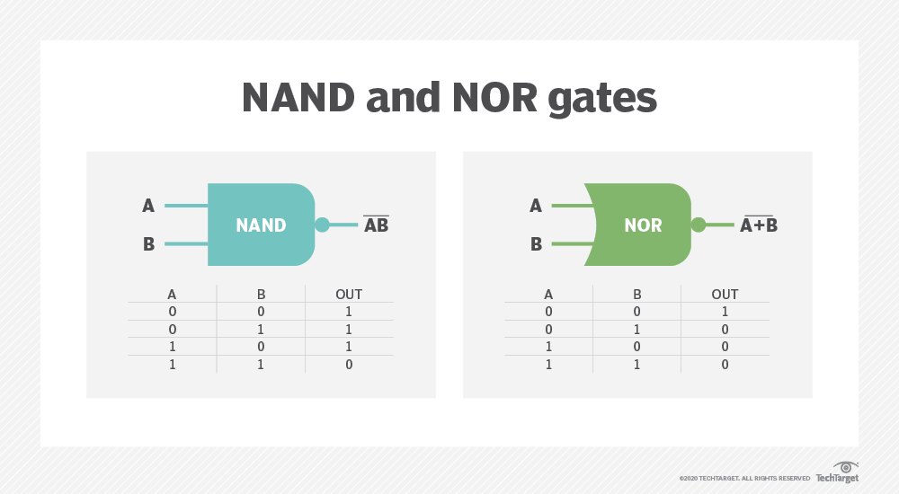
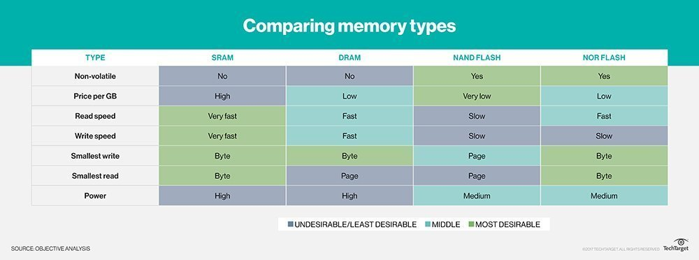

# 2021-01-14 ~ 2021-01-30 Pre Research

> 这个时间主要做预研工作，主要参考问题如下：
>
> 1. 文件系统的基本结构是？各子模块的功能分别是？
> 2. NOR Flash存储介质的特点是？
> 3. 目前有哪些面向NOR Flash的FS？试阅读相关的原始文献，列举并对比分析各自的优缺点；
> 4. 考虑嵌入式系统的特点和NOR Flash的特性，所设计的文件系统与常用的桌面级FS（如NTFS、EXT4等）相比，存在哪些差异？针对这些差异，如何进行适应性的优化？
> 5. FS有哪些性能指标？一般可从哪些方面优化FS的性能？
> 6. 为什么需要写平衡？有哪些常用的写平衡算法？
> 7. 实现掉电安全的常用方法有哪些？TPSFS是如何实现掉电安全的？
>
> 参考资料：
>
> 1. [File System Overview](https://kb.wisc.edu/helpdesk/page.php?id=11300#:~:text=A%20file%20system%20is%20a,systems%20when%20formatting%20such%20media.)
> 2. [文件系统的层次结构](https://www.cnblogs.com/caidi/p/6781759.html)
> 3. [OS之文件系统的层次结构](https://www.codetd.com/article/11977179)
> 4. [FAT32文件系统结构详解](https://blog.csdn.net/li_wen01/article/details/79929730/)
> 5. [EXT文件系统机制（知乎）](https://zhuanlan.zhihu.com/p/61749046)
> 6. [NTFS文件系统结构分析](http://www.360doc.com/content/10/1229/16/4573246_82348341.shtml)
> 7. [F2FS技术拆解](https://blog.csdn.net/feelabclihu/article/details/105534143)
> 8. [NorFlash结构与特性](http://www.yingtexin.net/news-2/54718.shtml)
> 9. [NorFlash的基本操作](https://blog.csdn.net/bkyy123/article/details/80167344?utm_medium=distribute.pc_relevant.none-task-blog-BlogCommendFromMachineLearnPai2-4.control&depth_1-utm_source=distribute.pc_relevant.none-task-blog-BlogCommendFromMachineLearnPai2-4.control)
> 10. [嵌入式系统FS](https://www.keil.com/pack/doc/mw/FileSystem/html/emb_fs.html#:~:text=The%20Embedded%20File%20System%20EFS,is%20optimized%20for%20maximum%20performance.&text=File%20Names%20%26%20Content%20are%20stored,provide%20optimal%20file%20access%20times.)
> 11. [几种嵌入式文件系统比较](http://blog.chinaunix.net/uid-20692983-id-1892749.html?utm_source=jiancool)
> 12. [XIP](https://www.embedded-computing.com/guest-blogs/execute-in-place-xip-an-external-flash-architecture-ideal-for-the-code-and-performance-requirements-of-edge-iot-and-ai#:~:text=XiP%20is%20a%20method%20of,the%20program%20from%20that%20RAM.&text=Serial%20flash%20memory%20is%20typically,as%20BIOS%20in%20a%20PC.)
> 13. [Flash与SSD的区别](http://www.yingtexin.net/news-2/54650.shtml)
> 14. [NandFlash](https://www.taodocs.com/p-4196750-1.html)
> 15. [NorFlash VS NandFlash](https://searchstorage.techtarget.com/definition/NOR-flash-memory)
> 16. [LFS](https://web.stanford.edu/~ouster/cgi-bin/papers/lfs.pdf)
> 17. [知乎：LFS](https://zhuanlan.zhihu.com/p/41358013)
> 18. [JFFS](https://sourceware.org/jffs2/jffs2.pdf)
> 19. [SPI](http://www.elecfans.com/d/778327.html)
> 20. [SPIFFS：SPI NOR Flash - 无堆，RAM较小](https://zhuanlan.zhihu.com/p/27285177)
> 21. [YAFFS Presentation](https://elinux.org/images/e/e3/Yaffs.pdf)
> 22. [SylixOS TPSFS文件系统掉电安全原理浅析](https://blog.csdn.net/automan12138/article/details/71480863)
>
> 简单的会议PPT：
>
> [第一阶段预研工作(2021-01-24)](../Files/PPT/pre-research-stage1.pptx)

[TOC]

## 文件系统的层次结构

### 文件系统的基本结构

其中，各个模块的 **宽泛含义** 如下：

- **用户接口模块** ：提供用户接口，例如：**open、write、read** 等；
- **文件目录模块** ：用户通过文件路径访问文件，这个模块需要**根据路径** 找到相应的**FCB** 。所有和目录、目录项相关的管理工作都在本模块内完成，例如：管理活跃的文件目录、管理打开文件表等；
- **存取控制模块** ：验证用户是否有访问权限；
- **逻辑文件系统与文件信息缓冲区** ：用户指明想要访问的文件记录号，该模块将记录好转换为对应的逻辑地址；
- **备份恢复模块** ：该模块用于解决掉电安全问题，在xv6中，对应于Logging Layer，在SylixOS中，tpsFS利用Transaction机制来保证；
- **物理文件系统** ：将逻辑地址转换为物理地址；
- **辅助分配模块** ：负责文件存储空间的管理，即负责分配和回收空间；
- **设备管理模块** ：直接与硬件交互，负责和硬件相关的一些管理工作：如分配设备、分配设备缓冲区、磁盘调度、启动设备、释放设备；

### 调研目前已有的FS结构

#### FAT FS

#### EXT FS

#### NT FS

#### F2 FS

## NorFlash 存储介质的特点

NorFlash是两种非易失Flash存储技术之一，NandFlash是另外一种。非易失存储意味着断电数据不会丢失。

Nor Flash 和Nand Flash用了不同的逻辑门来存储数据（或非门、与非门）。两种Flash都是Toshiba（东芝）公司发明的，但是商用Nor Flash由Intel于1988提出，Nand Flash由Toshiba于1989年提出。

### Nor Flash VS Nand Flash

 NorFlash比NandFlash的**读速度**更快，但是它也更贵，擦除与写入新数据的时间也更长。Nand相比于Nor有更高的存储容量。

Nand存储设备只能**连续访问（access serially）**，利用8个相同的管脚来传输控制、寻址、数据信息。Nand可以写入单个的内存单元，即一次8个bit，一个byte。

相反，早一些的，并行的NorFlash技术支持**单字节随机访问（one-byte random access）**,这使得机器指令能够直接被取出并**直接在芯片上运行（XIP，eXecute In Place）**——这与传统计算机提取指令并在主内存中运行方式一致（RAM）。不过，NorFlash相较于Nand必须一次写入更大块（larger chunks）的数据。并行NorFlash有一个SRAM接口，它包括了足够的引脚来寻址整个芯片，使得能够访问芯片中的任意一个byte。

NorFlash技术要比Nand技术在每bit生产和花费更贵一点。再者，NorFlash允许随机访问，这意味着NorFlash大多用于**指令执行**，而NandFlash大多用于**数据存储**。

再来看能源花费，NorFlash 需要更高的能源来启动。不过，一旦设备启动完毕，NandFlash消耗的维持能源就要更高一点。因此，NorFlash通常更适于**随机读**，而NandFlash在**写、顺序读、擦除**方面更占优势。

NorFlash通常用于**手机、科学设备和医疗器械**。NandFlash在大容量储备方面有较大的市场，例如：MP3播放器，数码相机和USB。

一些设备同时具有NorFlash与NandFlash。例如：平板或者只能手机可能用嵌入式NorFlash来启动OS，用NandFlash来存储。

### NorFlash的优点

主要的优点在于NorFlash提供比NandFlash更快更好的数据读取服务。例如，一个Nand MLC（multi-level cell）Flash设备读取速率大概为20.5MB/s，而Nor MLC Flash设备至少为61.5MB/s。

但是，NorFlash的写速率远远慢于NandFlash。一个Nand MLC设备写速率大概在3.2MB/s，但Nor MLC设备大概只在0.47MB/s。除此之外，NorFlash每个存储单元的大小也限制了NorFlash的存储能力。

NorFlash的优点与缺陷意味着**NorFlash最好的用例**是：设备仅仅是有限的数据需要被存储且大多数存储IO都是**读IO**。

这也是为什么NorFlash常常被用于消费者设备如平板和只能手机的原因了。这些设备有着相对轻量级的OS，这一点符合NorFlash存储容量有限的特点。另外，NorFlash的能够**快速读**的优点使得OS的启动相比于NandFlash更快。

手机OS并**非写占多数（not to be write-intensive）**,这也使得NorFlash是一个好的选择。不过，因为NorFlash的写速度太慢了，这会导致OS的更新速率非常慢。

NorFlash同时也是嵌入式系统的不二选择，因为这些系统都具有读多写少的特点。

### 串行Nor

Nor存储芯片有两种主要类型：并行Nor与串行Nor。二者的主要区别之一是串行相比并行设备需要与电路板的连接数更少。即串行Nor的接口更加简单，花费更少。

SPI（Serial Peripheral Interface） NorFlash存储芯片被布局为扇区（sectors）和页（pages）。一个扇区被定义为**最小的可擦写块大小**。扇区又可被细分为页面。尽管页面远比扇区小，但是数据仍可以被写入页面大小（page-size）的块（chunks）。扇区通常用KB作为计量单位，通常来讲扇区大小为4，32，64以及256KB。相反，页面大小通常以B作为计量单位，通常为256B和512B。

数据写入SPI Nor设备的方式取决于存储芯片是否安装有缓冲区。如果有，那么页面可以被读入缓冲区，修改最后写回芯片。如果SPI Nor设备没有缓冲区，那么整个页面必须在外部读、修改最后写回芯片。于是有缓冲的SPI Nor设备具有更好的写性能。

## 面向NorFlash的FS

### JFFS（Journaling Flash File System）

- LFS（Log-structured File System）；
- Inode、Imap位置不固定；
- One-type of Node：只有一种类型的Node，没有Dirent，故不支持硬链接；
- 整个文件系统就是一个日志；
- 每一个写操作都追加在最后；
- Garbage Collection（GC）：追加写Head数据，留出Segment合并；
- Checkpoint Region（CR）：每30s写一次，防止掉电；

### JFFS2（Journaling Flash File System Version2）

- 多种类型的Inode；

- GC，BlockLists，对于每个Block：

  - clean_list：全是有效node；
  - dirty_list：至少含有一个过期node（obsoleted node）；
  - free_list：一个有效节点；

  GC过程中，99%的概率从dirty_list中覆写，1%的概率从clean_list中覆写；

- 设计inode_cache数据结构，优点在于访问快捷，缺点在于内存RAM消耗过大；

### SPIFFS（SPI Flash File System）

- 受YAFFS启发；
- 没有Inode节点；
- 建立在无堆结构，RAM受限；
- 每个Block开头记录page使用情况；
- Object；
- 每个文件由Index Page与Data Page构成；
- 每个Page都有一个Page Header；
- Object id：标识文件唯一id；
- span index：标识文件内部逻辑page数；
- 扁平式布局，没有目录的概念；

## 嵌入式与桌面式FS差异

很大的一点就是：**嵌入式存储芯片常常采用Flash**，而Flash具有有限的生命周期，这与桌面式主机磁盘不同。于是嵌入式FS更多要考虑**磨损平衡**。因此很多嵌入式FS都采用的是LFS结构，即索引块所在的位置并不是固定的，每一个块都要写到。而诸如Ext等FS，它们的inode与imap都保存在特定的位置，因此对该磁盘位置的读写频率会较大。考虑磨损平衡是嵌入式系统的重中之重。

## FS性能指标

- ……

## 写平衡

>  为什么需要写平衡？

很大一部分原因就是嵌入式系统采用Flash存储技术，Flash具有擦写生命周期，如果在某个块上擦写次数过多，那么这个块就容易变成坏块。

> 常见的写平衡算法？

- Log-structured（不断追加写）；
- 随机；
- JFFS2，Blocklists；

## 掉电安全

- Checkpoint Region；
- 日志系统；
- 事务提交机制（TPSFS）

### TPSFS

TPSFS采用事务写机制，它的原理是在进行写操作之前，把各个步骤看为是一个个**小事务**，整体算一个**大事务**。TPSFS会把各个小事务先写进日志块区域，日志全部写进成功之后，再把它写进数据块区域。

如果在保存日志的过程中发生掉电，则文件系统会忽略整个大事务。

如果在写真实数据区域时发生掉电，则文件系统上电后可以重新提交该事务。

TPSFS采用这种方式保证文件系统的一致性和完整性。

