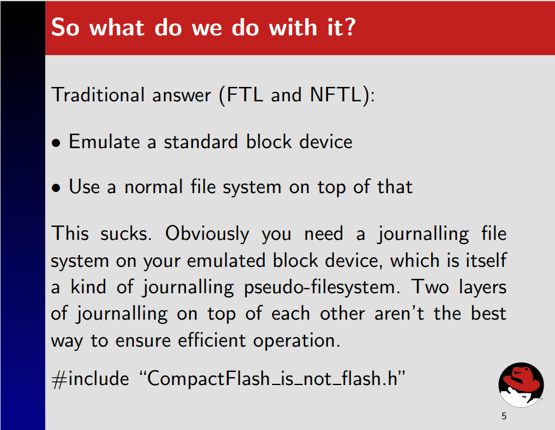
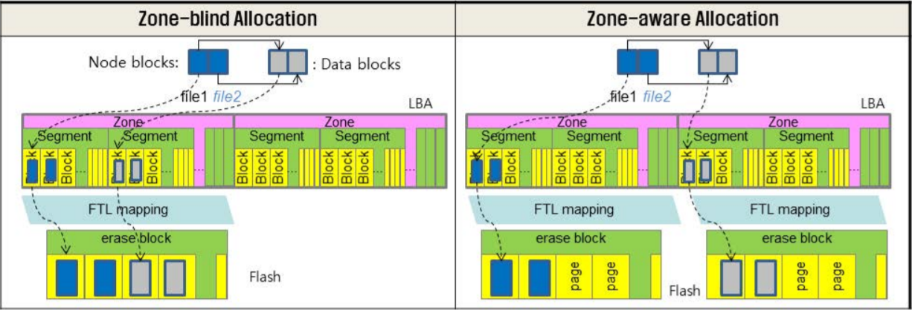
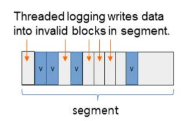
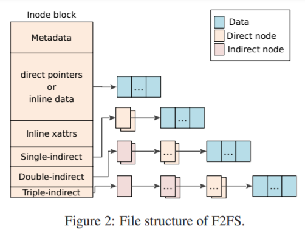
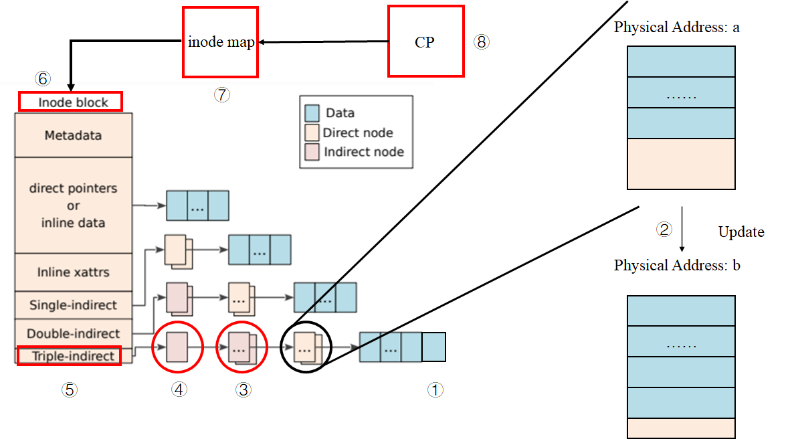
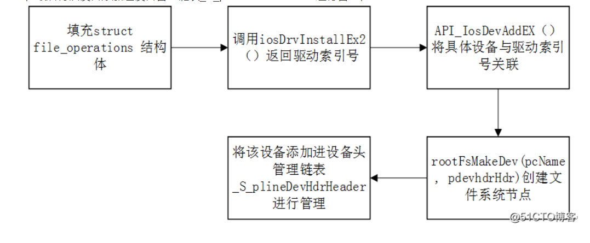
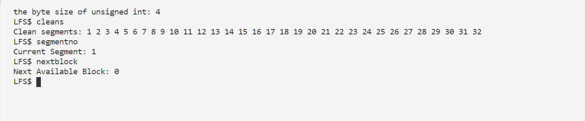
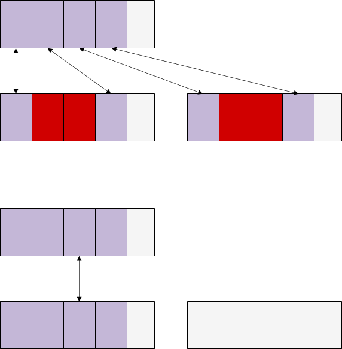
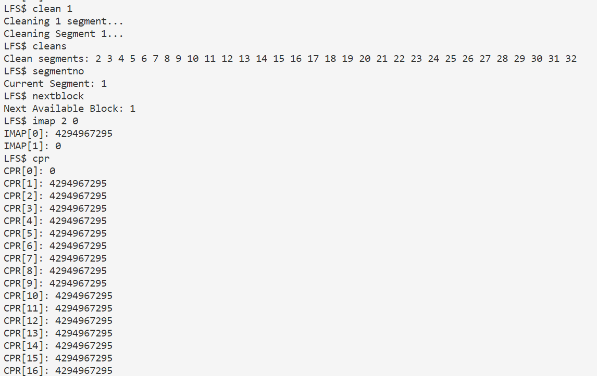

# 2021-01-26 ~ 2021-01-31 Deep Research

> 主要解决几个问题：
>
> 1. Sylix OS文件系统挂载；
> 2. Sylix IDE的智能补全机制；
> 3. JFFS（LFS）的具体操作流程；
> 4. SSD F2FS的实现方式；
>
> 参考文献：
>
> 1. [F2FS origin paper](https://www.usenix.org/system/files/conference/fast15/fast15-paper-lee.pdf)
> 2. [F2FS slides](https://www.usenix.org/sites/default/files/conference/protected-files/fast15_slides_lee.pdf)
> 3. [F2FS presentation](https://www.youtube.com/watch?v=HgCvcMQnJQ0)
> 4. [F2FS versus JFFS](https://lwn.net/Articles/519337/)
> 5. [UBIFS](http://www.linux-mtd.infradead.org/doc/ubifs_whitepaper.pdf)
> 6. [UBIFS DOC](http://www.linux-mtd.infradead.org/doc/ubifs.html#L_raw_vs_ftl)
> 7. [冷热数据分区是好是坏？](https://win.uantwerpen.be/~vanhoudt/papers/1998/PEVA2014.pdf)
> 8. [Raw Flash VS FTL Device](https://digitalcerebrum.wordpress.com/random-tech-info/flash-memory/raw-flash-vs-ftl-devices/)
> 9. [Firmware](https://hanyu.baidu.com/zici/s?wd=固件&query=什么叫固件&srcid=28204&from=kg0)
> 10. [MTD Doc](http://www.linux-mtd.infradead.org/doc/general.html)
> 11. [Spin lock 与mutex 的区别](https://www.cnblogs.com/linshangyao/p/3362772.html)
> 12. [SylixOS I/O](https://blog.csdn.net/qq_29476813/article/details/83302316)
> 13. [什么是挂载（mount）？ - kkbill - 博客园 (cnblogs.com)](https://www.cnblogs.com/kkbill/p/11979082.html)
> 14. [什么是文件的挂载？ - 小蒋的随笔 - 博客园 (cnblogs.com)](https://www.cnblogs.com/jynote/p/12449172.html)
> 15. [能否通俗易懂，深入浅出地解释一下linux中的挂载的概念？ - 知乎 (zhihu.com)](https://www.zhihu.com/question/266907637/answer/316859400)
> 16. [LFS-Proj](https://github.com/cd17822/log-structured-file-system)
>
> 简单的会议PPT：
>
> [第二阶段预研工作(2021-01-31)](../Files/PPT/pre-research-stage2.pptx)

[TOC]

## 蒋老师的回复

**Q：**

**问题一：**如何在SylixOS IDE中设置代码智能补全？

**问题二：**我们小组选择的Project 32是基于NorFlash的文件系统，在NandFlash越来越火的今天，为何还需要设计基于NorFlash的FS？

**A：**

**第一个问题：**置代码智能补全是IDE自带的功能，不需要设置的。

**第二个问题：**首先SylixOS上已经实现了时候NandFlash和硬盘等大型存储设备的文件系统，目前只差norflash文件系统没有实现。其次目前还有一些使用SylixOS工控及电力等设备用到了norflash，同样也有文件系统需求。另外实现一个norflash在功能上和其它设备的文件系统差不多，也就是说对于题目的学习目的来说并没有多少变化。**（工程需求、完整性需求）**

**Q：**

**针对第一个问题的回复：**我们录了一个视频，放在了附件里，确实没有看到智能补全；

**针对第二个问题的回复：**我们还想了解一下，既然本次大赛Norflash FS是要应用于工业领域，那么本项目的着力点是在norflash fs的性能上还是其可靠性上？还是两者兼具呢？

**A：**

**第一个问题：**eclipse下的智能补全和vs下的不一样，有的（如全局函数）补齐需要你按ALT+/ 键。如果是结构体，在你输入.或者->之后会自动补齐成员。

**第二个问题：**首先是要实现功能，然后肯定是必须关心可靠性，之后才是效率。我们题目要求里面有掉电安全和写平衡需求，其实也是对可靠性要求的体现。**（功能 > 可靠性 > 效率）**


工欲善其事必先利其器，没有Intellisense可太难受了。于是，写了一个简单的脚本来实现Sylix IDE类似VS的代码补全功能，这里是[工具链接](../../Tools/auto_complete.py)。使用方法很简单，打开Sylix IDE后，在代码编辑界面打开该脚本；在没有编辑代码的时候关闭此脚本即可。


## F2FS

### F2FS 轮廓
首先需要明白F2FS与JFFS之间的区别。事实上，二者**没有可比性**。因为F2FS把Flash设备看作块设备，利用FTL（Flash Translation Layer）技术；而JFFS是直接由Flash的特点设计而来。

这里有一个很有趣的问题。

在JFFS2的presentation中，作者认为利用FTL是一个**很烂**的选择。



这里值得一提的是，F2FS的诞生在2012年左右，而JFFS2在2001年左右就已经诞生。

下面是[F2FS versus JFFS](https://lwn.net/Articles/519337/)中的两条回复：

> 1. It is designed for flash devices that expose themselves as block devices (like SSDs) and not for raw flash devices as jffs2 .. so they aren't really comparable.
>
> 2. And JFFS2 works really **badly on file systems which sizes are in GBs** as it AFAIK **keeps the whole fs structure in RAM**. From scalability point of view, **UBIFS** would be more reasonable comparison.

也许在进一步深入F2FS之前还应该去阅读UBIFS。

> The big difference between JFFS2 and UBIFS is that UBIFS stores the index on flash whereas JFFS2 stores the index only in main memory, rebuilding it when the file system is mounted.

点到为止，还有更多的工作需要完成，翻译工作将在后续进行。

**从Presentation来看**，F2FS主要特点是：

1. 基于特殊FTL，该FTL能够根据规则翻译物理地址（zone 2 zone mapping）。根据后面的QA环节可以直到，这种FTL是由**三星**自研的。

   

2. 冷热数据分区。其规则是：Node比Data热，在Node中，**目录文件下的Direct Node**为Hot、**File文件下的Direct Node**为Warm、**Indirect Node**为Cold；Data中，**Dirent**为Hot、普通Data Block为Warm、**被回收的、用户指定的、多媒体数据文件**等为Cold。

3. Multi-Head Log。减少更新传播（update propagation），所有Node通过**NAT（Node Address Table）**翻译

   

4. 适应性追加Log机制（Adaptive Logging）。

   (1).Append Logging 。在垃圾清理（cleaning）的时候，**随机读顺序写**；

   (2).Threaded Logging。不需要垃圾清理，覆写dirty Segments中的不可用Block，这导致**随机写**;

   

5. Rollback机制，在Presentation中没有搞懂，还需阅读论文。

   

   

### Design and Implementation of F2FS

> 关于性能评估部分不需要做很深的研究，我们只需要知道它好就行了。不过F2FS适用于Nand Flash，但是也许我们同样可从它的设计中取出一些精华。

#### Block、Segment、Section and Zone

F2FS把整个卷分成固定大小的**Segment**，Segment是F2FS进行管理的基本单位。

其中，若干Block构成Segment；若干Segment构成Section；若干Section构成Zone；

>  在Presentation中，我们可以看到：
>
> 1. Block大小一般为4KB；
> 2. Segment大小一般为2MB，也就是512个Block；
> 3. Section大小是n个Segment；
> 4. Zone大小是m个Section；

#### 整体布局


- **SuperBlock（SB）：**SB具有F2FS文件系统的基本分区信息和一些默认参数，这些是在文件系统格式化的时候给出的，是不可更改的。

- **Checkpoint（CP）：**CP维护了文件系统的状态、有效**NAT/SIT集合的位图**、**孤儿节点（Orphan inode）**列表以及当前被激活的Segments的入口（Entries）。一个有效的**”检查点包“**应该保存**给定时间（given point of time）**的F2FS状态——用于掉电恢复。CP区域用**两个Segment**保存了两个检查点包（#0和#1）：一个用于保存最近稳定的版本，另一个用于保存一个**中间（过时的）版本**；

- **Segment Information Table（SIT）：**SIT包含了**每一个Segment的信息**，例如：Segment中有效的Block数量以及在**Main Area**中的Block的位图。另外，在垃圾清理阶段（Cleaning），SIT中的信息还被用于选择**受害Segment（Victim Segment）**并识别其中的有效块。
- **Node Address Table（NAT）：**NAT是一个Block地址映射表，用于定位所有在Main Area中的**”Node Blocks“**；
- **Segment Summary Area（SSA）：**SSA保存了**“Summary Entries”**，该**“Summary Entries”**记录了Main Area中所有**Block的归属信息**，例如：父Inode号以及它在其中的偏移**（node/data offsets）**。在垃圾清理过程中，在迁移有效块之前，这些“Entries”将被用于识别父node节点；
- **Main Area（MA）：**MA被**大小为4KB的Block填充**。每一个Block有两种大的类型：node类型或data类型。一个**“Node Block”**包含了**inode或Data Blocks索引**，而一个**“Data Block”**包含了**dirent或用户数据**。**注意，一个Section并不同时存储Node Blocks和Data Blocks**


下面举一个例子。

> 假设我们要查询文件“/dir/file”

F2FS的查找步骤如下：

1. 发现路径开始为**“/”**，则从**NAT**中寻找**Root inode**对应的地址，然后读取地址对应的**Node Block**，获得**Root inode**；
2. 在**Root inode**下，F2FS在它的**Data Block**中寻找名字为**dir**的**dirent**，通过**dirent**可以获取对应的**inode num**；
3. 接着，F2FS通过**NAT**将inode num转化为物理地址，并通过读取该物理地址对应的**Node Block**，获取名字为**dir**的**inode**；
4. 在**dir inode**中，与**步骤2**一样，找到**file**对应的**dirent**，然后获取其**inode num**，然后重复**步骤3**，最终获得**file inode**；
5. 真实的文件数据可在**Main Area**中获取，接下来要说明文件的结构。

#### 文件结构（file inode structure）



传统的**LFS**利用*inode map* 将**inode num**翻译为物理地址。相比而言，F2F2利用**node**结构，将*inode map*拓展到可以翻译更多的索引块上。每一个**Node Block**都有一个唯一标识符**“Node ID”**。通过这个Node ID，NAT可以为所有的**Node Block** 提供它们相应的物理地址。一个**Node Block**有三种类型：inode、direct和indirect node。**inode block**包括了文件的元数据，例如文件名、inode num、文件大小、访问时间、修改时间等；**direct node block**包含了**Data Block**的地址，而**indirect node block**则包含的是可以定位其他**Node Block**的**Node ID**。

> 也就是说，F2FS的indirect node的内容并不直接是另一个direct或者indirect node的物理地址，而是它们的逻辑ID。通过NAT表，我们可以将这个ID翻译为它们对应的物理地址，这样的好处是解决了Wandering Tree的问题。

在传统的LFS中，如果一个位于叶子的**Data Block**被更新了，由于LFS的追加写机制，那么它的**direct和indirect**指针Block都会被递归地更新，然后是指向direct或者indirect的inode也会被更新，接着是相应的*inode map*会被更新，最后是CP区域会被更新，见下图。



但是F2FS仅仅更新**一个direct node block**和它对应的NAT入口，这有效解决了Wandering Tree的问题。


可以预见，**Single-indirect、Double-indirect以及Triple-indirect** 部分也都保存的**Node ID**。

#### 目录结构（Directory Structure）

在F2FS中，一个4KB大小的**dentry block**由几个部分组成：bitmap以及两个成对的slot和name数组。其中，slot包含了一个文件名的hash值，**inode num**，文件名长度以及文件类型（例如：普通文件、目录文件以及符号链接）。一个目录文件构建了一个**多级哈希表**来更有效地管理dentries。具体操作见[wiki百科](https://en.wikipedia.org/wiki/F2FS#Directory_structure)。

> 个人理解是：相当于每一个dentry block中的name的hash值都相同，可将多个block看作一个hash桶。因为在[wiki百科](https://en.wikipedia.org/wiki/F2FS#Directory_structure)中提到：
>
> In the case of file creation, F2FS finds empty consecutive slots that cover the file name. F2FS searches the empty slots in the hash tables of whole levels from 1 to *N* in the same way as the lookup operation.
>
> 也就是说，在创建文件的时候，先会根据**寻找算法** 一样的算法去插入一条dentry。

#### 多级头部日志（Multi-Head Logging）

不像LFS只有一个大的log区域，F2FS维护了六个主要的log区域来最大化冷热数据分区效应。F2FS静态地为**Node Block**和**Data Block**定义了3个数据温度级别——**hot**、**warm**以及**cold**，如下表所示。


因为Direct Node Block更新更加频繁，因此，它比Indirect Node Block更热，反观Indirect Node Block，它包含**Node ID**，并且仅仅只在一个Node Block被添加或者删除时才会去追加写更新。Direct Node Block和存储Dentries的Data Block都被视为热Block。其中，具有以下特点的Data Block被认为是冷Block：

- **被Cleaning过程移动的Data Block：**既然它们已经在Cleaning里被保留下来了，那么他们在不远的将来也同样不会被修改；
- **被用户定义的”Cold“ Data Block：**F2FS允许用户添加这个参数；
- **多媒体文件：**多媒体文件大都表现为”写一次，只读“模式。F2FS通过文件后缀名来识别这些文件。

F2FS默认开启6个Log区域。同样也支持2、4个Log区域。当6个区域都被激活时，6个区域对应上表的6种温度级别的Block；当4个区域被激活时，F2FS将Cold和Warm Log区域合并在一起。如果只有2个Log区域，那么F2FS将一个区域分配给**Node Block**，一个区域分配给**Data Block**。

F2FS提供了一种Zone可定制FTL兼容方法，能够间接减轻GC开销。**具体原理不太清楚**，大概类似下图的Zone-aware Allocation：


> F2FS maps active logs to different zones to separate them in the FTL.
>
> 冷热数据分离的原因？
>
> 是让性能更好？对WL应该没有什么帮助！
>
> 参考这篇文章[On the Necessity of Hot and Cold Data Identification to Reduce the Write Amplification in Flash-based SSDs](https://win.uantwerpen.be/~vanhoudt/papers/1998/PEVA2014.pdf)的结论：
>
> In this paper we compare the performance of such a write approach with write approaches that do rely on data identification using both mean field models and simulation experiments. The main finding is that **the added gain of identifying hot and cold data is quite limited, especially as the hot data gets hotter**. Moreover, the write approaches relying on hot and cold data identification may even become inferior if either the fraction of data labeled hot is not ideally chosen or if the probability of having false positives or negatives when identifying data is substantial (e.g. 5%).
>
> 是了，这符合我的想法。

#### Cleaning

在F2FS种，Cleaning是以**Section**为单位完成的。F2FS的Cleaning发生在**”Foreground“** 和**”Background“** 。Foreground Cleaning只在没有足够多的空闲Section时才发生，而Background Cleaning是由内核线程阶段性的唤醒来完成。一个Cleaning包含3个步骤：

1. **Victim Selection：**主要有两种方式，其一为**Greedy**——选择具有**最少有效块**的Section作为Victim Section，F2FS将Greedy方式作为Foreground Cleaning以最小化前端应用的延迟。另外，F2FS保留了5%的存储空间，这足以够Cleaning进程进来移动Block；第二种方式是**cost-benefit**，F2FS将其作为Background Cleaning方法，这种方法不仅仅根据Section的使用情况，还根据它的**”年龄“**来选择Victim Section。F2FS利用SIT里记录的信息来推测Section的年龄，一般是计算Section中所有Segment的平均年龄（F2FS infers the age of a section by averaging the age of segments in the section）。有了cost-benefit方法，F2FS就有了分别冷热数据的另一种方法。

2. **Valid block identification and migration：**在进行完Victim Selection之后，F2FS必须验证Section中Block的有效性。F2FS在SIT中为每一个Segment都维护了一个**有效位图（validity bitmap）**，一旦通过Section中的所有bitmap找到了该Section中所有Segment中所有的有效Block，F2FS就能够从SSA中获取这些Block的父Node Block。接着，F2FS就能够将有效的Block全部**迁移（migrate）** 到log的其他空闲**区域**中。

   > 这里有一个问题，到底移到哪一个log区域中呢？有整整6个Log区域呀，这该怎么权衡呢？
   >
   > 呵呵，应该只在Log Area也就是单一Zone里面移动吧……
   >
   > 是吗？好像不是？

   对于Background Cleaning，F2FS并不会引起移动有效块的I/O。相反，F2FS将**有效块**装载到**Page Cache**中，然后将它们标记为**Dirty**。接下来，F2FS就将他们留在Page Cache中，等待内核工作进程将他们Flush到存储器中。这种模式被称为**Lazy Migration**，它不止减轻了对前台应用I/O的影响，同时允许**小的写入（Small Write）**被合并起来。Background Cleaning在常规I/O或者Foreground Cleaning时不会工作。

3. **Post-cleaning process：**当所有有效块都被迁移后，那个**Victim Section**就会被标记为**Pre-Free**。当Checkpoint生成后，这个Section才变成一个Free Section，等待被重新分配。这个机制的原因是：如果一个Pre-Free Section在Checkpoint生成前就被当作空闲块使用，那么当掉电时，文件系统可能会丢失在上一个Checkpoint时的数据。（因为Pre-Free Section已经被覆写了。Brilliant！）

#### Adaptive Logging

> The original LFS introduced two logging policies, **normal logging and threaded logging**. **In the normal logging**, blocks are written to clean segments, yielding strictly sequential writes. Even if users submit many random write requests, this process transforms them to sequential writes as long as there exists enough free logging space. **As the free space shrinks to nil**, however, **this policy starts to suffer high cleaning overheads**, resulting in a serious performance drop (quantified to be over 90% under harsh conditions, see Section 3.2.5). **On the other hand, threaded logging writes blocks to holes (invalidated, obsolete space) in existing dirty segments**. **This policy requires no cleaning operations, but triggers random writes and may degrade performance as a result.**
>
> F2FS implements both policies and switches between them dynamically according to the file system status. Specifically, if there are more than k clean sections, where k is a pre-defined threshold, normal logging is initiated. Otherwise, threaded logging is activated. k is set to 5% of total sections by default and can be configured.

简单来说，设定一个阈值，当空闲块大于这个阈值时，F2FS启用基于Append Logging的Cleaning回收机制，当空闲块小于这个阈值时，如果再调用Cleaning，那么写入效率会变得非常低下，于是直接采用Threaded Logging——直接写到脏Segment的空闲Block中，就不采用Cleaning操作了。

#### Checkpoint And Recovery

无论何时，F2FS需要维护一个持续状态事件：例如sync、umount以及Foreground Cleaning时，F2FS都会触发一个检查点，具体流程如下：

1. 所有在Page Cache中的Dirty Node和Dentry Block被Flush；
2. F2FS暂停基本写系统调用，例如：create、unlink以及mkdir；
3. 文件系统的元数据、NAT、SIT以及SSA被写入Flash特定区域；
4. F2FS向CP Area写入Checkpoint包，包括了以下信息：
   - **Header and Footer：**分别被写入包的开头和结尾。F2FS在Header和Footer中维护版本号，该版本号在创建检查点时递增。在文件系统装载时，版本号可以从两个Checkpoint包中曲分最新的稳定包；
   - **NAT and SIT bitmaps：**NAT和SIT bitmaps指明构成当前包的**NAT和SIT的Block**的集合；
   - **NAT and SIT journals：**包含了一小部分最近修改的NAT与SIT Entries，用于避免经常性的NAT和SIT更新；
   - **Summary blocks of active segments：**由内存中的SSA Block组成，这些内存中的SSA Block将来会被Flush到Flash的SSA Area中；
   - **Orphan Blocks：**保存孤儿节点信息。如果一个inode在它被关闭之前删除了，例如：当两个进程同时打开一个文件，然后其中一个进程删除了这个文件，那么此时这个文件就被标记为孤儿节点，在突然断电后，F2FS就可以成功恢复它；


**回滚恢复（Roll-Back Recovery）**

在突然掉电后，F2FS回滚到最近Checkpoint上。F2FS维护了两个Checkpoint包，如果一个Checkpoint包的Header和Footer和另一个相同，则F2FS认为该Checkpoint包是有效的，否则，它会被丢弃。

同样，F2FS同样管理了两组NAT和SIT的块集合，由每个Checkpoint包的NAT和SIT bitmaps区分。当在更新检查点时写NAT或者SIT block时，F2FS将交替写这两组集合，然后将bitmap指向被最新的集合。

如果只有很少的NAT或者SIT Entries被经常更新，则F2FS将多次写入4KB大小的NAT或者SIT Block。为了减轻负担，F2FS在Checkpoint包中实现了NAT and SIT journal，这项技术减少了I/O的数量，以及更新检查点的延迟。

在文件系统挂载恢复阶段，F2FS通过Header和Footer搜索有效的Checkpoint 包。如果所有Checkpoint 包都有效，F2FS就选择最新的一个包。一旦选择了最近有效的包，F2FS将检查是否存在孤儿节点。如果存在，F2FS将剪除这些孤儿节点指向的所有Data Block，然后将这些孤儿节点Free掉。接下来，F2FS在Roll-Forward Recovery成功完成后，通过指向NAT和SIT Blocks的bitmaps来开启文件系统服务。

**前滚恢复（Roll-Forward Recovery，类似强制刷新吧，不是很懂。。。感觉是针对数据库的？？？Mayday Mayday /(ㄒoㄒ)/~~）**

类似数据库的应用时常向文件写入小型数据并执行fsync来保证数据的持续性。一个支持fsync的简单的方法可能是：触发更新检查点然后通过Roll-Back模型来恢复数据。然而，这个方法的性能十分低下，因为更新检查点将导致所有无关的Node、Dentry Block都被写入数据库文件。

F2FS实现了一个高效的前滚恢复机制来提升fsync性能。关键思想是只写Data Block以及这些Data Block的Direct Node Block，而不写其他Node 或者F2FS元数据Block。为了在回滚到稳定的Checkpoint时选择性地找到Data Block，F2FS在Direct Node Block中保留了一些特殊的标志位。

### 值得回味的地方

- NAT的设计，有效避免了Wandering Tree问题；

- 多级哈希表的设计，使得dirent的查找效率更快；

- 冷热数据的分区（虽然在文中没看出WL，不过也给了我们对于冷热数据区分的思路）；

  > 夏老师的回复：冷热分离，一方面是性能，另外对磨损均衡还是有作用的，热数据可以挪一挪

- Adaptive Logging机制，一种混合Append Logging和Threaded Logging的方式，值得借鉴；

- Foreground Cleaning的Greedy机制与Background Cleaning的基于**Lazy Migration**的Cost-benefit机制；


## SylixOS Simple FS Code Thru

> 这一部分主要进行SylixOS Filesystem部分的Code Thru，大概思路为以下几个步骤：
>
> 1. 看懂向RootFS注册新的FS的方法；
> 2. 了解接口函数，标注它们的功能；
> 3. ……
> 4. 询问蒋老师目标NorFlash的硬件平台；

### NorFlash开发板

> 陈洪邦老师的回复：
>
>  根据市面上带NorFlash的 板卡，结合我司开源的BSP，建议选择mini2440/JZ2440均可以。

**BSP（Board Support Package）：**

The [Wind River](https://en.wikipedia.org/wiki/Wind_River_Systems) board support package for the ARM Integrator 920T single-board computer contains, among other things, the following elements:

- A config.h file, which defines constants such as **ROM_SIZE and RAM_HIGH_ADRS**.

- A Makefile, which defines **binary versions of VxWorks ROM images** for programming into [flash memory](https://en.wikipedia.org/wiki/Flash_memory).

- A bootrom file, which **defines the boot line parameters for the board**.

- A target.ref file, which describes board-specific information such as **switch and jumper settings, interrupt levels, and offset bias**.

- A [VxWorks](https://en.wikipedia.org/wiki/VxWorks) image.

- Various C files, including:

  - flashMem.c—the device **driver for the board's flash memory**

  - pciIomapShow.c—mapping file for the PCI bus

  - primeCellSio.c—TTY（**TeleTYpewriter** ） driver

  - sysLib.c—system-dependent routines specific to this board

  - romInit.s—**ROM initialization module for the board**; contains **entry code for images that start running from ROM**

Additionally the BSP is supposed to perform the following operations

- Initialize the processor
- Initialize the bus
- Initialize the interrupt controller
- Initialize the clock
- Initialize the RAM settings
- Configure the segments
- Load and run bootloader from flash

> 位于硬件和OS之间的板级支持包，为OS提供基本服务。
>
> 更新：终于找到BSP在哪里了
>
> 


### Code Thru

#### fsCommon part

> 这一部分是通用FS函数，显然，如果从面向对象的角度来看，它就是文件系统最抽象的类，我们需要用好这个Part。这里有一点值得注意，可以发现，在SylixOS中每个头文件的有一个#ifndef #define #endif的定义，考虑如下情况：多个文件同时include同一个头文件，那么当这些文件编译链接成一个可执行文件时，就会出现大量“重定义”的错误。添加 #ifndef #define #endif的妙处正是在这里。

**fsCommon.h**

首先**LW_CFG_MAX_VOLUMES**这个宏表示**系统同时支持的卷的数量** ，显然不能为**负数**

```c
#ifndef __FSCOMMON_H
#define __FSCOMMON_H

/*********************************************************************************************************
  文件系统函数声明
*********************************************************************************************************/
#if LW_CFG_MAX_VOLUMES > 0

INT      __fsRegister(CPCHAR   pcName, 
                      FUNCPTR  pfuncCreate, 
                      FUNCPTR  pfuncCheck,
                      FUNCPTR  pfuncProb);                              /*  注册文件系统                */
FUNCPTR  __fsCreateFuncGet(CPCHAR       pcName, 
                           PLW_BLK_DEV  pblkd, 
                           UINT8        ucPartType);                    /*  获得文件系统创建函数        */
UINT8    __fsPartitionProb(PLW_BLK_DEV  pblkd);                         /*  特殊分区探测                */

VOID     __fsDiskLinkCounterAdd(PLW_BLK_DEV  pblkd);                    /*  物理连接计数操作            */
VOID     __fsDiskLinkCounterDec(PLW_BLK_DEV  pblkd);
UINT     __fsDiskLinkCounterGet(PLW_BLK_DEV  pblkd);

#endif                                                                  /*  (LW_CFG_MAX_VOLUMES > 0)    */

/*********************************************************************************************************
  通用函数声明
*********************************************************************************************************/

INT      __fsCheckFileName(CPCHAR  pcName);                             /*  文件名正确性检查            */

#endif                                                                  /*  __FSCOMMON_H                */
```

**fsCommon.c**

值得注意的是这个结构体（LW？？？**long wing？？是什么**）：

```c
/*********************************************************************************************************
  文件系统名对应的文件系统装载函数 (不针对 yaffs 系统)
*********************************************************************************************************/
typedef struct {
    LW_LIST_LINE                 FSN_lineManage;                        /*  管理链表                    */
    FUNCPTR                      FSN_pfuncCreate;                       /*  文件系统创建函数            */
    FUNCPTR                      FSN_pfuncCheck;                        /*  文件系统检查函数            */
    FUNCPTR                      FSN_pfuncProb;                         /*  文件系统类型探测            */
    CHAR                         FSN_pcFsName[1];                       /*  文件系统名称                */
} __LW_FILE_SYSTEM_NODE;
typedef __LW_FILE_SYSTEM_NODE   *__PLW_FILE_SYSTEM_NODE;

static LW_SPINLOCK_DEFINE       (_G_slFsNode) = LW_SPIN_INITIALIZER;
static LW_LIST_LINE_HEADER       _G_plineFsNodeHeader = LW_NULL;        /*  文件系统入口表              */
```

好，这里就看到了**LW_LIST_LINE**，结构如下：

```c
/*********************************************************************************************************
  双向线形管理表
*********************************************************************************************************/

typedef struct __list_line {
	struct __list_line      *LINE_plistNext;                            /*  线形表前向指针              */
    struct __list_line      *LINE_plistPrev;                            /*  线形表后向指针              */
} LW_LIST_LINE;
typedef LW_LIST_LINE        *PLW_LIST_LINE;
typedef PLW_LIST_LINE        LW_LIST_LINE_HEADER;                       /*  线形表表头                  */
```

这里的**LW_LIST_LINE**前加了一个P，应该是**Pointer**的意思。

然后是定义了双向链表头**_G_plineFsNodeHeader**与一个自旋锁**_G_slFsNode**。

> 关于spinlock和mutex，摘自[Spin lock 与mutex 的区别](https://www.cnblogs.com/linshangyao/p/3362772.html)：
>
> 从实现原理上来讲，**Mutex属于sleep-waiting**类型的锁。例如在一个双核的机器上有两个线程(线程A和线程B)，它们分别运行在Core0和 Core1上。假设线程A想要通过pthread_mutex_lock操作去得到一个临界区的锁，而此时这个锁正被线程B所持有，那么线程A就会被阻塞 (blocking)，Core0 会在此时进行上下文切换(Context Switch)将线程A置于等待队列中，此时Core0就可以运行其他的任务(例如另一个线程C)而不必进行忙等待。而**Spin lock则不然，它属于busy-waiting**类型的锁，如果线程A是使用pthread_spin_lock操作去请求锁，那么线程A就会一直在 Core0上进行忙等待并不停的进行锁请求，直到得到这个锁为止。

下面分析几个函数：

**__fsRegister**

---

```c
/*********************************************************************************************************
** 函数名称: __fsRegister
** 功能描述: 注册一个文件系统
** 输　入  : pcName           文件系统名
**           pfuncCreate      文件系统创建函数
**           pfuncCheck       文件系统检查函数
** 输　出  : ERROR
** 全局变量: 
** 调用模块: 
*********************************************************************************************************/
INT  __fsRegister (CPCHAR  pcName, FUNCPTR  pfuncCreate, FUNCPTR  pfuncCheck, FUNCPTR  pfuncProb)
{
    INTREG                  iregInterLevel;
    __PLW_FILE_SYSTEM_NODE  pfsnNew;

    if (!pcName || !pfuncCreate) {
        return  (PX_ERROR);
    }
    //分配了一个fs_node
    pfsnNew = (__PLW_FILE_SYSTEM_NODE)__SHEAP_ALLOC(lib_strlen(pcName) + 
                                                    sizeof(__LW_FILE_SYSTEM_NODE));
    if (pfsnNew == LW_NULL) {
        _DebugHandle(__ERRORMESSAGE_LEVEL, "system low memory.\r\n");
        _ErrorHandle(ERROR_SYSTEM_LOW_MEMORY);
        return  (PX_ERROR);
    }
    pfsnNew->FSN_pfuncCreate = pfuncCreate;
    pfsnNew->FSN_pfuncCheck  = pfuncCheck;
    pfsnNew->FSN_pfuncProb   = pfuncProb;
    lib_strcpy(pfsnNew->FSN_pcFsName, pcName);
    
    LW_SPIN_LOCK_QUICK(&_G_slFsNode, &iregInterLevel);
    _List_Line_Add_Ahead(&pfsnNew->FSN_lineManage, &_G_plineFsNodeHeader);
    LW_SPIN_UNLOCK_QUICK(&_G_slFsNode, iregInterLevel);
    
    return  (ERROR_NONE);
}
```

实际上就是用**链表**管理**__LW_FILE_SYSTEM_NODE**，这里就是做**__LW_FILE_SYSTEM_NODE**的初始化，**easy！**

这里有一个**LW_SPIN_LOCK_QUICK(&_G_slFsNode, &iregInterLevel)**，不用理会，应该就是SylixOS定义调用自旋锁的基本写法：

```c
static LW_SPINLOCK_DEFINE       (_G_sl_ObejectName) = LW_SPIN_INITIALIZER;
INTREG                  iregInterLevel;
LW_SPIN_LOCK_QUICK(&_G_sl_ObejectName, &iregInterLevel);
//临界区代码
//Do something here
...
LW_SPIN_UNLOCK_QUICK(&_G_sl_ObejectName, iregInterLevel);
```

另外，这里有一个**__SHEAP_ALLOC**，事实上它是**sys_heap_alloc**的缩写，即堆分配（理解为**malloc**即可），相关源码如下：

```c
/*********************************************************************************************************
  内核与系统级内存堆宏操作 (驱动程序与其他内核模块必须使用 sys_malloc 分配内存)
      
  注意: 移植 linux 系统驱动时, kmalloc 与 kfree 可以使用   sys_malloc 与 sys_free 替换.
                               vmalloc 与 vfree 也可以使用 sys_malloc 与 sys_free 替换.
*********************************************************************************************************/

#define ker_malloc(size)                __KHEAP_ALLOC((size_t)(size))
#define ker_zalloc(size)                __KHEAP_ZALLOC((size_t)(size))
#define ker_free(p)                     __KHEAP_FREE((p))
#define ker_realloc(p, new_size)        __KHEAP_REALLOC((p), (size_t)(new_size))
#define ker_malloc_align(size, align)   __KHEAP_ALLOC_ALIGN((size_t)(size), (size_t)(align))

#define sys_malloc(size)                __SHEAP_ALLOC((size_t)(size))
#define sys_zalloc(size)                __SHEAP_ZALLOC((size_t)(size))
#define sys_free(p)                     __SHEAP_FREE((p))
#define sys_realloc(p, new_size)        __SHEAP_REALLOC((p), (size_t)(new_size))
#define sys_malloc_align(size, align)   __SHEAP_ALLOC_ALIGN((size_t)(size), (size_t)(align))
```

但有点离谱的是，**K**打头的和**S**打头的一毛一样……

```c
#define __KHEAP_ALLOC(stNBytes)         _HeapAllocate(_K_pheapKernel, stNBytes, __func__)
#define __SHEAP_ALLOC(stNBytes)         _HeapAllocate(_K_pheapSystem, stNBytes, __func__)

#define __KHEAP_ZALLOC(stNBytes)        _HeapZallocate(_K_pheapKernel, stNBytes, __func__)
#define __SHEAP_ZALLOC(stNBytes)        _HeapZallocate(_K_pheapSystem, stNBytes, __func__)

#define __KHEAP_REALLOC(pvMemory, stNBytes)     \
        _HeapRealloc(_K_pheapKernel, pvMemory, stNBytes, LW_FALSE, __func__)
         
#define __SHEAP_REALLOC(pvMemory, stNBytes)     \
        _HeapRealloc(_K_pheapSystem, pvMemory, stNBytes, LW_FALSE, __func__)

#define __KHEAP_FREE(pvMemory)          _HeapFree(_K_pheapKernel, pvMemory, LW_FALSE, __func__)
#define __SHEAP_FREE(pvMemory)          _HeapFree(_K_pheapSystem, pvMemory, LW_FALSE, __func__)
```

 **__fsCreateFuncGet**

---

```c
/*********************************************************************************************************
** 函数名称: __fsCreateFuncGet
** 功能描述: 获取文件系统创建函数
** 输　入  : pcName           文件系统名
**           pblkd            对应磁盘
**           ucPartType       对应分区类型
** 输　出  : 文件系统创建函数
** 全局变量: 
** 调用模块: 
*********************************************************************************************************/
FUNCPTR  __fsCreateFuncGet (CPCHAR   pcName, PLW_BLK_DEV  pblkd, UINT8  ucPartType)
{
    INTREG                  iregInterLevel;
    __PLW_FILE_SYSTEM_NODE  pfsnFind;
    PLW_LIST_LINE           plineTemp;

    if (!pcName) {
        return  (LW_NULL);
    }
    
    LW_SPIN_LOCK_QUICK(&_G_slFsNode, &iregInterLevel);
    plineTemp = _G_plineFsNodeHeader;
    LW_SPIN_UNLOCK_QUICK(&_G_slFsNode, iregInterLevel);
    
    while (plineTemp) {
        pfsnFind = (__PLW_FILE_SYSTEM_NODE)plineTemp;
        if (lib_strcmp(pfsnFind->FSN_pcFsName, pcName) == 0) {
            break;
        }
        plineTemp = _list_line_get_next(plineTemp);
    }
    
    if (plineTemp) {
        if (pfsnFind->FSN_pfuncCheck && pblkd) {
            if (pfsnFind->FSN_pfuncCheck(pblkd, ucPartType) < ERROR_NONE) {
                return  (LW_NULL);
            }
        }
        return  (pfsnFind->FSN_pfuncCreate);
    
    } else {
        return  (LW_NULL);
    }
}
```

很简单，首先用**SPIN_LOCK**取**FS_NODE链表**头部作为**plineTemp**，然后遍历**FS_NODE链表**，根据**pcName**寻找对应相应的文件系统**NODE**，找到后对应于**pfsnFind**，接着调用**FSN_pfuncCheck**文件系统检查函数检验该文件系统的**对应磁盘**与**对应分区类型**是否合法，如果合法，就返回**pfsnFind->FSN_pfuncCreate**，否则返回**LW_NULL**。

**__fsPartitionProb** 

---

```c
/*********************************************************************************************************
** 函数名称: __fsPartitionProb
** 功能描述: 分区类型探测
** 输　入  : pblkd            对应磁盘
** 输　出  : 分区类型
** 全局变量: 
** 调用模块: 
*********************************************************************************************************/
UINT8  __fsPartitionProb (PLW_BLK_DEV  pblkd)
{
#ifndef LW_DISK_PART_TYPE_EMPTY
#define LW_DISK_PART_TYPE_EMPTY  0x00
#endif

    INTREG                  iregInterLevel;
    __PLW_FILE_SYSTEM_NODE  pfsnProb;
    PLW_LIST_LINE           plineTemp;
    UINT8                   ucPartType = LW_DISK_PART_TYPE_EMPTY;
    
    LW_SPIN_LOCK_QUICK(&_G_slFsNode, &iregInterLevel);
    plineTemp = _G_plineFsNodeHeader;
    LW_SPIN_UNLOCK_QUICK(&_G_slFsNode, iregInterLevel);
    
    while (plineTemp) {
        pfsnProb = (__PLW_FILE_SYSTEM_NODE)plineTemp;
        if (pfsnProb->FSN_pfuncProb) {
            pfsnProb->FSN_pfuncProb(pblkd, &ucPartType);
            if (ucPartType != LW_DISK_PART_TYPE_EMPTY) {
                break;
            }
        }
        plineTemp = _list_line_get_next(plineTemp);
    }
    
    return  (ucPartType);
}
```

该函数与**__fsCreateFuncGet**函数类似，通过遍历链表，然后不断调用**文件系统类型探测函数FSN_pfuncProb**，如果探测到的类型不为**LW_DISK_PART_TYPE_EMPTY**，那么就返回**该磁盘的分区类型**

**__fsDiskLinkCounterAdd**

---

```c
/*********************************************************************************************************
** 函数名称: __fsDiskLinkCounterAdd
** 功能描述: 将物理磁盘链接数量加1
** 输　入  : pblkd           块设备控制块
** 输　出  : ERROR
** 全局变量: 
** 调用模块: 
*********************************************************************************************************/
VOID  __fsDiskLinkCounterAdd (PLW_BLK_DEV  pblkd)
{
    INTREG       iregInterLevel;
    PLW_BLK_DEV  pblkdPhy;

    __LW_ATOMIC_LOCK(iregInterLevel);
    if (pblkd->BLKD_pvLink) {
        pblkdPhy = (PLW_BLK_DEV)pblkd->BLKD_pvLink;                     /*  获得物理设备连接            */
        pblkdPhy->BLKD_uiLinkCounter++;
        if (pblkdPhy->BLKD_uiLinkCounter == 1) {
            pblkdPhy->BLKD_uiPowerCounter = 0;
            pblkdPhy->BLKD_uiInitCounter  = 0;
        }
    } else {
        pblkd->BLKD_uiLinkCounter++;
    }
    __LW_ATOMIC_UNLOCK(iregInterLevel);
}
```

关于**PLW_BLK_DEV**的定义如下：

```c
  BLKD_iLogic               // 是否为逻辑磁盘, 用户驱动程序只要将其设置为 0 即可.
  BLKD_iLinkCounter         // 物理设备驱动相关字段, 初始化时必须为 0
  BLKD_pvLink               // 物理设备驱动相关字段, 初始化时必须为 NULL
  
  BLKD_uiPowerCounter       // 电源控制计数器, 初始化时必须为 0
  BLKD_uiInitCounter        // 磁盘初始化计数器, 初始化时必须为 0
```

> 不是很明白**BLKD_pvLink** 是什么，按照注释来看是**物理设备链接**，有什么用？
>
> 追溯代码，看一下pvLink在何处被赋了值：
>
> ```c
> //位于SylixOS/system/device/block/blockRaw.c
> 
> if (bLogic) {
>     pblkd->BLKD_iLogic = 1;
>     pblkd->BLKD_pvLink = (PLW_BLK_DEV)pblkd;
> }
> ```
> 其中，bLogic为一个Bool变量。
>
> 这段代码发生在**__blkRawCreate**时，当且仅当bLogic（**代表逻辑分区**）为真时，**BLKD_pvLink**被赋值，还是不是很清楚有什么用……

**__fsDiskLinkCounterDec**

---

```c
/*********************************************************************************************************
** 函数名称: __fsDiskLinkCounterDec
** 功能描述: 将物理磁盘链接数量减1
** 输　入  : pblkd           块设备控制块
** 输　出  : ERROR
** 全局变量: 
** 调用模块: 
*********************************************************************************************************/
VOID  __fsDiskLinkCounterDec (PLW_BLK_DEV  pblkd)
{
    INTREG       iregInterLevel;
    PLW_BLK_DEV  pblkdPhy;

    __LW_ATOMIC_LOCK(iregInterLevel);
    if (pblkd->BLKD_pvLink) {
        pblkdPhy = (PLW_BLK_DEV)pblkd->BLKD_pvLink;                     /*  获得物理设备连接            */
        pblkdPhy->BLKD_uiLinkCounter--;
    } else {
        pblkd->BLKD_uiLinkCounter--;
    }
    __LW_ATOMIC_UNLOCK(iregInterLevel);
}
```

**__fsDiskLinkCounterGet**

---

```c
/*********************************************************************************************************
** 函数名称: __fsDiskLinkCounterGet
** 功能描述: 获取物理磁盘链接数量
** 输　入  : pblkd           块设备控制块
** 输　出  : 物理磁盘连接数量
** 全局变量:
** 调用模块:
*********************************************************************************************************/
UINT  __fsDiskLinkCounterGet (PLW_BLK_DEV  pblkd)
{
    INTREG       iregInterLevel;
    PLW_BLK_DEV  pblkdPhy;
    UINT         uiRet;

    __LW_ATOMIC_LOCK(iregInterLevel);
    if (pblkd->BLKD_pvLink) {
        pblkdPhy = (PLW_BLK_DEV)pblkd->BLKD_pvLink;                     /*  获得物理设备连接            */
        uiRet    = pblkdPhy->BLKD_uiLinkCounter;
    } else {
        uiRet    = pblkd->BLKD_uiLinkCounter;
    }
    __LW_ATOMIC_UNLOCK(iregInterLevel);

    return  (uiRet);
}
```

**__fsCheckFileName**

---

```c
/*********************************************************************************************************
** 函数名称: __fsCheckFileName
** 功能描述: 检查文件名操作
** 输　入  : pcName           文件名
** 输　出  : ERROR
** 全局变量:
** 调用模块:
*********************************************************************************************************/
INT  __fsCheckFileName (CPCHAR  pcName)
{
#ifndef __LW_FILE_ERROR_NAME_STR
#define __LW_FILE_ERROR_NAME_STR        "\\*?<>:\"|\t\r\n"              /*  不能包含在文件内的字符      */
#endif                                                                  /*  __LW_FILE_ERROR_NAME_STR    */

    REGISTER PCHAR  pcTemp;

    /*
     *  不能建立 . 或 .. 文件
     */
    pcTemp = lib_rindex(pcName, PX_DIVIDER);
    if (pcTemp) {
        pcTemp++;
        if (*pcTemp == PX_EOS) {                                        /*  文件名长度为 0              */
            return  (PX_ERROR);
        }
        if ((lib_strcmp(pcTemp, ".")  == 0) ||
            (lib_strcmp(pcTemp, "..") == 0)) {                          /*  . , .. 检查                 */
            return  (PX_ERROR);
        }

    } else {
        if (pcName[0] == PX_EOS) {                                      /*  文件名长度为 0              */
            return  (PX_ERROR);
        }
    }

    /*
     *  不能包含非法字符
     */
    pcTemp = (PCHAR)pcName;
    for (; *pcTemp != PX_EOS; pcTemp++) {
        if (lib_strchr(__LW_FILE_ERROR_NAME_STR, *pcTemp)) {            /*  检查合法性                  */
            return  (PX_ERROR);
        }
    }

    return  (ERROR_NONE);
}
```

通用文件名合法性检测函数，不多提了。

#### ramFs part

> 从一个简单一点的文件系统开始研究，为什么选择ramFs呢？
>
> 因为NorFlash与Ram其实具有相似的特征，都能够随机访问，并且可执行代码，因此选择看ramFs。
>
> 主要看几个基本部分：
>
> 1. 如何注册ramFs；
> 2. 基本操作的实现，调用了那些API？

**ramFs.h**

```c
LW_API INT      API_RamFsDrvInstall(VOID);
LW_API INT      API_RamFsDevCreate(PCHAR   pcName, PLW_BLK_DEV  pblkd);
LW_API INT      API_RamFsDevDelete(PCHAR   pcName);

#define ramFsDrv                API_RamFsDrvInstall
#define ramFsDevCreate          API_RamFsDevCreate
#define ramFsDevDelete          API_RamFsDevDelete
```

定义的API接口比较简单。

**ramFs.c**

**API_RamFsDrvInstall，注册RamFs**

---

```c
/*********************************************************************************************************
** 函数名称: API_RamFsDrvInstall
** 功能描述: 安装 ramfs 文件系统驱动程序
** 输　入  :
** 输　出  : < 0 表示失败
** 全局变量:
** 调用模块:
                                           API 函数
*********************************************************************************************************/
LW_API
INT  API_RamFsDrvInstall (VOID)
{
    struct file_operations     fileop;
    
    if (_G_iRamfsDrvNum > 0) {
        return  (ERROR_NONE);
    }
    
    lib_bzero(&fileop, sizeof(struct file_operations));

    fileop.owner       = THIS_MODULE;
    fileop.fo_create   = __ramFsOpen; //__norFsOpen
    fileop.fo_release  = __ramFsRemove;//
    fileop.fo_open     = __ramFsOpen;
    fileop.fo_close    = __ramFsClose;
    fileop.fo_read     = __ramFsRead;
    fileop.fo_read_ex  = __ramFsPRead;
    fileop.fo_write    = __ramFsWrite;
    fileop.fo_write_ex = __ramFsPWrite;
    fileop.fo_lstat    = __ramFsLStat;
    fileop.fo_ioctl    = __ramFsIoctl;
    fileop.fo_symlink  = __ramFsSymlink;
    fileop.fo_readlink = __ramFsReadlink;
    
    _G_iRamfsDrvNum = iosDrvInstallEx2(&fileop, LW_DRV_TYPE_NEW_1);     /*  使用 NEW_1 型设备驱动程序   */

    DRIVER_LICENSE(_G_iRamfsDrvNum,     "GPL->Ver 2.0");
    DRIVER_AUTHOR(_G_iRamfsDrvNum,      "Han.hui");
    DRIVER_DESCRIPTION(_G_iRamfsDrvNum, "ramfs driver.");

    _DebugHandle(__LOGMESSAGE_LEVEL, "ram file system installed.\r\n");
                                     
    __fsRegister("ramfs", API_RamFsDevCreate, LW_NULL, LW_NULL);        /*  注册文件系统，连接到链表上去  */

    return  ((_G_iRamfsDrvNum > 0) ? (ERROR_NONE) : (PX_ERROR));
}
```

这里**iosDrvInstallEx2**的作用是：

搜索全局 _S_deventryTbl（默认64）表，查找未使用的驱动程序控制块，返回该数组下标，关联设备文件操作控制块函数

~~然而我并没有找到它的实现。~~

实现在文件**SylixOS/system/ioLib/ioSys.c**中，看起来还是比较好理解的。

```c
/*********************************************************************************************************
** 函数名称: API_IosDrvInstallEx2
** 功能描述: 注册设备驱动程序
** 输　入  : pFileOp                     文件操作块
**           iType                       设备驱动类型 
                                         LW_DRV_TYPE_ORIG or LW_DRV_TYPE_NEW_? or LW_DRV_TYPE_SOCKET
** 输　出  : 驱动程序索引号
** 全局变量: 
** 调用模块: 
** 注  意  : pfileop 中的 open 与 create 操作 (如果非符号链接, 则不可更改 name 参数内容)
             仅当 LW_CFG_PATH_VXWORKS == 0 才支持部分符号链接功能
                                           API 函数
*********************************************************************************************************/
LW_API  
INT  API_IosDrvInstallEx2 (struct file_operations  *pfileop, INT  iType)
{
    REGISTER PLW_DEV_ENTRY    pdeventry = LW_NULL;
    REGISTER INT              iDrvNum;
    
    if (!pfileop) {                                                     /*  参数错误                    */
        _DebugHandle(__ERRORMESSAGE_LEVEL, "file_operations invalidate.\r\n");
        _ErrorHandle(ERROR_IOS_FILE_OPERATIONS_NULL);
        return  (PX_ERROR);
    }
    
    if ((iType != LW_DRV_TYPE_ORIG)  &&
        (iType != LW_DRV_TYPE_NEW_1) &&
        (iType != LW_DRV_TYPE_SOCKET)) {                                /*  驱动是否符合标准            */
        _DebugHandle(__ERRORMESSAGE_LEVEL, "driver type invalidate.\r\n");
        _ErrorHandle(EINVAL);
        return  (PX_ERROR);
    }
    
    _IosLock();                                                         /*  进入 IO 临界区              */
    for (iDrvNum = 1; iDrvNum < LW_CFG_MAX_DRIVERS; iDrvNum++) {        /*  搜索驱动程序表              */
        if (_S_deventryTbl[iDrvNum].DEVENTRY_bInUse == LW_FALSE) {
            pdeventry = &_S_deventryTbl[iDrvNum];                       /*  找到空闲位置                */
            break;
        }
    }
    if (pdeventry == LW_NULL) {                                         /*  没有空闲位置                */
        _IosUnlock();                                                   /*  退出 IO 临界区              */
        _DebugHandle(__ERRORMESSAGE_LEVEL, "major device is full (driver table full).\r\n");
        _ErrorHandle(ERROR_IOS_DRIVER_GLUT);
        return  (PX_ERROR);
    }
    
    pdeventry->DEVENTRY_bInUse   = LW_TRUE;                             /*  填写驱动程序表              */
    pdeventry->DEVENTRY_iType    = iType;
    pdeventry->DEVENTRY_usDevNum = 0;
    
    pdeventry->DEVENTRY_pfuncDevCreate  = pfileop->fo_create;
    pdeventry->DEVENTRY_pfuncDevDelete  = pfileop->fo_release;
    pdeventry->DEVENTRY_pfuncDevOpen    = pfileop->fo_open;
    pdeventry->DEVENTRY_pfuncDevClose   = pfileop->fo_close;
    pdeventry->DEVENTRY_pfuncDevRead    = pfileop->fo_read;
    pdeventry->DEVENTRY_pfuncDevReadEx  = pfileop->fo_read_ex;
    pdeventry->DEVENTRY_pfuncDevWrite   = pfileop->fo_write;
    pdeventry->DEVENTRY_pfuncDevWriteEx = pfileop->fo_write_ex;
    pdeventry->DEVENTRY_pfuncDevIoctl   = pfileop->fo_ioctl;
    pdeventry->DEVENTRY_pfuncDevSelect  = pfileop->fo_select;
    pdeventry->DEVENTRY_pfuncDevLseek   = pfileop->fo_lseek;
    pdeventry->DEVENTRY_pfuncDevFstat   = pfileop->fo_fstat;
    pdeventry->DEVENTRY_pfuncDevLstat   = pfileop->fo_lstat;
    
    pdeventry->DEVENTRY_pfuncDevSymlink  = pfileop->fo_symlink;
    pdeventry->DEVENTRY_pfuncDevReadlink = pfileop->fo_readlink;
    
    pdeventry->DEVENTRY_pfuncDevMmap  = pfileop->fo_mmap;
    pdeventry->DEVENTRY_pfuncDevUnmap = pfileop->fo_unmap;
    
    pdeventry->DEVENTRY_drvlicLicense.DRVLIC_pcLicense     = LW_NULL;   /*  清空许可证信息              */
    pdeventry->DEVENTRY_drvlicLicense.DRVLIC_pcAuthor      = LW_NULL;
    pdeventry->DEVENTRY_drvlicLicense.DRVLIC_pcDescription = LW_NULL;
    
    _IosUnlock();                                                       /*  退出 IO 临界区              */
    
    return  (iDrvNum);
}
```

其中**_S_deventryTbl**中，每一个元素都是一个驱动入口**LW_DEV_ENTRY**。至于**LW_DEV_ENTRY**的定义，它与**struct file_operations**的定义基本一致。

**API_RamFsDevCreate**

---

```c
/*********************************************************************************************************
** 函数名称: API_RamFsDevCreate
** 功能描述: 创建 ramfs 文件系统设备.
** 输　入  : pcName            设备名(设备挂接的节点地址)
**           pblkd             使用 pblkd->BLKD_pcName 作为 最大大小 标示.
** 输　出  : < 0 表示失败
** 全局变量:
** 调用模块:
                                           API 函数
*********************************************************************************************************/
LW_API
INT  API_RamFsDevCreate (PCHAR   pcName, PLW_BLK_DEV  pblkd)
{
    PRAM_VOLUME     pramfs;
    size_t          stMax;

    if (_G_iRamfsDrvNum <= 0) {
        _DebugHandle(__ERRORMESSAGE_LEVEL, "ramfs Driver invalidate.\r\n");
        _ErrorHandle(ERROR_IO_NO_DRIVER);
        return  (PX_ERROR);
    }
    if ((pblkd == LW_NULL) || (pblkd->BLKD_pcName == LW_NULL)) {
        _DebugHandle(__ERRORMESSAGE_LEVEL, "block device invalidate.\r\n");
        _ErrorHandle(ERROR_IOS_DEVICE_NOT_FOUND);
        return  (PX_ERROR);
    }
    if ((pcName == LW_NULL) || __STR_IS_ROOT(pcName)) {
        _DebugHandle(__ERRORMESSAGE_LEVEL, "mount name invalidate.\r\n");
        _ErrorHandle(EFAULT);                                           /*  Bad address                 */
        return  (PX_ERROR);
    }
    if (sscanf(pblkd->BLKD_pcName, "%zu", &stMax) != 1) {
        _DebugHandle(__ERRORMESSAGE_LEVEL, "max size invalidate.\r\n");
        _ErrorHandle(EINVAL);
        return  (PX_ERROR);
    }
    
    pramfs = (PRAM_VOLUME)__SHEAP_ALLOC(sizeof(RAM_VOLUME));
    if (pramfs == LW_NULL) {
        _DebugHandle(__ERRORMESSAGE_LEVEL, "system low memory.\r\n");
        _ErrorHandle(ERROR_SYSTEM_LOW_MEMORY);
        return  (PX_ERROR);
    }
    lib_bzero(pramfs, sizeof(RAM_VOLUME));                              /*  清空卷控制块                */
    
    pramfs->RAMFS_bValid = LW_TRUE;
    
    pramfs->RAMFS_hVolLock = API_SemaphoreMCreate("ramvol_lock", LW_PRIO_DEF_CEILING,
                                             LW_OPTION_WAIT_PRIORITY | LW_OPTION_DELETE_SAFE | 
                                             LW_OPTION_INHERIT_PRIORITY | LW_OPTION_OBJECT_GLOBAL,
                                             LW_NULL);
    if (!pramfs->RAMFS_hVolLock) {                                      /*  无法创建卷锁                */
        __SHEAP_FREE(pramfs);
        return  (PX_ERROR);
    }
    
    pramfs->RAMFS_mode     = S_IFDIR | DEFAULT_DIR_PERM;
    pramfs->RAMFS_uid      = getuid();
    pramfs->RAMFS_gid      = getgid();
    pramfs->RAMFS_time     = lib_time(LW_NULL);
    pramfs->RAMFS_ulCurBlk = 0ul;
    
    if (stMax == 0) {
#if LW_CFG_CPU_WORD_LENGHT == 32
        pramfs->RAMFS_ulMaxBlk = (__ARCH_ULONG_MAX / __RAM_BSIZE);
#else
        pramfs->RAMFS_ulMaxBlk = ((ULONG)(128ul * LW_CFG_GB_SIZE) / __RAM_BSIZE);
#endif
    } else {
        pramfs->RAMFS_ulMaxBlk = (ULONG)(stMax / __RAM_BSIZE);
    }
	//事实上是一个空操作
    __ram_mount(pramfs);
    
    if (iosDevAddEx(&pramfs->RAMFS_devhdrHdr, pcName, _G_iRamfsDrvNum, DT_DIR)
        != ERROR_NONE) {                                                /*  安装文件系统设备            */
        API_SemaphoreMDelete(&pramfs->RAMFS_hVolLock);
        __SHEAP_FREE(pramfs);
        return  (PX_ERROR);
    }
    
    _DebugFormat(__LOGMESSAGE_LEVEL, "target \"%s\" mount ok.\r\n", pcName);

    return  (ERROR_NONE);
}
```

这里**PRAM_VOLUME**结构如下：

```c
typedef struct {
    LW_DEV_HDR          RAMFS_devhdrHdr;                                /*  ramfs 文件系统设备头        */
    LW_OBJECT_HANDLE    RAMFS_hVolLock;                                 /*  卷操作锁                    */
    LW_LIST_LINE_HEADER RAMFS_plineFdNodeHeader;                        /*  fd_node 链表                */
    LW_LIST_LINE_HEADER RAMFS_plineSon;                                 /*  儿子链表                    */
    
    BOOL                RAMFS_bForceDelete;                             /*  是否允许强制卸载卷          */
    BOOL                RAMFS_bValid;
    
    uid_t               RAMFS_uid;                                      /*  用户 id                     */
    gid_t               RAMFS_gid;                                      /*  组   id                     */
    mode_t              RAMFS_mode;                                     /*  文件 mode                   */
    time_t              RAMFS_time;                                     /*  创建时间                    */
    ULONG               RAMFS_ulCurBlk;                                 /*  当前消耗内存大小            */
    ULONG               RAMFS_ulMaxBlk;                                 /*  最大内存消耗量              */
} RAM_VOLUME;
typedef RAM_VOLUME     *PRAM_VOLUME;
```

另外，**iosDevAddEx**函数能够实现安装文件系统的功能。网上有一张图，显示了安装一个基本设备的流程，~~后两步看不怎么懂，可能需要看rootFs~~。



补充一下，今天找到了**iosDevAddEx**的实现，同样在**ioSys.c**中，首先介绍一下`register`变量修饰符：可以理解为将该变量放入寄存器中（不需要编译器来猜测）。

```c
/*********************************************************************************************************
** 函数名称: API_IosDevAddEx
** 功能描述: 向系统中添加一个设备 (可以设置设备的 mode)
** 输　入  : 
**           pdevhdrHdr                   设备头指针
**           pcDevName                    设备名
**           iDrvNum                      驱动程序索引
**           ucType                       设备 type (与 dirent 中的 d_type 相同)
** 输　出  : ERROR CODE
** 全局变量: 
** 调用模块: 
                                           API 函数
*********************************************************************************************************/
LW_API  
ULONG  API_IosDevAddEx (PLW_DEV_HDR    pdevhdrHdr,
                        CPCHAR         pcDevName,
                        INT            iDrvNum,
                        UCHAR          ucType)
{
    REGISTER PLW_LIST_LINE  plineTemp;
    REGISTER PLW_DEV_HDR    pdevhdrTemp;
    REGISTER PLW_DEV_HDR    pdevhdrMatch;
    REGISTER size_t         stNameLen;
    
             UINT16         usDevNum;
             CHAR           cNameBuffer[MAX_FILENAME_LENGTH];
             CPCHAR         pcName;
    
    if (pcDevName == LW_NULL) {
        _DebugHandle(__ERRORMESSAGE_LEVEL, "device name error.\r\n");
        _ErrorHandle(EFAULT);                                           /*  Bad address                 */
        return  (EFAULT);
    }
    
    if ((iDrvNum < 0) || (iDrvNum >= LW_CFG_MAX_DRIVERS)) {
        _ErrorHandle(EINVAL);                                           /*  Driver number error         */
        return  (EINVAL);
    }
    
    if (!_S_deventryTbl[iDrvNum].DEVENTRY_bInUse) {
        _ErrorHandle(ENXIO);                                            /*  No such driver              */
        return  (ENXIO);
    }
    
    _PathGetFull(cNameBuffer, MAX_FILENAME_LENGTH, pcDevName);
    
    pcName = cNameBuffer;                                               /*  使用绝对路径                */
    
    stNameLen = lib_strlen(pcName);                                     /*  设备名长短                  */
    
    pdevhdrMatch = API_IosDevMatch(pcName);                             /*  匹配设备名                  */
    if (pdevhdrMatch != LW_NULL) {                                      /*  出现重名设备                */
        if (lib_strcmp(pdevhdrMatch->DEVHDR_pcName, pcName) == 0) {
            _ErrorHandle(ERROR_IOS_DUPLICATE_DEVICE_NAME);
            return  (ERROR_IOS_DUPLICATE_DEVICE_NAME);
        }
    }
                                                                        /*  开辟设备名空间              */
    pdevhdrHdr->DEVHDR_pcName = (PCHAR)__SHEAP_ALLOC(stNameLen + 1);
    if (pdevhdrHdr->DEVHDR_pcName == LW_NULL) {                         /*  缺少内存                    */
        _DebugHandle(__ERRORMESSAGE_LEVEL, "system low memory.\r\n");
        _ErrorHandle(ERROR_SYSTEM_LOW_MEMORY);
        return  (ERROR_SYSTEM_LOW_MEMORY);
    }
    
    pdevhdrHdr->DEVHDR_usDrvNum = (UINT16)iDrvNum;
    pdevhdrHdr->DEVHDR_ucType   = ucType;                               /*  设备 d_type                 */
    pdevhdrHdr->DEVHDR_atomicOpenNum.counter = 0;                       /*  没有被打开过                */
    lib_strcpy(pdevhdrHdr->DEVHDR_pcName, pcName);                      /*  拷贝名字                    */
    
    _IosLock();                                                         /*  进入 IO 临界区              */
    
    usDevNum = __LW_DEV_NUMINIT(iDrvNum);
__again:                                                                /*  分配子设备号                */
    for (plineTemp  = _S_plineDevHdrHeader;
         plineTemp != LW_NULL;
         plineTemp  = _list_line_get_next(plineTemp)) {
        
        pdevhdrTemp = _LIST_ENTRY(plineTemp, LW_DEV_HDR, DEVHDR_lineManage);
        if (pdevhdrTemp->DEVHDR_usDrvNum == (UINT16)iDrvNum) {
            if (usDevNum == pdevhdrTemp->DEVHDR_usDevNum) {
                usDevNum++;
                goto    __again;
            }
        }
    }
    
    pdevhdrHdr->DEVHDR_usDevNum = usDevNum;
    __LW_DEV_NUMINIT(iDrvNum)   = usDevNum + 1;                         /*  添加如设备头链表            */
    _List_Line_Add_Ahead(&pdevhdrHdr->DEVHDR_lineManage, &_S_plineDevHdrHeader);
    
    _IosUnlock();                                                       /*  退出 IO 临界区              */
    
#if LW_CFG_PATH_VXWORKS == 0                                            /*  是否分级目录管理            */
    if (rootFsMakeDev(pcName, pdevhdrHdr) < ERROR_NONE) {               /*  创建根目录节点              */
        _IosLock();                                                     /*  进入 IO 临界区              */
        _List_Line_Del(&pdevhdrHdr->DEVHDR_lineManage, &_S_plineDevHdrHeader);
        _IosUnlock();                                                   /*  退出 IO 临界区              */
        __SHEAP_FREE(pdevhdrHdr->DEVHDR_pcName);                        /*  释放设备名缓冲              */
        return  (API_GetLastError());
    }
#endif                                                                  /*  LW_CFG_PATH_VXWORKS == 0    */
    
    return  (ERROR_NONE);
}
```

这里需要给一下**PLW_DEV_HDR**的定义，显然，由于具有`DEVHDR_lineManage`，因此，设备头也是用链表来管理的。

```c
/*********************************************************************************************************
  设备头
*********************************************************************************************************/

typedef struct {
    LW_LIST_LINE               DEVHDR_lineManage;                       /*  设备头管理链表              */
    UINT16                     DEVHDR_usDrvNum;                         /*  主设备号                    */
    UINT16                     DEVHDR_usDevNum;                         /*  子设备号                    */
    PCHAR                      DEVHDR_pcName;                           /*  设备名称                    */
    UCHAR                      DEVHDR_ucType;                           /*  设备 dirent d_type          */
    atomic_t                   DEVHDR_atomicOpenNum;                    /*  打开的次数                  */
    PVOID                      DEVHDR_pvReserve;                        /*  保留                        */
} LW_DEV_HDR;
typedef LW_DEV_HDR            *PLW_DEV_HDR;
typedef LW_DEV_HDR             DEV_HDR;
```

另外，代码中出现了**API_IosDevMatch**，这个函数主要工作是在root下寻找相应设备。可以理解为寻找/dev/xxx？？？

呐，你看在代码末尾出现了

```c
if (rootFsMakeDev(pcName, pdevhdrHdr) < ERROR_NONE) {               /*  创建根目录节点              */
        _IosLock();                                                     /*  进入 IO 临界区              */
        _List_Line_Del(&pdevhdrHdr->DEVHDR_lineManage, &_S_plineDevHdrHeader);
        _IosUnlock();                                                   /*  退出 IO 临界区              */
        __SHEAP_FREE(pdevhdrHdr->DEVHDR_pcName);                        /*  释放设备名缓冲              */
        return  (API_GetLastError());
}
```

这就相当于在**/dev**目录下添加了新设备了……

接下来，我们可以看一看**API_RamFsDevCreate**在哪些地方被用到了，主要用到的地方在下面，虽然目前不是很懂跟文件系统映射是什么意思，不过看到**ramFsDevCreate("/dev/ram", &blkdevRam);**的调用，我们就可以交叉论证前面说的过程的正确性。

```c
/*********************************************************************************************************
** 函数名称: API_RootFsMap
** 功能描述: 根文件系统映射
** 输　入  : pdevhdr                       设备头
**           pcName                        链接原始文件名
**           pcLinkDst                     链接目标文件名
**           stMaxSize                     缓冲大小
** 输　出  : < 0 表示错误
** 全局变量: 
** 调用模块: 
                                           API 函数
*********************************************************************************************************/
LW_API 
INT  API_RootFsMap (ULONG  ulFlags)
{
   	...
    
    if (lib_strcmp(_G_rfsmapRoot.RFSMN_cMapDir, "/dev/ram") == 0) {
        lib_bzero(&blkdevRam, sizeof(LW_BLK_DEV));
        blkdevRam.BLKD_pcName = "0";
        ramFsDevCreate("/dev/ram", &blkdevRam);
    }
	
    ...
    
    return  (ERROR_NONE);
}
```

**API_RamFsDevDelete**

---

```c
/*********************************************************************************************************
** 函数名称: API_RamFsDevDelete
** 功能描述: 删除一个 ramfs 文件系统设备, 例如: API_RamFsDevDelete("/mnt/ram0");
** 输　入  : pcName            文件系统设备名(物理设备挂接的节点地址)
** 输　出  : < 0 表示失败
** 全局变量:
** 调用模块:
                                           API 函数
*********************************************************************************************************/
LW_API
INT  API_RamFsDevDelete (PCHAR   pcName)
{
    if (API_IosDevMatchFull(pcName)) {                                  /*  如果是设备, 这里就卸载设备  */
        return  (unlink(pcName));
    
    } else {
        _ErrorHandle(ENOENT);
        return  (PX_ERROR);
    }
}
```

多简单哦！

> 好，在这里停顿，可以看到这三个API函数中有大量关于设备dev与mnt的操作，要是不搞清楚，我只能说**焗鸡**。SylixOS的dev、mnt文件夹的原理应该与linux差不多，下面学习一下**linux的dev、mnt是什么**鬼。
>
> 下面做了一个实验，插入了USB后（见上，拔出后见下），多了**sdb**、**sdb1**以及**sg2** 三个文件；
>
> 
>
> 个人理解是，dev文件下记录了所有设备名，但是没有进行挂载，只有挂载后，才能通过根目录文件访问，即以/xx/xx/sdb的方式访问。
>

关于**ramFs.c**的具体操作是如何实现的，在此就不多提了，其一是不知道ramFs一般是什么格式，即布局、Node、Dirent长什么样子，直接看代码比较费时费力，没必要。值得一提的是，ramFs部分有两个子部分，还有一个为**ramFsLib**，这个库函数封装主要文件操作，例如它有一个**__ram_open**函数：

```c
/*********************************************************************************************************
** 函数名称: __ram_open
** 功能描述: ramfs 打开一个文件
** 输　入  : pramfs           文件系统
**           pcName           文件名
**           ppramnFather     当无法找到节点时保存最接近的一个,
                              但寻找到节点时保存父系节点. 
                              LW_NULL 表示根
             pbRoot           是否为根节点
**           pbLast           当匹配失败时, 是否是最后一级文件匹配失败
**           ppcTail          如果存在连接文件, 指向连接文件后的路径
** 输　出  : 打开结果
** 全局变量:
** 调用模块:
*********************************************************************************************************/
PRAM_NODE  __ram_open (PRAM_VOLUME  pramfs,
                       CPCHAR       pcName,
                       PRAM_NODE   *ppramnFather,
                       BOOL        *pbRoot,
                       BOOL        *pbLast,
                       PCHAR       *ppcTail)
{
    CHAR                pcTempName[MAX_FILENAME_LENGTH];
    PCHAR               pcNext;
    PCHAR               pcNode;
    
    PRAM_NODE           pramn;
    PRAM_NODE           pramnTemp;
    
    PLW_LIST_LINE       plineTemp;
    PLW_LIST_LINE       plineHeader;                                    /*  当前目录头                  */
    
    if (ppramnFather == LW_NULL) {
        ppramnFather = &pramnTemp;                                      /*  临时变量                    */
    }
    *ppramnFather = LW_NULL;
    
    if (*pcName == PX_ROOT) {                                           /*  忽略根符号                  */
        lib_strlcpy(pcTempName, (pcName + 1), PATH_MAX);
    } else {
        lib_strlcpy(pcTempName, pcName, PATH_MAX);
    }
    
    if (pcTempName[0] == PX_EOS) {
        if (pbRoot) {
            *pbRoot = LW_TRUE;                                          /*  pcName 为根                 */
        }
        if (pbLast) {
            *pbLast = LW_FALSE;
        }
        return  (LW_NULL);
    
    } else {
        if (pbRoot) {
            *pbRoot = LW_FALSE;                                         /*  pcName 不为根               */
        }
    }
    
    pcNext      = pcTempName;
    plineHeader = pramfs->RAMFS_plineSon;                               /*  从根目录开始搜索            */
    
    do {
        pcNode = pcNext;
        pcNext = lib_index(pcNode, PX_DIVIDER);                         /*  移动到下级目录              */
        if (pcNext) {                                                   /*  是否可以进入下一层          */
            *pcNext = PX_EOS;
            pcNext++;                                                   /*  下一层的指针                */
        }
        
        for (plineTemp  = plineHeader;
             plineTemp != LW_NULL;
             plineTemp  = _list_line_get_next(plineTemp)) {
            
            pramn = _LIST_ENTRY(plineTemp, RAM_NODE, RAMN_lineBrother);
            if (S_ISLNK(pramn->RAMN_mode)) {                            /*  链接文件                    */
                if (lib_strcmp(pramn->RAMN_pcName, pcNode) == 0) {
                    goto    __find_ok;                                  /*  找到链接                    */
                }
            
            } else if (S_ISDIR(pramn->RAMN_mode)) {
                if (lib_strcmp(pramn->RAMN_pcName, pcNode) == 0) {      /*  已经找到一级目录            */
                    break;
                }
                
            } else {
                if (lib_strcmp(pramn->RAMN_pcName, pcNode) == 0) {
                    if (pcNext) {                                       /*  还存在下级, 这里必须为目录  */
                        goto    __find_error;                           /*  不是目录直接错误            */
                    }
                    break;
                }
            }
        }
        if (plineTemp == LW_NULL) {                                     /*  无法继续搜索                */
            goto    __find_error;
        }
        
        *ppramnFather = pramn;                                          /*  从当前节点开始搜索          */
        plineHeader   = pramn->RAMN_plineSon;                           /*  从第一个儿子开始            */
        
    } while (pcNext);                                                   /*  不存在下级目录              */
    
__find_ok:
    *ppramnFather = pramn->RAMN_pramnFather;                            /*  父系节点                    */
    /*
     *  计算 tail 的位置.
     */
    if (ppcTail) {
        if (pcNext) {
            INT   iTail = pcNext - pcTempName;
            *ppcTail = (PCHAR)pcName + iTail;                           /*  指向没有被处理的 / 字符     */
        } else {
            *ppcTail = (PCHAR)pcName + lib_strlen(pcName);              /*  指向最末尾                  */
        }
    }
    return  (pramn);
    
__find_error:
    if (pbLast) {
        if (pcNext == LW_NULL) {                                        /*  最后一级查找失败            */
            *pbLast = LW_TRUE;
        } else {
            *pbLast = LW_FALSE;
        }
    }
    return  (LW_NULL);                                                  /*  无法找到节点                */
}
```

这个函数的功能和**xv6**中的**iname**十分相似，这与我的**Ext2**文件系统的**find_dir_item**也类似，不过不同的是我是寻找**directory entry**，**iname**和这个**__ram_open**都是寻找**node**。


## LFS（JFFS） Code Thru

> 这一部分主要进行LFS结构文件系统的基本操作Code Thru，主要解决以下几个问题：
>
> 1. LFS文件系统层次结构；
> 2. 基本操作：
>    - 文件读写操作，如open、close、read、write、seek等操作
>    - 目录操作，如opendir、readdir、rename等操作
>
> 可能基本操作这个星期研究不完，努力研究吧！

网上没有纯粹介绍JFFS的代码，我觉得不应该直接看成熟的代码，因为LFS中有些细节部分还没有弄得很清楚，于是在Github上找了一个实验项目来看[LFS-Proj](https://github.com/cd17822/log-structured-file-system)。该项目的实验指导书在[这里](../Files/cs350-Program2.pdf)，讲得非常详尽，有些地方通过源码注释的形式整理出来。

### Config

```c
#include <stdio.h>
#include <stdlib.h>
#include <cstring>
#include <iostream>
#include <fstream>
#include <vector>
#include <sstream>
#include <sys/types.h>
#include <sys/stat.h>
#include <unistd.h>
#include <cmath>
#include <set>
#include <stdbool.h>

/* Segment的总数为32个 */
#define NO_SEGMENTS 32
/* 每个Segment的大小为1MB */
#define SEG_SIZE 1048576 // 1MB
/* 每个Segment中有1K个Block：1MB/1KB = 1K */
#define BLOCKS_IN_SEG 1024 // 1K
/* 每个Block大小为1KB */
#define BLOCK_SIZE 1024  // 1KB
/* IMAP需要消耗40个Block，指导书中认为要消耗80个Block，这里我认为代码作者省去了Inode Num
   ，即把Inode Num当作索引来搜索即可，所以除以2 inode num <-> block num imap[inode_num] <-> block_num 
   4B * 10K = 40KB INODE pointer
   40KB / 1KB = 40 Block
*/
#define IMAP_BLOCKS 40
/* ？？？瞎写的把 */
#define MAX_FILESIZE 10
/* 每个文件最大数据块为128个 */
#define MAX_DATA_BLOCKS 128
/* 本文件系统最大支持10K个文件 */
#define MAX_FILES 10240 // 10K
/* Summary Blocks占用8个Block，1024， 1024 * (4B + 4B) = 8KB 
   Data Block: 1. belong inode num 2. index in inode;
   Inode Block: 1. Inode num 	   2. -1;
   Imap Block:1. -1 			   2. Fragment Num
   IMAP:包含了所有Imap，并且存在于内存；
*/
#define SUMMARY_BLOCKS 8  
#define CLEAN 0
#define DIRTY 1
/* 可写入数据的Block为1024 - 8 = 1016个，8个作为Summary Blocks */
#define ASSIGNABLE_BLOCKS 1016 // 1024 - 8
/* FILE MAP的每个块大小为256B，那么FILE MAP是什么？
   第一个字节为0/1有效位；
   后面254个字节为文件名；
   最后一个字节为Null；
*/
#define FILEMAP_BLOCK_SIZE 256 // first byte: 0/1 valid byte (0 means free, 1 means used),
                               // next 254: filename, last: null terminator
/* 用于FILE MAP中的第一个字节 */
char INVALID[1] = {0};
char VALID[1] = {127}; // used to tag filenames in the filemap
/* IMAP长这个样子，大小为 4 * 40 * 1KB = 160KB，是不是应该
   unsigned int IMAP[IMAP_BLOCKS * (BLOCK_SIZE / sizeof(unsigned int))]
   这样就刚好40KB   
*/
unsigned int IMAP[IMAP_BLOCKS*BLOCK_SIZE]; // entire imap
/* 当前内存中的Segment，应该是Buffer */
char SEGMENT[SEG_SIZE]; // current segment in memory
/* 当前写到的Segment编号，编号范围为：1-32 */
unsigned int SEGMENT_NO = 1; // current segment 1-32
/* 当前Segment中下一个空闲的Block编号，编号范围为：0-1023 */
unsigned int AVAILABLE_BLOCK = 0; // next free block on current segment 0-1023
/* 对于Segment中的每一个Block都有一个Summary，存储在Segment的末尾8个Block之中，每个Block的Summary占有8个字节，
   具体代表什么只有看下去才知道
*/
unsigned int SEGMENT_SUMMARY[BLOCKS_IN_SEG][2];
/* CPR有指向所有IMAP Blocks */
unsigned int CHECKPOINT_REGION[IMAP_BLOCKS];
/* 空闲Segemnt列表，HJH，直接开辟数组 */
char CLEAN_SEGMENTS[NO_SEGMENTS]; //0 = clean, 1 = not clean

typedef struct {
  char filename[FILEMAP_BLOCK_SIZE - 1];
  int size; // in true bytes rather than number of blocks
  /* Block Pointer */
  int block_locations[MAX_DATA_BLOCKS]; // global block locations
} inode;

```

### 初始化硬盘布局

```c
#include "Lab7.h"

void makeDriveDir(){
  struct stat st = {0};

  if (stat("./DRIVE", &st) == -1)
    mkdir("./DRIVE", 0700);
}

void initSegments(){
  std::ofstream outs[NO_SEGMENTS];
  for (int i = 0; i < NO_SEGMENTS; ++i){
    outs[i].open("DRIVE/SEGMENT"+std::to_string(i+1), std::ofstream::out | std::ofstream::trunc | std::ofstream::binary);

    char true_zero[1] = {0};
    for (int j = 0; j < ASSIGNABLE_BLOCKS * BLOCK_SIZE; ++j)
      outs[i].write(true_zero, 1);/* 模拟flash，全置为0 */

    unsigned int neg1 = -1;
    /* 注意到了吗，这里的*2就是对前面的unsigned int SEGMENT_SUMMARY[BLOCKS_IN_SEG][2];
        1024 * 2 * 4 = 8KB，刚好是Summary Block的个数(8个Block)，这里为何每个Block要用两部分记录，后面再说了 */
    /* 不初始化SEGMENT_SUMMARY，直接写入flash，而且直接写到每一块的 */
    for (int j = 0; j < BLOCKS_IN_SEG * 2; ++j)
      outs[i].write(reinterpret_cast<const char*>(&neg1), 4);

    outs[i].close();
  }
}

void initCheckpointRegion(){
  std::ofstream out;
  out.open("DRIVE/CHECKPOINT_REGION", std::ofstream::out | std::ofstream::trunc | std::ofstream::binary);

  /* 这里的CheckPoint Region由两部分构成：
     一个是指向所有IMAP Block的指针列表；
     另一个是Segment，这一部分暂时不清楚
  */
  unsigned int neg1 = -1;
  /* 40 * 4 = 160 B */
  /* IMAP_BLOCKS = 40 ，即用40个block保存整个imap */
  for (int i = 0; i < IMAP_BLOCKS; ++i)
    out.write(reinterpret_cast<const char*>(&neg1), 4);
  
  char true_zero[1] = {0};
  /* 32B */
  for (int i = 0; i < NO_SEGMENTS; ++i)
    out.write(true_zero, 1);

  out.close();
}

void initFilenameMap(){
  std::ofstream out;
  out.open("DRIVE/FILEMAP", std::ofstream::out | std::ofstream::trunc | std::ofstream::binary);

  char true_zero = 0;
  /* 这是文件映射表，256B * 10K = 2560KB 约等于 2MB，同时用于记录inode编号，就是文件映射表索引

    初始化全0，表明没有一个inode被占用
   */
  for (int i = 0; i < FILEMAP_BLOCK_SIZE * MAX_FILES; ++i)
    out << true_zero;

  out.close();
}


int main(int argc, char const *argv[]){
  makeDriveDir();
  initSegments();
  initCheckpointRegion();
  initFilenameMap();
  printf("%s\n", "Drive created.");
  return 0;
}

```

### 工具函数

```c
#include "Lab7.h"

std::vector<std::string> split(const std::string &str) {
  std::string buf;
  std::stringstream ss(str);
  std::vector<std::string> tokens;
  int no_tokens = 0;
  while (ss >> buf) tokens.push_back(buf);
  return tokens;
}

/* 读CheckPoint Region */
void readInCheckpointRegion(){
  std::fstream cpr("DRIVE/CHECKPOINT_REGION", std::ios::binary | std::ios::out | std::ios::in);
  
  /* 看这里，只读了40 * 4 = 160个字节，还有32B没有读 */
  char buffer[IMAP_BLOCKS * 4];
  cpr.read(buffer, IMAP_BLOCKS * 4);
  std::memcpy(CHECKPOINT_REGION, buffer, IMAP_BLOCKS * 4);
  /* 读了另外32B，原来是标记当前空闲块 */
  cpr.read(CLEAN_SEGMENTS, NO_SEGMENTS);

  cpr.close();
}
/* 找下一个空闲Block */
void findNextAvailableBlock(){
  bool at_least_one_imap_piece = false;
  unsigned int most_recent_imap_pos = 0;
  /* 在CheckPoint Region中检查所有Imap，找到最大的Block Num，Block Num最大的Imap一定是在Log最后的
     TODO：是这样理解吗？GC时怎么办？
  
  CheckPoint Region 布局：（Fragment Num 作为CPR的Index）
    +---------------+
    | Imap1 Block No|     -> Block 32
    +---------------+
    | Imap2 Block No|     -> Block 80
    +---------------+
    |      ...      |
    +---------------+
    | ImapN Block No|     -> Block 60
    +---------------+
  */
  for (int i = 0; i < IMAP_BLOCKS; ++i){
    if (CHECKPOINT_REGION[i] != (unsigned int) -1 && CHECKPOINT_REGION[i] >= most_recent_imap_pos){
      most_recent_imap_pos = CHECKPOINT_REGION[i];
      at_least_one_imap_piece = true;
    }
  }
  /* 如果按照我们上面的理解，那么这个Imap Block对应的后一块就是Avaliable Block

     不可能出现没有Imap却有非空闲块的情况 */
  /* most_recent_imap_pos相当于block在全局的位置，这里计算segment号和segment内部的block号 */
  AVAILABLE_BLOCK = (at_least_one_imap_piece) ? (most_recent_imap_pos % BLOCK_SIZE) + 1 : 0;
  SEGMENT_NO = 1 + most_recent_imap_pos / BLOCK_SIZE;
}

/* 读当前Segment */
void readInSegment(){
  std::fstream segment_file("DRIVE/SEGMENT"+std::to_string(SEGMENT_NO), std::fstream::binary | std::ios::in);
  /* 先读前1016个数据块的内容到SEGMENT中 */
  segment_file.read(SEGMENT, ASSIGNABLE_BLOCKS * BLOCK_SIZE);

  char buffer[SUMMARY_BLOCKS * BLOCK_SIZE];
  /* 再读8个Summary Block到SEGMENT_SUMMARY中 */
  segment_file.read(buffer, SUMMARY_BLOCKS * BLOCK_SIZE);
  std::memcpy(&SEGMENT_SUMMARY, buffer, SUMMARY_BLOCKS * BLOCK_SIZE);

  segment_file.close();
}

/* 
  读Imap Block
  @address：就是Block Num，线性布局。
  @fragment_no：CheckPoint Region中从上往下数第几片Imap
  使用方法：
    void readInImap(){
      for (unsigned int i = 0; i < IMAP_BLOCKS; ++i){
        if (CHECKPOINT_REGION[i] != (unsigned int) -1)
          readInImapBlock(CHECKPOINT_REGION[i], i);
      }
    }
*/
void readInImapBlock(unsigned int address, unsigned int fragment_no){
  unsigned int segment_no = (address / BLOCKS_IN_SEG) + 1;
  unsigned int block_start_pos = (address % BLOCKS_IN_SEG) * BLOCK_SIZE;
  std::fstream segment_file("DRIVE/SEGMENT" + std::to_string(segment_no), std::fstream::binary | std::ios::in | std::ios::out);

  char buffer[BLOCK_SIZE];
  segment_file.seekg(block_start_pos);
  segment_file.read(buffer, BLOCK_SIZE);
  /* IMAP每个元素大小为4B，那么表示一个BLOCK就需要BLOCK_SIZE/4这么多个元素，即256个为一组，
     前面乘上一个偏移即可，不是太明白为啥他那里要开一个160KB的数组，可能写错了？
  */
  std::memcpy(&IMAP[fragment_no*(BLOCK_SIZE/4)], buffer, BLOCK_SIZE);

  segment_file.close();
}

void readInImap(){
  for (unsigned int i = 0; i < IMAP_BLOCKS; ++i){
    if (CHECKPOINT_REGION[i] != (unsigned int) -1)
      readInImapBlock(CHECKPOINT_REGION[i], i);
  }
}

/* 回写CheckoutPoint Region */
void writeOutCheckpointRegion(){
  std::fstream cpr("DRIVE/CHECKPOINT_REGION", std::fstream::binary | std::ios::out);

  char buffer[IMAP_BLOCKS * 4];
  std::memcpy(buffer, CHECKPOINT_REGION, IMAP_BLOCKS * 4);
  /* 先写回指向的所有Imap Block Num */
  cpr.write(buffer, IMAP_BLOCKS * 4);
  /* 再写当前可用的Segment */
  cpr.write(CLEAN_SEGMENTS, NO_SEGMENTS);

  cpr.close();
}

/* 寻找下一个空闲的Segment */
void findNextCleanSegment(){
  for (int i = 0; i < NO_SEGMENTS; ++i){
    if (CLEAN_SEGMENTS[i] == CLEAN) {
      SEGMENT_NO = i+1;
      return;
    }
  }
  /* 空间不足，创建检查点并退出 */
  printf("No available memory remaining. Exiting...\n");
  writeOutCheckpointRegion();
  exit(0);
}

/* 回写Segment */
void writeOutSegment(){
  std::fstream segment_file("DRIVE/SEGMENT"+std::to_string(SEGMENT_NO), std::fstream::binary | std::ios::out);
  /* 先回写数据块 */
  segment_file.write(SEGMENT, ASSIGNABLE_BLOCKS * BLOCK_SIZE);
  /* 再回写Summary Block */
  segment_file.write(reinterpret_cast<const char*>(&SEGMENT_SUMMARY), SUMMARY_BLOCKS * BLOCK_SIZE);

  segment_file.close();
  /* 回写后立刻更新当前空闲Segment */
  findNextCleanSegment();
  AVAILABLE_BLOCK = 0;
}

/* 寻找下一个Inode Number 
  
  原来是用filemap来记录每个inode编号
*/
unsigned int nextInodeNumber(){
  std::ifstream filemap("DRIVE/FILEMAP");

  for (int i = 0; i < MAX_FILES; ++i){
    filemap.seekg(i*FILEMAP_BLOCK_SIZE);
    char valid[1];
    filemap.read(valid, 1);
    /* valid = 0表示free了，valid = 1表示used */
    if (!valid[0]) {
      filemap.close();
      return i;
    }
  }

  filemap.close();

  return -1;
}

/* 更新Filemap
  @inode_number：inode号
  @lfs_filename：更新文件名。。。

  因为每个Filemap就保存了Valid Byte与Name Bytes
*/
void updateFilemap(unsigned int inode_number, std::string lfs_filename){
  std::fstream filemap("DRIVE/FILEMAP", std::fstream::binary | std::ios::out | std::ios::in);

  filemap.seekp(inode_number * FILEMAP_BLOCK_SIZE);
  filemap.write(VALID, 1);
  filemap.write(lfs_filename.c_str(), lfs_filename.length()+1);

  filemap.close();
}

/* 追加写Inode到空闲块 */
void writeInode(const inode& node, unsigned int inode_number){
  /* 这里就可以看到对每一个Segment Summary来说，两个元素保存了什么：
     第一个标识Inode Number
     第二个标识有效？
   */
  SEGMENT_SUMMARY[AVAILABLE_BLOCK][0] =  inode_number;
  SEGMENT_SUMMARY[AVAILABLE_BLOCK][1] = (unsigned int) -1;

  //write that inode to the next BLOCK
  std::memcpy(&SEGMENT[AVAILABLE_BLOCK*BLOCK_SIZE], &node, sizeof(inode));
  AVAILABLE_BLOCK++;
}
/* 更新Imap
  @inode_number：inode number；
  @block_position：更新Imap对应Block的位置

  IMAP布局 40 Imap Block, 1KB / 4B = 256个:
    +---------------+
    | inode1      No|     -> Block 32
    +---------------+
    | inode2      No|     -> Block 80 
    +---------------+
    |      ...      |
    +---------------+
    | inodeN      No|     -> Block 60
    +---------------+

*/
void updateImap(unsigned int inode_number, unsigned int block_position){
  if (AVAILABLE_BLOCK == BLOCKS_IN_SEG)
    writeOutSegment();
  /* 更新IMAP，建立inode_number到block_position的映射*/
  IMAP[inode_number] = block_position;
  /* 属于第inode_number / (BLOCKS_IN_SEG / 4)片 */
  unsigned int fragment_no = inode_number / (BLOCKS_IN_SEG / 4);
  /* 将第fragment_no片的IMAP Block追加写进SEGMENT里面 */
  std::memcpy(&SEGMENT[AVAILABLE_BLOCK * BLOCK_SIZE], &IMAP[fragment_no * (BLOCK_SIZE / 4)], BLOCK_SIZE);
  /* 这里就可以看到对每一个Segment Summary来说，两个元素保存了什么：
     第一个标识-1
     第二个标识fragment_no
     TODO：与Inode Block标记相反啊，其实这里可以用一个标志位，更好看
   */
  SEGMENT_SUMMARY[AVAILABLE_BLOCK][0] = -1;
  SEGMENT_SUMMARY[AVAILABLE_BLOCK][1] = fragment_no;
  /* 还要更新Checkpoint Region，第fragment片对应真实Block位置 */
  CHECKPOINT_REGION[fragment_no] = AVAILABLE_BLOCK + (SEGMENT_NO - 1) * BLOCKS_IN_SEG;
  /* 为啥就Dirty了？ 
    ~~TODO:难道不是：
    1. UPDATEING_SEGMENT = CHECKPOINT_REGION[fragment];
    2. IF UPDATEING_SEGMENT == SEGMENT_NO goto End
    3. CLEAN_SEGMENT[UPDATEING_SEGMENT] = DIRTY
    END~~
    理解错了，DIRTY就是这个SEGMENT被写脏了
  */
  CLEAN_SEGMENTS[SEGMENT_NO - 1] = DIRTY;

  AVAILABLE_BLOCK++;
}
/* 获取文件大小 */
int getFileSize(int inode_number){
  /* 通过IMAP获取Inode的物理Block位置 */
  unsigned int block_position = IMAP[inode_number];
  /* 通过物理Block位置获取Segmnet位置 */
  unsigned int segment_location = block_position/BLOCKS_IN_SEG + 1;
  /* 获取相对偏移，以字节为单位 */
  unsigned int local_block_pos = (block_position % BLOCKS_IN_SEG) * BLOCK_SIZE;

  inode meta;
  /* 检查是否在内存中 */
  if(SEGMENT_NO == segment_location){
    std::memcpy(&meta, &SEGMENT[local_block_pos], sizeof(inode));
  }else{
    std::fstream disk_segment("DRIVE/SEGMENT" + std::to_string(segment_location), std::ios::binary | std::ios::in);

    disk_segment.seekg(local_block_pos);
    char buffer[sizeof(inode)];
    disk_segment.read(buffer, sizeof(inode));
    std::memcpy(&meta, buffer, sizeof(inode));

    disk_segment.close();
  }

  return meta.size;
}

/* 根据文件名获取文件Inode号，其实就是在FILEMAP中的偏移 */
unsigned int getInodeNumberOfFile(std::string lfs_filename){
  std::fstream filemap("DRIVE/FILEMAP", std::ios::binary | std::ios::in | std::ios::out);

  for (unsigned int i = 0; i < MAX_FILES; ++i){
    filemap.seekg(i*FILEMAP_BLOCK_SIZE);
    char valid[1];
    filemap.read(valid, 1);
    /* 有效才读 */
    if (valid[0]) {
      char filename_buffer[FILEMAP_BLOCK_SIZE-1];
      filemap.read(filename_buffer, FILEMAP_BLOCK_SIZE-1);

      std::string filename(filename_buffer);
      if (filename == lfs_filename){
        filemap.close();
        return i;
      }
    }
  }

  filemap.close();

  return (unsigned int) -1;
}

/* 输出Block 
  @global_block_pos：就是Block物理号；
  @start_byte：起始字节
  @end_byte：终止字节
  @first_block：是否是第一个block；
  @last_block：是否是最后一个block；
*/
void printBlock(unsigned int global_block_pos, unsigned int start_byte, unsigned int end_byte, bool first_block, bool last_block){
  unsigned int segment_no = (global_block_pos / BLOCKS_IN_SEG) + 1;
  unsigned int local_block_pos = (global_block_pos % BLOCKS_IN_SEG) * BLOCK_SIZE;
  if (first_block) local_block_pos += start_byte;

  unsigned int buffer_size;
  if (first_block && last_block) buffer_size = end_byte - start_byte;
  else if (last_block) buffer_size = end_byte % BLOCK_SIZE;
  else if (first_block) buffer_size = BLOCK_SIZE - (start_byte % BLOCK_SIZE);
  else buffer_size = BLOCK_SIZE;

  char buffer[buffer_size];

  if (segment_no != SEGMENT_NO){
    std::fstream seg_file("DRIVE/SEGMENT"+std::to_string(segment_no), std::ios::binary | std::ios::in);

    seg_file.seekg(local_block_pos);
    seg_file.read(buffer, buffer_size);

    seg_file.close();
  }else{
    std::memcpy(buffer, &SEGMENT[local_block_pos], buffer_size);
  }

  for (int i = 0; i < buffer_size; ++i)
    printf("%c", buffer[i]);

  if (last_block) printf("\n");
}

/* 根据Inode号获取Inode */
inode getInode(unsigned int inode_number){
  /* 查找inode对应的物理块号 */
  unsigned int global_block_pos = IMAP[inode_number];
  /* 对应的segment号 */
  unsigned int segment_no = (global_block_pos / BLOCKS_IN_SEG) + 1;
  /* 相对字节偏移 */
  unsigned int local_block_pos = (global_block_pos % BLOCKS_IN_SEG) * BLOCK_SIZE;

  inode meta;
  /* 不存在到这个Inode的映射 */
  if (global_block_pos == (unsigned int) -1) { // if there isn't an inode to be returned
    meta.size = -1;
    return meta;
  }

  if (segment_no != SEGMENT_NO){
    std::fstream segment_file("DRIVE/SEGMENT"+std::to_string(segment_no), std::ios::binary | std::ios::in);

    segment_file.seekg(local_block_pos);
    char buffer[BLOCK_SIZE];
    segment_file.read(buffer, BLOCK_SIZE);

    std::memcpy(&meta, buffer, sizeof(inode));

    segment_file.close();
  }else{
    std::memcpy(&meta, &SEGMENT[local_block_pos], sizeof(inode));
  }

  return meta;
}

/* 写入Clean Segment
  @clean_summary：已经回收的summary
  @clean_segment：已经回收的segment
  @next_available_block_clean：该段号的可用block
  @clean_segment_no：要写入的段号
  @inodes：要写入的inodes
  @fragments：要写入的Imap Block Num
  具体是将一系列inode和imap写入到新的segment中，同时更新该segment的summary，接着还修改了CPR，最后写入到flash里。然后修改CLEAN_SEGMENT相应标记为dirty。注意，他这里将next_available_block_clean和clean_segment_no都修改了。我觉得这个函数除了写入Clean Segment还去找下一个干净块。
*/
void writeCleanSegment(unsigned int clean_summary[BLOCKS_IN_SEG][2], 
                       char clean_segment[ASSIGNABLE_BLOCKS * BLOCK_SIZE], 
                       unsigned int& next_available_block_clean, 
                       int& clean_segment_no, 
                       std::vector<inode>& inodes, 
                       std::set<int>& fragments){
  
  /* 首先写Inode */
  for (int i = 0; i < inodes.size(); ++i) {
    /* 填充clean_segment、clean_summary */
    std::memcpy(&clean_segment[next_available_block_clean * BLOCK_SIZE], &inodes[i], sizeof(inode));

    int inode_number = getInodeNumberOfFile(inodes[i].filename);

    clean_summary[next_available_block_clean][0] = inode_number;
    clean_summary[next_available_block_clean][1] = -1;
    /* 修改IMAP */
    IMAP[inode_number] = (clean_segment_no - 1) * BLOCKS_IN_SEG + next_available_block_clean;

    next_available_block_clean++;
  }
  /* 写Imap */
  for (auto fragment_no: fragments){
    std::memcpy(&clean_segment[next_available_block_clean * BLOCK_SIZE], &IMAP[fragment_no * (BLOCK_SIZE / 4)], BLOCK_SIZE);

    clean_summary[next_available_block_clean][0] = -1;
    clean_summary[next_available_block_clean][1] = fragment_no;
    /* 更新CHECKPOINT_REGION */
    CHECKPOINT_REGION[fragment_no] = next_available_block_clean + (clean_segment_no - 1) * BLOCKS_IN_SEG;

    next_available_block_clean++;
  }
  /* 经过上述操作后，可以看到Imap位于最末 */

  //for (int i = 0; i < next_available_block_clean; ++i)
    //printf("CLEAN[%d]: {%u, %u}\n", i, clean_summary[i][0], clean_summary[i][1]);
  
  /* 写SEGMENT */
  std::fstream segment_file("DRIVE/SEGMENT"+std::to_string(clean_segment_no), std::fstream::binary | std::ios::out);
  /* 先写clean_segment */
  segment_file.write(clean_segment, ASSIGNABLE_BLOCKS * BLOCK_SIZE);
  char buffer[SUMMARY_BLOCKS * BLOCK_SIZE];
  /* 再写Summary */
  std::memcpy(buffer, clean_summary, SUMMARY_BLOCKS * BLOCK_SIZE);
  segment_file.write(buffer, SUMMARY_BLOCKS * BLOCK_SIZE);
  segment_file.close();

  fragments.clear();
  inodes.clear();
  /* 这里又是前一个变为DIRTY了，很奇怪 */
  CLEAN_SEGMENTS[clean_segment_no - 1] = DIRTY;
  next_available_block_clean = 0;

  for (int i = 0; i < BLOCKS_IN_SEG; ++i) {
    for (int j = 0; j < 2; ++j)
      clean_summary[i][j] = (unsigned int) -1;
  }

  clean_segment_no++;
}
/* free某个Segment 
  @dirty_segment_no：脏段
  @clean_summary：回收的summary
  @clean_segment：回收的segment
  @next_available_block_clean：
  @clean_segment_no：可以写入的clean段
  @inodes：回收的所有inodes
  @fragments：回收的所有Imap Block num
  把脏segment和它的summary读到内存。
*/
void cleanSegment(int dirty_segment_no, 
                  unsigned int clean_summary[BLOCKS_IN_SEG][2], 
                  char clean_segment[ASSIGNABLE_BLOCKS * BLOCK_SIZE], 
                  unsigned int& next_available_block_clean, 
                  int& clean_segment_no, 
                  std::vector<inode>& inodes, 
                  std::set<int>& fragments){
  // import dirty segment into memory
  unsigned int dirty_summary[BLOCKS_IN_SEG][2];
  char dirty_segment[ASSIGNABLE_BLOCKS * BLOCK_SIZE];

  if (dirty_segment_no == SEGMENT_NO){
    std::memcpy(dirty_summary, SEGMENT_SUMMARY, SUMMARY_BLOCKS * BLOCK_SIZE);
    std::memcpy(dirty_segment, SEGMENT, ASSIGNABLE_BLOCKS * BLOCK_SIZE);
  }else{
    char summary_buffer[SUMMARY_BLOCKS * BLOCK_SIZE];
    std::fstream segment_file("DRIVE/SEGMENT"+std::to_string(dirty_segment_no), std::ios::in | std::ios::out | std::ios::binary);
    segment_file.read(dirty_segment, ASSIGNABLE_BLOCKS * BLOCK_SIZE);
    segment_file.read(summary_buffer, SUMMARY_BLOCKS * BLOCK_SIZE);
    std::memcpy(dirty_summary, summary_buffer, SUMMARY_BLOCKS * BLOCK_SIZE);
    segment_file.close();
  }

  for (int i = 0; i < ASSIGNABLE_BLOCKS; ++i){
    /* 这个块属于哪一个inode */
    unsigned int inode_no = dirty_summary[i][0];
    /* 这个块在inode中的偏移是多少 */
    unsigned int block_no = dirty_summary[i][1];
    /* 是数据块Data Block */
    if (inode_no != (unsigned int) -1 && block_no != (unsigned int) -1){       //--------datablock--------
      if (ASSIGNABLE_BLOCKS - next_available_block_clean < 3 + fragments.size() + inodes.size())
        writeCleanSegment(clean_summary, clean_segment, next_available_block_clean, clean_segment_no, inodes, fragments);
      /* 获取其对应的inode */
      inode old_node = getInode(inode_no);
      /* inode对应偏移的物理Block号刚好summary中等于该块的物理偏移号，说明该数据块是有效的（未过期） */
      if (old_node.size != (unsigned int) -1 && 
          old_node.block_locations[block_no] == (dirty_segment_no-1) * BLOCKS_IN_SEG + i) { //if data block is live
        /* 把这个inode对应的Imap Block号存进fragments里面 */
        //deal with imap piece
        fragments.insert(inode_no / (BLOCKS_IN_SEG / 4));
        /* 把inode放进inodes里面 */
        //deal with inode
        bool duplicate_inode = false; // sees whether this inode was already in our vector
        for (int j = 0; j < inodes.size(); ++j) {
          if (strcmp(inodes[j].filename, old_node.filename) == 0){
            inodes[j].block_locations[block_no] = (clean_segment_no-1) * BLOCKS_IN_SEG + next_available_block_clean;
            duplicate_inode = true;
            break;
          }
        }

        if (!duplicate_inode){
          old_node.block_locations[block_no] = (clean_segment_no-1) * BLOCKS_IN_SEG + next_available_block_clean;
          inodes.push_back(old_node);
        }
        /* 把这个Block写进clean_segment中 */
        //deal with actual data
        std::memcpy(&clean_segment[next_available_block_clean * BLOCK_SIZE], &dirty_segment[i * BLOCK_SIZE], BLOCK_SIZE);
        clean_summary[next_available_block_clean][0] = inode_no;
        clean_summary[next_available_block_clean][1] = block_no;
        next_available_block_clean++;
      }
    }
    /* 是Inode Block */
    else if (inode_no != (unsigned int) -1 && block_no == (unsigned int) -1){ //--------inode block--------
      if (ASSIGNABLE_BLOCKS - next_available_block_clean < 2 + fragments.size() + inodes.size())
        writeCleanSegment(clean_summary, clean_segment, next_available_block_clean, clean_segment_no, inodes, fragments);
      /* inode在IMAP中的映射的物理地址刚好是对应的物理地址，即该Inode有效 */
      if (IMAP[inode_no] == (dirty_segment_no-1) * BLOCKS_IN_SEG + i) { //if actual inode
        inode old_node = getInode(inode_no);

        fragments.insert(inode_no / (BLOCKS_IN_SEG / 4));

        bool duplicate_inode = false; // sees whether this inode was already in our vector
        for (int j = 0; j < inodes.size(); ++j) {
          if (strcmp(inodes[j].filename, old_node.filename) == 0){
            duplicate_inode = true;
            break;
          }
        }
        if (!duplicate_inode)
          inodes.push_back(old_node);
      }
    }
    /* 是Imap Block */
    else if (inode_no == (unsigned int) -1 && block_no != (unsigned int) -1){ //--------imap fragment--------
      if (ASSIGNABLE_BLOCKS - next_available_block_clean < 1 + fragments.size() + inodes.size())
        writeCleanSegment(clean_summary, clean_segment, next_available_block_clean, clean_segment_no, inodes, fragments);

      fragments.insert(block_no);
    }
  }
}
```

### 操作

> 这部分就是简单的调用函数了
>
> 令人无语的是，GC需要手动调用，太离谱了，不过现在整个基本流程大概理解了
>
> ~~但是GC过程还是有点迷……~~
>
> 文件更新的时候会出现Obseleted块，通过Summary Block与Current Segment进行比较……
>
> 明天写一个小文件，再捋一捋。

```c
/* 导入一个文件，相当于创建一个文件了 */
void import(std::string filename, std::string lfs_filename) {
  std::ifstream in(filename);
  if (!in.good()){
    std::cout << "Could not find file." << std::endl;
    return;
  }

  //get input file length
  in.seekg(0, std::ios::end);
  int in_size = in.tellg();
  in.seekg(0, std::ios::beg);

  /* 没有足够的缓存了，回写Segment */
  if ((in_size / BLOCK_SIZE) + 3 > ASSIGNABLE_BLOCKS - AVAILABLE_BLOCK)
    writeOutSegment();

  if (lfs_filename.length() > 254){
    std::cout << "Filename too large." << std::endl;
    in.close();
    return;
  }

  if (getInodeNumberOfFile(lfs_filename) != (unsigned int) -1){
    std::cout << "Duplicate filename." << std::endl;
    in.close();
    return;
  }
  /* 获取下一个可用的inode号 */
  unsigned int inode_number = nextInodeNumber();

  if (inode_number == -1) {
    std::cout << "Max files reached." << std::endl;
    in.close();
    return;
  }
  /* 更新FileMap */
  updateFilemap(inode_number, lfs_filename);

  //read from file we're importing and write it in blocks of SEGMENT
  char buffer[in_size];
  in.read(buffer, in_size);
  /* 写数据块，这里保证一次写入的文件不超过一个Segment大小，这有点离谱 */
  std::memcpy(&SEGMENT[AVAILABLE_BLOCK * BLOCK_SIZE], buffer, in_size);

  //inode blocks
  inode meta;
  for (int i = 0; i < lfs_filename.length(); ++i){
    meta.filename[i] = lfs_filename[i];
  }
  meta.filename[lfs_filename.length()] = '\0';
  meta.size = in_size;
  /* 写Block Summary */
  for (unsigned int i = 0; i <= in_size/BLOCK_SIZE; ++i){
    meta.block_locations[i] = AVAILABLE_BLOCK + (SEGMENT_NO-1)*BLOCKS_IN_SEG;
    SEGMENT_SUMMARY[AVAILABLE_BLOCK][0] = inode_number;
    SEGMENT_SUMMARY[AVAILABLE_BLOCK][1] = i;
    AVAILABLE_BLOCK++;
  }
  /* 写Inode进Segment */
  writeInode(meta, inode_number);

  /* Imap紧跟在Inode之后，为啥UpdateImap后，这个段就标记为了 DIRTY？ */
  //update imap (which also updates checkpoint region)
  updateImap(inode_number, (AVAILABLE_BLOCK - 1) + (SEGMENT_NO-1)*BLOCKS_IN_SEG);

  //for (int i = AVAILABLE_BLOCK - meta.size/BLOCK_SIZE - 3; i < AVAILABLE_BLOCK; ++i)
    //printf("SUMMARY[%d]: {%u, %u}\n", i+(SEGMENT_NO-1)*BLOCKS_IN_SEG, SEGMENT_SUMMARY[i][0], SEGMENT_SUMMARY[i][1]);

  in.close();
}

/* 移除一个文件 */
void remove(std::string lfs_filename) {
  unsigned int inode_number = getInodeNumberOfFile(lfs_filename);

  if (inode_number == (unsigned int) -1){
    std::cout << "Could not find file." << std::endl;
    return;
  }

  std::fstream filemap("DRIVE/FILEMAP", std::ios::binary | std::ios::in | std::ios::out);

  filemap.seekp(inode_number*FILEMAP_BLOCK_SIZE);
  filemap.write(INVALID, 1);

  filemap.close();
  /* 只需要取消inode映射就好了 */
  updateImap(inode_number, (unsigned int) -1);

  //printf("SUMMARY[%d]: {%u, %u}\n", AVAILABLE_BLOCK - 1, SEGMENT_SUMMARY[AVAILABLE_BLOCK - 1][0], SEGMENT_SUMMARY[AVAILABLE_BLOCK - 1][1]);
}

/* 查看文件内容 */
void cat(std::string lfs_filename) {
  unsigned int inode_number = getInodeNumberOfFile(lfs_filename);

  if (inode_number == (unsigned int) -1){
    std::cout << "Could not find file." << std::endl;
    return;
  }

  inode meta = getInode(inode_number);

  int no_data_blocks = (meta.size / BLOCK_SIZE) + 1;

  for (int i = 0; i < no_data_blocks; ++i)
    printBlock(meta.block_locations[i], 0, meta.size, (i == 0), (i == no_data_blocks - 1));
}
```

### 测试&总结

> Makefile里加了一个"-g"Flag，明天GDB调试看看具体操作把，今天就先到这里了，让我的树莓派休息一下

#### 初始化



初始状态有32个没有任何Block的Segment，当前内存中即将写入的Segment编号为1，下一个可用的Block是Block0。

我们构造如下测试文件：

> lorem.txt:
>
> Deadpool and His Star

不到1KB的字符，预计在LFS中创建该文件后，会产生以下变化：

1. Clean Segments少了一个1；

2. segmentno不变，因为没有写完一个Segment（**1MB**）这么大的大小；

3. Next Available Block变化：

   - 首先在内存中先写一个 Data Block；
   - 然后写内存中的 Summary Block（就是末尾8个Block）；
   - 然后写Inode，花费一个Block；
   - 最后写Imap，花费一个Block；（IMAP在内存中有一个大的映射，这里是将大的映射取一部分，即一个Block大小，写入Segment中）；
   - 于是Next AvailableBlock就应该变为**3**；


#### 创建一个小文件后


#### 更新一个文件

为了简化操作，我们可以分析删除文件。

删除操作只需要更新Imap，即重新写一个Imap Block，这个Imap Block里对应文件Inode的映射被无效即对应文件被删除了。

因此，删除操作后对应的变化应该是：

1. Clean Segments仍然是2、3、4……
2. segmentno不变；
3. Next Available Block变为4，因为写了一个Imap Block


   #### GC

在这个实验中，这个Team做的GC并不是自动的，而是手动触发的，通过将Summary Block中的内容与当前内存中的IMAP进行比较即可判断。有三种类型：

1. Data Block；

   在Summary Block中，记录了Data Block的两个信息，其一是它属于的Inode号**ino**，其二是它在Inode内的偏移**ioff**；

   由于IMAP中放了最新的所有Imap映射关系，因此，我们可以按照如下步骤来判断Data Block是否过期：

   - 通过**ino**，在IMAP中找到对应的**Inode**；
   - 通过**ioff**，在**Inode**中找到其指向的物理地址**blockno**；
   - 比较这个Data Block的物理地址和blockno是否一致，如果一致，则说明这个块没有过期，否则过期

2. Inode Block；

   在Summary Block中，记录了Inode Block的一个信息，即它的Inode号**ino**；

   在IMAP中通过**ino**找到最新的Inode Block的物理地址**blockno**，即可比较该Inode块是否过期；

3. Imap Block；

   在Summary Block中，记录了该Imap Block在IMAP中的**逻辑位置segmentno**；

   由于Imap Block的逻辑位置不会发生改变，因此我们只需记录设置一个集合来保证回收一个segmentno即可；

   

下面，我们先来看一下当前内存布局是什么样子的：


回收的过程中，这个Team做的操作是，从第一个被回收的Segment开始，然后向后写。可以简单理解为下图：



回收之后，可以预见，只有唯一一个IMAP中的第二个Imap Block被留了下来。因为前面的Data Block、Inode Block都过时了，而由于IMAP中保留的是第二个Imap Block，因此写回的也只有第二个Imap Block；

结果如下：



   

#### 总结

上述实验将LFS的结构更加清晰地展现了出来，事实上，有很多地方都是很简单的。

其一没有考虑文件大小超过Segment会怎么样；

其二GC不是自动触发；

其三GC的方式可能与我们所想有所不同；

不过，掌握这个实验的基本思想，也就基本掌握了LFS结构的基本思想。

