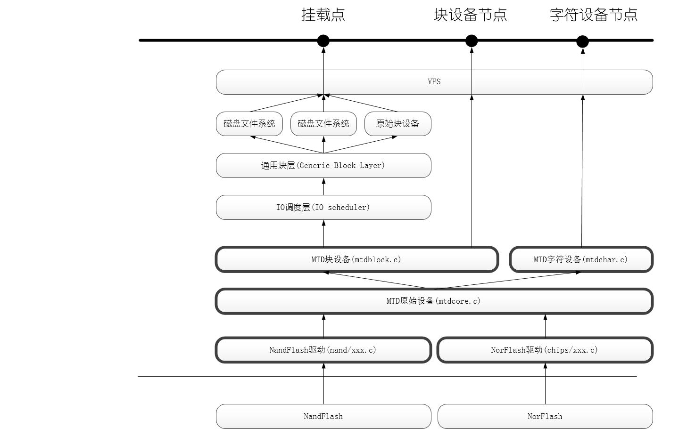

# 第二周记录


## SylixOS

SylixOS 还提供了一些方便文件系统使用的组件，它们包括：磁盘分区检查工具，磁盘缓冲器，磁盘自动挂载工具等。

SylixOS 的文件系统实际上是一组虚拟的设备驱动，它提供两组 API 接口，对上符合 I/O 系统标准，对下要求设备驱动符合块设备标准。

SylixOS 内部所有的设备（包括文件系统）都必须挂载到根文件系统上；

磁盘自动挂载工具是将很多磁盘工具封装在一起的一个工具集。设备可以通过热插拔事件将物理磁盘块设备交给磁盘自动挂载工具，这个工具首先会为这个磁盘开辟磁盘缓冲，然后会自动进 行磁盘分区检查，最后生成对应每个分区的虚拟块设备，最后这个工具会识别每一个分区的文件系统类型，并装载与之对应的文件系统；

FTL是Flash Translation Layer，让Flash设备可当作Block设备来被系统使用。

## Linux中常见文件系统

> 整理一些自认为有必要了解的关于Linux中常见的文件系统的知识

### 基于FLASH的文件系统

#### 1 JFFS2

基于MTD驱动层

#### 2 YAFFS

yaffs/yaffs2自带NAND芯片的驱动，并且为嵌入式系统提供了直接访问文件系统的API，用户可以不使用Linux中的MTD与VFS，直接对文件系统操作。当然，yaffs也可与MTD驱动程序配合使用。

#### 3 CramFS

一种只读的压缩文件系统。也基于MTD驱动程序。

每一页(4KB)被单独压缩，可以随机页访问。

在运行时解压缩，所以不支持应用程序以XIP方式运行，所有的应用程序要求被拷到RAM里去运行。

只读属性同时又是它的一大缺陷，使得用户无法对其内容对进扩充。

#### 4 RomFS

不支持动态擦写保存，**按顺序存放数据，因而支持应用程序以XIP**(eXecute In Place，片内运行)方式运行，在系统运行时，节省RAM空间。

### 基于RAM的文件系统

#### 1 RamDisk

RamDisk是将一部分固定大小的内存当作分区来使用。它并非一个实际的文件系统，而是一种将实际的文件系统装入内存的机制，并且可以作为根文件系统。

#### 2 RamFS/TmpFS

一种基于内存的文件系统，工作于虚拟文件系统(VFS)层，不能格式化，可以创建多个，在创建时可以指定其最大能使用的内存大小。(实际上，VFS本质上可看成一种内存文件系统，它统一了文件在内核中的表示方式，并对磁盘文件系统进行缓冲。)

Ramfs/tmpfs文件系统把所有的文件都放在RAM中，所以读/写操作发生在RAM中，可以用ramfs/tmpfs来存储一些临时性或经常要修改的数据，例如/tmp和/var目录，这样既避免了对Flash存储器的读写损耗，也提高了数据读写速度。

Ramfs/tmpfs相对于传统的Ramdisk的不同之处主要在于：不能格式化，文件系统大小可随所含文件内容大小变化。

Tmpfs就是Ramfs可以指定size的版本，即Ramfs的size不确定，用户可一直向Ramfs中写数据直到ram满。

Tmpfs的一个缺点是当系统重新引导时会丢失所有数据。

Rootfs是一种特殊的Ramfs或Tmpfs。


## TPSFS

TPSFS中以块为单位，一个块可能由多个物理扇区sector组成；

TPSFS数据块大小为4096字节，为4个扇区。它是文件系统为文件或者目录分配的最小单位。

数据块区域不仅仅是文件数据，它里面至少有四种数据。

1. 元数据，就是inode节点，一个文件或者一个目录都有一个inode节点，保存它的属性

2. 目录数据，目录也被看做一个文件，只不过它里面的数据是目录下文件或者目录所对应的文件号(就是inode号)和文件名。

3. 文件数据。

4. TPSFS一个inode块后面是B+树的node节点，

**如果一个块是inode块**，则inode占用一个扇区大小（inode结构体要比512小很多），该块内的数据区起始于2048字节，中间是node节点（node节点应该是数据区不够大时，用来连接其他块的，这个node还和b+树相关，看得不是太懂）

**如果一个块被分给目录数据时**，那它里面就只有目录数据，不会有文件数据，也不会有inode节点。

**如果一个块被分给文件数据时**，那它里面就只有文件数据，不会有目录数据和inode节点。

TPSFS只有在写文件数据时采用非事务写，其他都采用事务写机制。


## MTD

MTD(memory technology device)是用于访问memory设备（比如NOR Flash、NAND Flash）的Linux的子系统；MTD将 Nand Flash,nor flash 和其他类型的 flash 等设备,统一抽象成MTD 设备来管理。

MTD将文件系统与底层的Flash存储器进行了隔离，使Flash驱动工程师无须关心Flash作为字符设备和块设备与Linux内核的接口。

MTD设备既非块设备也不是字符设备，但可以同时提供字符设备和块设备接口来操作它。

SD/MMC卡、CF（Compact Flash）卡、USB Flash等并不是MTD设备，因为这些设备中已经有一个内置的Flash Translation Layer，这个layer处理erase、wear leveling事情了（这个TL应该是固件中支持的）。所以这些设备直接当做普通的Block Device使用。

 Linux系统中/dev/mtdx是MTD char设备。

MTD block设备是垃圾，**别用**。MTD block掉电会损失当前正在写的block数据，且**MTD block不提供磨损平衡**。当然只读文件系统可以用MTD block。

### 一 MTD逻辑层次

引入MTD后，linux系统中的flash设备驱动及接口可分为4层：设备节点、MTD设备层、MTD原始层和硬件驱动。

**1 Flash硬件驱动层**

硬件驱动层负责在init时驱动Flash硬件并建立从具体设备到MTD原始设备映射关系

tip: 映射关系通常包括 分区信息、I/O映射及特定函数的映射 

> drivers/mtd/chips :  CFI/jedec接口通用驱动 
>
> drivers/mtd/nand :  nand通用驱动和部分底层驱动程序 
>
> drivers/mtd/maps :  nor flash映射关系相关函数 
>
> drivers/mtd/devices:  nor flash底层驱动

Linux中常见Flash硬件驱动：PCMCIA，CFI Nor Flash，Onboard Nand Flash，M-Systems' DiskOnChip 2000 and Millennium。

> - PCMCIA devices：PCMCIA flash (not CompactFlash but real flash) cards are now supported by the pcmciamtd driver in CVS.
> - Common Flash Interface (CFI) onboard NOR flash：This is a common solution and is well-tested and supported, most often using JFFS2 or cramfs file systems.
> - Onboard NAND flash：NAND flash is rapidly overtaking NOR flash due to its larger size and lower cost; JFFS2 support for NAND flash is approaching production quality.
> - M-Systems' DiskOnChip 2000 and Millennium：The DiskOnChip 2000, Millennium and Millennium Plus devices should be fully supported, using their native NFTL and INFTL 'translation layers'. Support for JFFS2 on DiskOnChip 2000 and Millennium is also operational although lacking proper support for bad block handling.

**2 MTD原始设备** 

用于描述MTD原始设备的数据结构是mtd_info，它定义了大量的关于MTD的数据和操作函数。

> mtdcore.c : MTD原始设备接口相关实现 
>
> mtdpart.c : MTD分区接口相关实现

**3 MTD设备层** 

基于MTD原始设备，linux系统可以定义出MTD的块设备（主设备号31）和字符设备（设备号90）。

> mtdchar.c : MTD字符设备接口相关实现 
>
> mtdblock.c : MTD块设备接口相关实现

**4 设备节点** 

通过mknod在/dev子目录下建立MTD块设备节点（主设备号为31）和MTD字符设备节点（主设备号为90）

通过访问此设备节点即可访问MTD字符设备和块设备

**5 文件系统** 

内核启动后，通过mount 命令可以将flash中的其余分区作为文件系统挂载到mountpoint上。


### 二 MTD系统分析

> 这部分内容借鉴自网络博客，基于Linux3.14.0

MTD设备的Nor Flash芯片驱动位于drivers/mtd/chips/子目录下，Nand Flash芯片的驱动则位于drivers/mtd/nand/子目录下。

#### MTD子系统框架



- **设备节点层**:MTD框架可以在/dev下创建字符设备节点(主设备号90)以及块设备节点(主设备号31), 用户通过访问此设备节点即可访问MTD字符设备或块设备。
- **MTD设备层**: 基于MTD原始设备, Linux在这一层次定义出了MTD字符设备和块设备, 字符设备在mtdchar.c中实现, 块设备则是通过结构mtdblk_dev来描述,**"/drivers/mtd/mtdchar.c"**文件实现了MTD字符设备接口; **"/drivers/mtd/mtdblock.c"**文件实现了MTD块设备接口
- **MTD原始设备层**: 由MTD原始设备的通用代码+特定的Flash数据组成。mtd_info、mtd_part、mtd_partition以及mtd_partitions等对象及其操作方法就属于这一层，对应的文件是**"drivers/mtd/mtdcore.c"**。类似于i2c驱动框架中的核心层。
- **硬件驱动层**: 内核将常用的flash操作都已经在这个层次实现, 驱动开发只需要将相应的设备信息添加进去即可, 比如,NOR flash的芯片驱动位于**"drivers/mtd/chips/"**, Nand flash位于**"drivers/mtd/nand/"**

#### 核心结构和方法简述

为了实现上述的框架, 内核中使用了如下类和API, 这些几乎是开发一个MTD驱动必须的

##### 核心结构

- **mtd_info**描述原始设备层的一个分区的结构, 描述一个设备或一个多分区设备中的一个分区
- **mtd_table**管理原始设备层的mtd_info的数组
- **mtd_part**表示一个分区, 其中的struct mtd_info mtd描述该分区的信息， 一个物理Flash设备可以有多于1个mtd_part，每个mtd_part都对应一个mtd_info。
- **mtd_partition**描述一个分区表, 通过管理mtd_part以及每一个mtd_part中的mtd_info来描述所有的分区，一个物理Flash设备只有一个mtd_partition
- **mtd_partitions**是一个list_head对象，用于管理mtd_partition们
- **map_info**描述一个NOR Flash设备
- **nand_chip**描述一个NAND Flash设备

##### 核心方法

- **add_mtd_device()/del_mtd_device()**注册/注销一个MTD设备
- **add_mtd_partitions()/del_mtd_partitions()**注册注销一个或多个分区表,
- **do_map_probe()**用来根据传入的参数匹配一个map_info对象的驱动，比如CFI接口或JEDEC接口的NOR Flash，并返回一个mtd_info以便注册分区信息。
- **nand_scan()**：NAND flash使用这个API来匹配驱动。

#### 核心结构和方法详述

##### mtd_info

本身是没有list_head来供内核管理，对mtd_info对象的管理是通过mtd_part来实现的。mtd_info对象属于原始设备层，里面的很多函数接口内核已经实现了。mtd_info中的read()/write()等操作是MTD设备驱动要实现的主要函数，在NORFlash或NANDFlash中的驱动代码中几乎看不到mtd_info的成员函数，即这些函数对于Flash芯片是透明的，因为Linux在MTD的下层实现了针对NORFlash和NANDFlash的通用的mtd_info函数。

```c
114 struct mtd_info {
115         u_char type;
116         uint32_t flags;
117         uint64_t size;   // Total size of the MTD
118 
123         uint32_t erasesize;
131         uint32_t writesize;
132 
142         uint32_t writebufsize;
143 
144         uint32_t oobsize;   // Amount of OOB data per block (e.g. 16)
145         uint32_t oobavail;  // Available OOB bytes per block
146 
151         unsigned int erasesize_shift;
152         unsigned int writesize_shift;
153         /* Masks based on erasesize_shift and writesize_shift */
154         unsigned int erasesize_mask;
155         unsigned int writesize_mask;
156 
164         unsigned int bitflip_threshold;
165 
166         // Kernel-only stuff starts here.
167         const char *name;
168         int index;
169 
170         /* ECC layout structure pointer - read only! */ 
171         struct nand_ecclayout *ecclayout;
172 
173         /* the ecc step size. */
174         unsigned int ecc_step_size;
175 
176         /* max number of correctible bit errors per ecc step */
177         unsigned int ecc_strength;
178 
179         /* Data for variable erase regions. If numeraseregions is zero,
180          * it means that the whole device has erasesize as given above.
181          */
182         int numeraseregions;
183         struct mtd_erase_region_info *eraseregions;
184 
185         /*
186          * Do not call via these pointers, use corresponding mtd_*()
187          * wrappers instead.
188          */
189         int (*_erase) (struct mtd_info *mtd, struct erase_info *instr);
190         int (*_point) (struct mtd_info *mtd, loff_t from, size_t len,
191                        size_t *retlen, void **virt, resource_size_t *phys);
192         int (*_unpoint) (struct mtd_info *mtd, loff_t from, size_t len);
193         unsigned long (*_get_unmapped_area) (struct mtd_info *mtd,
194                                              unsigned long len,
195                                              unsigned long offset,
196                                              unsigned long flags);
197         int (*_read) (struct mtd_info *mtd, loff_t from, size_t len,
198                       size_t *retlen, u_char *buf);
199         int (*_write) (struct mtd_info *mtd, loff_t to, size_t len,
200                        size_t *retlen, const u_char *buf);
201         int (*_panic_write) (struct mtd_info *mtd, loff_t to, size_t len,
202                              size_t *retlen, const u_char *buf);
203         int (*_read_oob) (struct mtd_info *mtd, loff_t from,
204                           struct mtd_oob_ops *ops);
205         int (*_write_oob) (struct mtd_info *mtd, loff_t to,
206                            struct mtd_oob_ops *ops);
207         int (*_get_fact_prot_info) (struct mtd_info *mtd, struct otp_info *buf,
208                                     size_t len);
209         int (*_read_fact_prot_reg) (struct mtd_info *mtd, loff_t from,
210                                     size_t len, size_t *retlen, u_char *buf);
211         int (*_get_user_prot_info) (struct mtd_info *mtd, struct otp_info *buf,
212                                     size_t len);
213         int (*_read_user_prot_reg) (struct mtd_info *mtd, loff_t from,
214                                     size_t len, size_t *retlen, u_char *buf);
215         int (*_write_user_prot_reg) (struct mtd_info *mtd, loff_t to,
216                                      size_t len, size_t *retlen, u_char *buf);
217         int (*_lock_user_prot_reg) (struct mtd_info *mtd, loff_t from,
218                                     size_t len);
219         int (*_writev) (struct mtd_info *mtd, const struct kvec *vecs,
220                         unsigned long count, loff_t to, size_t *retlen);
221         void (*_sync) (struct mtd_info *mtd);
222         int (*_lock) (struct mtd_info *mtd, loff_t ofs, uint64_t len);
223         int (*_unlock) (struct mtd_info *mtd, loff_t ofs, uint64_t len);
224         int (*_is_locked) (struct mtd_info *mtd, loff_t ofs, uint64_t len);
225         int (*_block_isbad) (struct mtd_info *mtd, loff_t ofs);
226         int (*_block_markbad) (struct mtd_info *mtd, loff_t ofs);
227         int (*_suspend) (struct mtd_info *mtd);
228         void (*_resume) (struct mtd_info *mtd);
229         /*
230          * If the driver is something smart, like UBI, it may need to maintain
231          * its own reference counting. The below functions are only for driver.
232          */
233         int (*_get_device) (struct mtd_info *mtd);
234         void (*_put_device) (struct mtd_info *mtd);
235 
236         /* Backing device capabilities for this device
237          * - provides mmap capabilities
238          */
239         struct backing_dev_info *backing_dev_info;
240 
241         struct notifier_block reboot_notifier;  /* default mode before reboot */
242 
243         /* ECC status information */
244         struct mtd_ecc_stats ecc_stats;
245         /* Subpage shift (NAND) */
246         int subpage_sft;
247 
248         void *priv;
249 
250         struct module *owner;
251         struct device dev;
252         int usecount;
253 };
```

> **struct mtd_info**
> --115-->MTD设备类型，有MTD_RAM，MTD_ROM、MTD_NORFLASH、MTD_NAND_FLASH
> --116-->读写及权限标志位，有MTD_WRITEABLE、MTD_BIT_WRITEABLE、MTD_NO_ERASE、MTD_UP_LOCK
> --117-->MTD设备的大小
> --123-->主要的擦除块大小，NandFlash就是"块"的大小
> --131-->最小可写字节数，NandFlash一般对应"页"的大小
> --144-->一个block中的OOB字节数
> --145-->一个block中可用oob的字节数
> --171-->ECC布局结构体指针
> --190-->针对eXecute-In-Place，即XIP
> --192-->如果这个指针为空，不允许XIP
> --197-->读函数指针
> --199-->写函数指针
> --248-->私有数据

##### mtd_part

内核管理分区的链表节点，通过它来实现对mtd_info对象的管理。

```c
 41 struct mtd_part {
 42         struct mtd_info mtd;
 43         struct mtd_info *master;                                            
 44         uint64_t offset;
 45         struct list_head list;
 46 };
```

> **struct mtd_part**
> --42-->对应的mtd_info对象
> --43-->父对象指针
> --44-->偏移量
> --45-->链表节点

##### mtd_partition

描述一个分区

```c
 39 struct mtd_partition {
 40         const char *name;               /* identifier string */
 41         uint64_t size;                  /* partition size */
 42         uint64_t offset;                /* offset within the master MTD space */                                                
 43         uint32_t mask_flags;            /* master MTD flags to mask out for this partition */
 44         struct nand_ecclayout *ecclayout;       /* out of band layout for this partition (NAND only) */
 45 };
```

> **mtd_partition**
> --40-->分区名
> --41-->分区大小，使用MTDPART_SIZ_FULL表示使用全部空间
> --42-->分区在master设备中的偏移量。MTDPART_OFS_APPEND表示从上一个分区结束的地方开始，MTDPART_OFS_NXTBLK表示从下一个擦除块开始; MTDPART_OFS_RETAIN表示尽可能向后偏，把size大小的空间留下即可
> --43-->权限掩码，MTD_WRITEABLE表示将父设备的只读选项变成可写(可写分区要求size和offset要erasesize对齐，eg MTDPART_OFS_NEXTBLK)
> --44-->NANDFlash的OOB布局，OOB是NANDFlash中很有用空间，比如yaffs2就需要将坏块信息存储在OOB区域

##### mtd_partitions

链表头，将所有的mtd_partition连接起来。

```c
 36 /* Our partition linked list */
 37 static LIST_HEAD(mtd_partitions);  
```

下图是关键API的调用关系。

> mtd_add_partition()
>   └── add_mtd_device()
> add_mtd_partitions()
>   └── add_mtd_device()

##### add_mtd_device()

分配并初始化一个mtd对象。

```c
 334 int add_mtd_device(struct mtd_info *mtd)
 335 {
 336         struct mtd_notifier *not;
 337         int i, error;
 338 
 339         if (!mtd->backing_dev_info) {
 340                 switch (mtd->type) {
 341                 case MTD_RAM:
 342                         mtd->backing_dev_info = &mtd_bdi_rw_mappable;
 343                         break;
 344                 case MTD_ROM:
 345                         mtd->backing_dev_info = &mtd_bdi_ro_mappable;
 346                         break;
 347                 default:
 348                         mtd->backing_dev_info = &mtd_bdi_unmappable;
 349                         break;
 350                 }
 351         }
 355 
 356         i = idr_alloc(&mtd_idr, mtd, 0, 0, GFP_KERNEL);	//分配设备号
 357         if (i < 0)
 358                 goto fail_locked;
 359 
 360         mtd->index = i;
 361         mtd->usecount = 0;
 362 
 363         /* default value if not set by driver */
 364         if (mtd->bitflip_threshold == 0)
 365                 mtd->bitflip_threshold = mtd->ecc_strength;
 366 
 367         if (is_power_of_2(mtd->erasesize))
 368                 mtd->erasesize_shift = ffs(mtd->erasesize) - 1;
 369         else
 370                 mtd->erasesize_shift = 0;
 371 
 372         if (is_power_of_2(mtd->writesize))                                                         
 373                 mtd->writesize_shift = ffs(mtd->writesize) - 1;
 374         else
 375                 mtd->writesize_shift = 0;
 376 
 377         mtd->erasesize_mask = (1 << mtd->erasesize_shift) - 1;
 378         mtd->writesize_mask = (1 << mtd->writesize_shift) - 1;
 379 
 380         /* Some chips always power up locked. Unlock them now */
 381         if ((mtd->flags & MTD_WRITEABLE) && (mtd->flags & MTD_POWERUP_LOCK)) {
 382                 error = mtd_unlock(mtd, 0, mtd->size);
 387         }
 388 
 392         mtd->dev.type = &mtd_devtype;
 393         mtd->dev.class = &mtd_class;
 394         mtd->dev.devt = MTD_DEVT(i);
 395         dev_set_name(&mtd->dev, "mtd%d", i);
 396         dev_set_drvdata(&mtd->dev, mtd);
 397         if (device_register(&mtd->dev) != 0)
 399 
 400         if (MTD_DEVT(i))
 401                 device_create(&mtd_class, mtd->dev.parent,
 402                               MTD_DEVT(i) + 1,
 403                               NULL, "mtd%dro", i);
 408         list_for_each_entry(not, &mtd_notifiers, list)
 409                 not->add(mtd);
 417         return 0;
 424 }
```

> **add_mtd_device()**
> --395-->设置MTD设备的名字
> --396-->设置私有数据，将mtd地址藏到device->device_private->void* driver_data
> --408-->遍历所有的mtd_notifier，将其添加到通知链

##### mtd_add_partition()

通过将一个mtd_part对象注册到内核，将mtd_info对象注册到内核，即为一个设备添加一个分区。

```c
537 int mtd_add_partition(struct mtd_info *master, const char *name,
538                       long long offset, long long length)
539 {
540         struct mtd_partition part;
541         struct mtd_part *p, *new;
542         uint64_t start, end;
543         int ret = 0;
545         /* the direct offset is expected */
546         if (offset == MTDPART_OFS_APPEND ||                                                         
547             offset == MTDPART_OFS_NXTBLK)
548                 return -EINVAL;
549 
550         if (length == MTDPART_SIZ_FULL)
551                 length = master->size - offset;
552 
553         if (length <= 0)
554                 return -EINVAL;
555 
556         part.name = name;
557         part.size = length;
558         part.offset = offset;
559         part.mask_flags = 0;
560         part.ecclayout = NULL;
561 
562         new = allocate_partition(master, &part, -1, offset);
563         if (IS_ERR(new))
564                 return PTR_ERR(new);
565 
566         start = offset;
567         end = offset + length;
568 
569         mutex_lock(&mtd_partitions_mutex);
570         list_for_each_entry(p, &mtd_partitions, list)
571                 if (p->master == master) {
572                         if ((start >= p->offset) &&
573                             (start < (p->offset + p->mtd.size)))
574                                 goto err_inv;
575 
576                         if ((end >= p->offset) &&
577                             (end < (p->offset + p->mtd.size)))
578                                 goto err_inv;
579                 }
580 
581         list_add(&new->list, &mtd_partitions);
582         mutex_unlock(&mtd_partitions_mutex);
583 
584         add_mtd_device(&new->mtd);
585 
586         return ret;
591 }
```

##### add_mtd_partitions()

添加一个分区表到内核，一个MTD设备一个分区表

```c
626 int add_mtd_partitions(struct mtd_info *master,
627                        const struct mtd_partition *parts,
628                        int nbparts)
629 {
630         struct mtd_part *slave;
631         uint64_t cur_offset = 0;
632         int i;
636         for (i = 0; i < nbparts; i++) {
637                 slave = allocate_partition(master, parts + i, i, cur_offset);
642                 list_add(&slave->list, &mtd_partitions);
645                 add_mtd_device(&slave->mtd);
647                 cur_offset = slave->offset + slave->mtd.size;
648         }
649 
650         return 0;                                                                                   
651 }
```

#### 用户空间编程

MTD设备提供了字符设备和块设备两种接口，对于字符设备接口，在**"drivers/mtd/mtdchar.c"**中实现了，比如，用户程序可以直接通过ioctl()回调相应的驱动实现。其中下面的几个是这些操作中常用的结构，这些结构是对用户空间开放的，类似于输入子系统中的input_event结构。

##### mtd_info_user

```c
//include/uapi/mtd/mtd-abi.h
125 struct mtd_info_user {                                                                              
126         __u8 type;
127         __u32 flags;
128         __u32 size;     /* Total size of the MTD */
129         __u32 erasesize;    
130         __u32 writesize;        
131         __u32 oobsize;  /* Amount of OOB data per block (e.g. 16) */
132         __u64 padding;  /* Old obsolete field; do not use */
133 };
```

##### mtd_oob_buf

描述NandFlash的OOB（Out Of Band）信息。

```c
 35 struct mtd_oob_buf {                                                                                
 36         __u32 start;
 37         __u32 length;
 38         unsigned char __user *ptr;
 39 };
```

##### erase_info_user

```c
 25 struct erase_info_user {
 26         __u32 start;
 27         __u32 length;
 28 };
```

##### 实例

```c
mtd_oob_buf oob;
erase_info_user erase;
mtd_info_user meminfo;

/* 获得设备信息 */
if(0 != ioctl(fd, MEMGETINFO, &meminfo))
    perror("MEMGETINFO");
    
/* 擦除块 */
if(0 != ioctl(fd, MEMERASE, &erase))
    perror("MEMERASE");

/* 读OOB */
if(0 != ioctl(fd, MEMREADOOB, &oob))
    perror("MEMREADOOB");

/* 写OOB??? */    
if(0 != ioctl(fd, MEMWRITEOOB, &oob))
    perror("MEMWRITEOOB");
    
/* 检查坏块 */
if(blockstart != (ofs & (~meminfo.erase + 1))){
    blockstart = ofs & (~meminfo.erasesize + 1);
    if((badblock = ioctl(fd, MEMGETBADBLOCK, &blockstart)) < 0)
        perror("MEMGETBADBLOCK");
    else if(badblock)
        /* 坏块代码 */
    else
        /* 好块代码 */
}
```

NANDFlash和NORFlash都是基于MTD框架编写的，由于MTD框架中通用代码已经在内核中实现了，所以驱动开发主要是进行MTD框架中的的开发。

#### NorFlash驱动

下图就是NORFlash驱动在MTD驱动框架中的位置


基于上述的MTD框架, Flash驱动都变的十分的简单, 因为当下Flash的操作接口已经很统一, a, 相应的代码在**"drivers/mtd/chips"**中文件实现，所以在设备驱动层, 留给驱动工程师的工作就大大的减少了。
基于MTD子系统开发NOR FLash驱动，只需要构造一个map_info类型的对象并调用do_map_probe()来匹配内核中已经写好的驱动，比如CFI接口的驱动或JEDEC接口的驱动。当下编写一个NorFlash驱动的工作流程如下：


##### map_info

```c
208 struct map_info {
209         const char *name;
210         unsigned long size;
211         resource_size_t phys;
212 #define NO_XIP (-1UL)
214         void __iomem *virt;
215         void *cached;
217         int swap; /* this mapping's byte-swapping requirement */
218         int bankwidth; 
243         void (*set_vpp)(struct map_info *, int);
245         unsigned long pfow_base;
246         unsigned long map_priv_1;
247         unsigned long map_priv_2;
248         struct device_node *device_node;
249         void *fldrv_priv;
250         struct mtd_chip_driver *fldrv;                                                              
251 };
```

> **struct map_info**
> --210-->NOR Flash设备的容量
> --211-->NOR Flash在物理地址空间中的地址
> --214-->由物理地址映射的虚拟地址
> --218-->总线宽度，NOR Flash是有地址总线的，所以才能片上执行，一般都是8位或16位宽

构造好一个map_info对象之后，接下来的工作就是**匹配驱动+注册分区表**

##### do_map_probe()

这个API用来根据传入的参数匹配一个map_info对象的驱动，比如CFI接口或JEDEC接口的NOR Flash。这个函数的接口如下：

```c
struct mtd_info *do_map_probe(const char *name, struct map_info *map)
```

对于常用的NorFlash标准，这个函数的调用方式如下：

```c
do_map_probe("cfi_probe", &xxx_map_info);
do_map_probe("jedec_probe",&xxx_map_info);
do_map_probe("map_rom",&xxx_map_info);
```

匹配了设备驱动，可以发现一个map_info对象中没有mtd_partitions相关的信息，对于一个NOR Flash的分区信息，需要通过do_map_probe返回的mtd_info对象来注册到内核。这里我们可以先调用parse_mtd_partitions()查看Flash上已有的分区信息，获取了分区信息之后再调用add_mtd_partitions()将分区信息写入内核。

##### NOR Flash驱动模板

```c
#define WINDOW_SIZE ...
#define WINDOW_ADDR ...
static struct map_info xxx_map = {
    .name = "xxx flash",
    .size = WINDOW_SIZE,
    .bankwidth = 1,
    .phys = WINDOW_ADDR,
};

static struct mtd_partition xxx_partitions[] = {
    .name = "Drive A",
    .offset = 0,
    .size = 0x0e000,
};

#define NUM_PARTITIONS ARRAY_SIZE(xxx_partitions)

static struct mtd_info *mymtd;

static int __init init_xxx_map(void)
{
    int rc = 0;
    xxx_map.virt = ioremap_nocache(xxx_map.phys, xxx_map.size);
    if(!xxx_map.virt){
        printk(KERN_ERR"Failed to ioremap_nocache\n");
        rc = -EIO;
        goto err2;
    }
    simple_map_init(&xxx_map);
    mymtd = do_map_probe("jedec_probe", &xxx_map);
    if(!mymtd){
        rc = -ENXIO;
        goto err1;
    }
    mymtd->owner = THIS_MODULE;
    add_mtd_partitions(mymtd, xxx_partitions, NUM_PARTITIONS);
    return 0;
err1:
    map_destroy(mymtd);
    iounmap(xxx_map.virt);
err2:
    return rc;
}
static void __exit cleanup_xxx_map(void)
{
    if(mymtd){
        del_mtd_partitions(mymtd);
        map_destroy(mymtd);
    }
    
    if(xxx_map.virt){
        iounmap(xxx_map.virt);
        xxx_map.virt = NULL;
    }
}
```

#### NandFlash驱动

下图就是基于MTD框架的NandFlash驱动的位置。


Nand Flash和NOR Flash类似，内核中已经在**"drivers/mtd/nand/nand_base.c"**中实现了通用的驱动程序，驱动开发中不需要再实现mtd_info中的read, write, read_oob, write_oob等接口，只需要构造并注册一个nand_chip对象， 这个对象主要描述了一片flash芯片的相关信息，包括地址信息，读写方法，ECC模式，硬件控制等一系列底层机制。当下，编写一个NandFlash驱动的工作流程如下：


##### nand_chip

这个结构描述一个NAND Flash设备，通常藏在mtd_info->priv中，以便在回调其中的接口的时候可以找到nand_chip对象。

```c
547 struct nand_chip {
548         void __iomem *IO_ADDR_R;
549         void __iomem *IO_ADDR_W;
550 
551         uint8_t (*read_byte)(struct mtd_info *mtd);
578 
579         int chip_delay;
580         unsigned int options;
581         unsigned int bbt_options;
582 
583         int page_shift;
584         int phys_erase_shift;
585         int bbt_erase_shift;
586         int chip_shift;
587         int numchips;
588         uint64_t chipsize;
589         int pagemask;
590         int pagebuf;
591         unsigned int pagebuf_bitflips;
592         int subpagesize;
593         uint8_t bits_per_cell;
594         uint16_t ecc_strength_ds;
595         uint16_t ecc_step_ds;
596         int badblockpos;
597         int badblockbits;
598 
599         int onfi_version;
600         struct nand_onfi_params onfi_params;
601 
602         int read_retries;
603 
604         flstate_t state;
605 
606         uint8_t *oob_poi;
607         struct nand_hw_control *controller;
608 
609         struct nand_ecc_ctrl ecc;
610         struct nand_buffers *buffers;
611         struct nand_hw_control hwcontrol;
612 
613         uint8_t *bbt;
614         struct nand_bbt_descr *bbt_td;
615         struct nand_bbt_descr *bbt_md;
616 
617         struct nand_bbt_descr *badblock_pattern;
618 
619         void *priv;
620 };
```

>**struct nand_chip**
>--609-->NAND芯片的OOB分布和模式，如果不赋值，则会使用内核默认的OOB
>--580-->与具体的NAND 芯片相关的一些选项，如NAND_BUSWIDTH_16 等，可以参考<Linux/mtd/nand.h>
>--583-->用位表示的NAND 芯片的page 大小，如某片NAND 芯片的一个page 有512 个字节，那么page_shift 就是9 ；
>--584-->用位表示的NAND 芯片的每次可擦除的大小，如某片NAND 芯片每次可擦除16K 字节( 通常就是一个block 的大小) ，那么phys_erase_shift 就是14 ；
>--585-->用位表示的bad block table 的大小，通常一个bbt 占用一个block ，所以bbt_erase_shift 通常与phys_erase_shift 相等；
>--587-->表示系统中有多少片NAND 芯片；
>--588-->NAND 芯片的大小；
>--589-->计算page number 时的掩码，总是等于chipsize/page 大小 － 1 ；
>--590-->用来保存当前读取的NAND 芯片的page number ，这样一来，下次读取的数据若还是属于同一个page ，就不必再从NAND 芯片读取了，而是从data_buf 中直接得到；
>--596-->表示坏块信息保存在oob 中的第几个字节。对于绝大多数的NAND 芯片，若page size> 512，那么坏块信息从Byte 0 开始存储，否则就存储在Byte 5 ，即第六个字节。
>--619-->私有数据

##### nand_scan()

准备好了一个nand_chip，接下来的工作就是**匹配驱动+注册分区表**。
NAND flash使用nand_scan()来匹配驱动，这个函数会读取NAND芯片的ID，并根据mtd->priv即nand_chip中的成员初始化mtd_info。如果要分区，则以mtd_info和mtd_partition为参数调用add_mtd_partitions来添加分区信息。

```c
int nand_scan(struct mtd_info *mtd, int maxchips)  
```

##### NandFlash驱动模板

```c
#define CHIP_PHYSICAL_ADDRESS ...  
#define NUM_PARTITIONS 2 
static struct mtd_partition partition_info[] = { 
        { 
                .name = "Flash partition 1", 
                .info = 0, 
                .size = 8 * 1024 * 1024, 
        }, 
        { 
                .name = "Flash partition 2", 
                offset = MTDPART_OFS_NEXT, 
                size = MTDPART_SIZ_FULL, 
        }, 
}; 
 
 
int __init board_init(void) 
{ 
        struct nand_chip *this; 
        int err = 0; 
        /* 为MTD设备对象和nand_chip分配内存 */ 
        board_mtd = kmalloc(sizeof(struct mtd_info) + sizeof(struct nand_chip),GFP_KERNEL); 
        if(!board_mtd){ 
                printk("Unable to allocate NAND MTD device structure\n"); 
                err = -ENOMEM; 
                goto out; 
        } 
 
        /* 初始化结构体 */ 
        memset((char *)board_mtd, 0 ,sizeof(struct mtd_info) + sizeof(struct nand_chip)); 
 
        /* 映射物理地址 */ 
        baseaddr = (unsigned long) ioremap(CHIP_PHYSICAL_ADDRESS,1024); 
        if(!baseaddr){ 
                printk("Ioremap to access NAND Chip failed\n"); 
                err = -EIO; 
                goto out_mtd; 
        } 
 
        /* 获取私有数据(nand_chip)指针 */ 
        this = (struct nand_chip *)(&board_mtd[1]); 
 
        /* 将nand_chip赋予mtd_info私有指针 */ 
        board_mtd->priv = this; 
 
        /* 设置NAND Flash的IO基地址 */ 
        this->IO_ADDR_R = baseaddr; 
        this->IO_ADDR_W = baseaddr; 
 
        /* 硬件控制函数 */ 
        this->cmd_ctrl = board_hwcontrol; 
 
        /* 初始化设备ready函数 */ 
        this->dev_ready = board_dev_ready; 
         
        /* 扫描以确定设备的存在 */ 
        if(nand_scan(board_mtd, 1)){ 
                err = -ENXIO; 
                goto = out_ior; 
        } 
 
        /* 添加分区 */ 
        add_mtd_partitions(board_mtd,partition_info,NUM_PARTITIONS); 
        goto out; 
out_ior: 
        iounmap((void *)baseaddr); 
out_mtd: 
        kfree(board_mtd); 
out: 
        return err; 
} 
 
static void __exit board_cleanup(void) 
{ 
        /* 释放资源，注销设备 */ 
        nand_release(board_mtd); 
 
        /* unmap物理地址 */ 
        iounmap((void *)baseaddr); 
 
        /* 释放MTD设备结构体 */ 
        kfree(board_mtd); 
} 
 
/* 硬件控制 */ 
static void board_hwcontrol(struct mtd_info *mtd, int dat,unsigned int ctrl) 
{ 
        ... 
        if(ctrl & NAND_CTRL_CHANGE){ 
                if(ctrl & NAND_NCE){ 
 
                } 
        } 
        ... 
} 
 
/*返回ready状态*/ 
static int board_dev_ready(struct mtd_info *mtd) 
{ 
        return xxx_read_ready_bit(); 
} 
```


## 关于Linux

> 记录本周学习到的与Linux有关的知识

### module

Linux中可以将一些部分的代码“模块化”，这样可以在Linux内核运行时动态地加载和卸载各种module，kernel其实也算是一个模块，只不过永远不能将kernel卸载罢了。这样当某个模块的代码发生改变，我们不必重新编译整个Linux内核，只需要将发生改动的模块编译，并通过insmod指令安装模块即可，之后观察 /etc/modules 应该就可以看到这个 module 的名字。

模块可以对其它模块或者kernel提供服务，每一个 module 都可以 export 一些 function 或变量来让别人使用。除此之外，module 也可以使用已经载到 kernel 里的 module 提供的 function。这种情形叫做 module stack。比方说，module A 用到 module B 的东西，那在加载 module A 之前必须要先加载 module B。否则 module A 会无法加载。

用ksyms -a 就可知道目前载到kernel里的module提供了哪些function或variable。

xxx.ver文件是给module中export出来的变量或函数的名称后面添加linux版本后缀的。.ver文件中一般是各种各样的define，在代码中include进.ver即可。

要写一个 module，必须要提供两个 function。这两个 function 是给 insmod 和 rmmod 使用的。它们分别是 init_module()，以及 cleanup_module()。

由于 module 是载到 kernel 使用的，所以，可能别的 module 会使用你的 module，甚至某些 process 也会使用到你的 module，为了避免 module 还有人使用时就被移除，每个 module 都有一个 use count。用来记录目前有多少个 process 或 module 正在使用这个 module。当 module 的 use count 不等于 0 时，module 是不会被移除掉的。也就是说，当 module 的 use count 不等于 0 时，cleanup_module() 是不会被呼叫的。module 的 use count 必须由写 module 的人自己来 maintain。

### Proc文件系统

/proc 文件系统是为了提供有关系统中进程的信息。但是由于这个文件系统非常有用，因此内核中的很多元素也开始使用它来报告信息，或启用动态运行时配置。其中包含一些数字编号的文件。每个实际上都是一个目录，表示系统中的一个进程。在 GNU/Linux 中创建的第一个进程是init进程，它的process id为 1。

proc_create在proc系统中创建文件；proc_mkdir在proc系统中创建目录；

这里只需要知道PDE_DATA(inode)会从inode找到该inode对应的proc_inode中的proc_dir_entry中的data即可。

### container_of

> Linux内核源码堪称C语言应用大全，其中充斥各种各样C语言的花样技巧

```c
/**
 * container_of - cast a member of a structure out to the containing structure
 *
 * @ptr:        the pointer to the member.
 * @type:       the type of the container struct this is embedded in.
 * @member:     the name of the member within the struct.
 *
 */
#define container_of(ptr, type, member) ({                      \
        const typeof( ((type *)0)->member ) *__mptr = (ptr);    \
        (type *)( (char *)__mptr - offsetof(type,member) );})
```

container_of是C语言中的一个高级用法，其中

> ptr：结构体变量中某个成员的地址
>
> type：结构体类型
>
> member:该结构体变量的具体名字

该函数就是已知某个结构体type中的某个成员member的地址ptr，返回该结构体的起始地址，例如

```c
struct A{
    int b;
    int c;
}
struct A a;
struct A* p_a = container_of(&a.b, struct A, b);	//通过b的地址就可以得到a的地址
```

其中

```c
#define offset_of(type, memb) \
        ((unsigned long)(&((type *)0)->memb))
//把0地址看成是某个结构体的起始地址, 那么相应成员的地址就自然是该成员相对于结构体起始位置的偏移量offset
```

