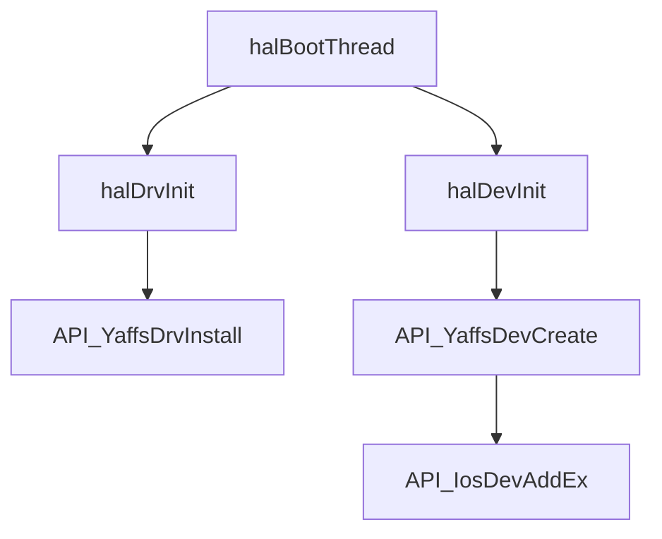
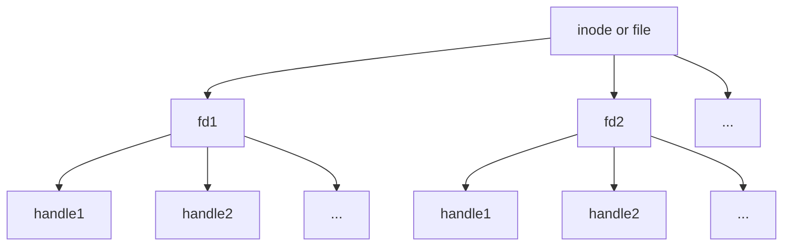
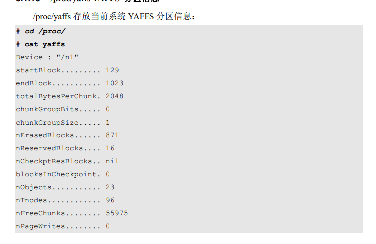

# YAFFS2（SylixOS）

### YAFFS2的机制

1. YAFFS2使用T节点树来保存文件。每个T节点树一共分为三级(level0,1,2)。 T-tree是一种一个节点中包含多个索引条目的平衡二叉树 。

### 名词解释

 Object：YAFFS 对象，通常包括文件、路径、链接、设备等。 

 Chunk：YAFFS 的寻址单元，通常与 Page 大小一致。

新型NEW_1驱动：字符设备驱动

```c
2013-01-04: han.hui
SylixOS 加入新的一种驱动程序模型(NEW_1), 主要是为了支持 UNIX 兼容系统的 vnode 功能, 
这样为 SylixOS 未来支持文件记录锁打好基础, 
SylixOS 可以同时支持多种驱动程序模型, 
ORIG 为 VxWorks 兼容驱动模型, 
NEW_1 为新一代驱动程序模型, 
SOCKET 为独立的 socket 模型, 
安装设备驱动时可以指定驱动程序的类型, 用户不可以建立 SOCKET 类型设备驱动.
```


### 源码分析

#### 装载YAFFS2大致流程



#### 函数所在文件

1. halBootThread -->(libsylixos\SylixOS\mktemp\mkdemo\bsp\SylixOS\bsp\bspInit.c)
2. halDrvInit-->(libsylixos\SylixOS\mktemp\mkdemo\bsp\SylixOS\bsp\bspInit.c)
3. halDevInit-->(libsylixos\SylixOS\mktemp\mkdemo\bsp\SylixOS\bsp\bspInit.c)
4. API_YaffsDrvInstall-->(libsylixos\SylixOS\fs\yaffs2\yaffs_sylixos.c)
5. API_YaffsDevCreate-->(libsylixos\SylixOS\fs\yaffs2\yaffs_sylixos.c)
6. API_IosDevAddEx-->(libsylixos\SylixOS\system\ioLib\ioSys.c)


#### 多任务初始化（可视为系统初始化）

```c
/*********************************************************************************************************
** 函数名称: halBootThread
** 功能描述: 多任务状态下的初始化启动任务
** 输　入  : NONE
** 输　出  : NONE
** 全局变量:
** 调用模块:
*********************************************************************************************************/
static PVOID  halBootThread (PVOID  pvBootArg)
{
    LW_CLASS_THREADATTR     threakattr = API_ThreadAttrGetDefault();    /*  使用默认属性                */

    (VOID)pvBootArg;

#if LW_CFG_SHELL_EN > 0
    halShellInit();
#endif                                                                  /*  LW_CFG_SHELL_EN > 0         */

#if LW_CFG_POWERM_EN > 0
    halPmInit();
#endif                                                                  /*  LW_CFG_POWERM_EN > 0        */

#if LW_CFG_DEVICE_EN > 0
    halBusInit();
    halDrvInit();	/* 驱动器初始化 */
    halDevInit();	/* 设备初始化 */
    halStdFileInit();
#endif                                                                  /*  LW_CFG_DEVICE_EN > 0        */

#if LW_CFG_LOG_LIB_EN > 0
    halLogInit();
    console_loglevel = default_message_loglevel;                        /*  设置 printk 打印信息等级    */
#endif                                                                  /*  LW_CFG_LOG_LIB_EN > 0       */

    /*
     *  以为 yaffs 挂载物理卷时, 需要 stdout 打印信息, 如果在 halDevInit() 中被调用, 由于没有创建
     *  标准文件, 所以会打印警告错误信息, 所以将此函数放在这里!
     *  如果未初始化标准文件会提示错误信息
     */
    /*
     * TODO: 加入你的处理代码, 参考代码如下:
     */
#if 0                                                                   /*  参考代码开始                */
#ifdef __GNUC__
    nand_init();
    mtdDevCreateEx("/n");                                               /*  mount mtddevice             */
#else
    nandDevCreateEx("/n");                                              /*  mount nandflash disk(yaffs) */
#endif
#endif                                                                  /*  参考代码结束                */

    halStdDirInit();                                                    /*  创建标准目录                */

    /*
     *  只有初始化了 shell 并获得了 TZ 环境变量标示的时区, 才可以调用 rtcToRoot()
     */
    system("varload");                                                  /*  从/etc/profile中读取环境变量*/
    lib_tzset();                                                        /*  通过 TZ 环境变量设置时区    */
    rtcToRoot();                                                        /*  将 RTC 时间同步到根文件系统 */

    /*
     *  网络初始化一般放在 shell 初始化之后, 因为初始化网络组件时, 会自动注册 shell 命令.
     */
#if LW_CFG_NET_EN > 0
    halNetInit();
    halNetifAttch();                                                    /*  wlan 网卡需要下载固件       */
#endif                                                                  /*  LW_CFG_NET_EN > 0           */

#if LW_CFG_POSIX_EN > 0
    halPosixInit();
#endif                                                                  /*  LW_CFG_POSIX_EN > 0         */

#if LW_CFG_SYMBOL_EN > 0
    halSymbolInit();
#endif                                                                  /*  LW_CFG_SYMBOL_EN > 0        */

#if LW_CFG_MODULELOADER_EN > 0
    halLoaderInit();
#endif                                                                  /*  LW_CFG_MODULELOADER_EN > 0  */

#if LW_CFG_MONITOR_EN > 0
    halMonitorInit();
#endif                                                                  /*  LW_CFG_MONITOR_EN > 0       */

    system("shfile /yaffs2/n0/etc/startup.sh");                         /*  执行启动脚本                */
                                                                        /*  必须在初始化 shell 后调用!! */

    API_ThreadAttrSetStackSize(&threakattr, __LW_THREAD_MAIN_STK_SIZE); /*  设置 main 线程的堆栈大小    */
    API_ThreadCreate("t_main",
                     (PTHREAD_START_ROUTINE)t_main,
                     &threakattr,
                     LW_NULL);                                          /*  Create "t_main()" thread    */

    return  (LW_NULL);
}
```


##### 驱动初始化

```c
/*********************************************************************************************************
** 函数名称: halDrvInit
** 功能描述: 初始化目标系统静态驱动程序
** 输　入  : NONE
** 输　出  : NONE
** 全局变量:
** 调用模块:
*********************************************************************************************************/
#if LW_CFG_DEVICE_EN > 0

static VOID  halDrvInit (VOID)
{
    /*
     *  standard device driver (rootfs and procfs need install first.)
     */
    rootFsDrv();                                                        /*  ROOT   device driver        */
    procFsDrv();                                                        /*  proc   device driver        */
    shmDrv();                                                           /*  shm    device driver        */
    randDrv();                                                          /*  random device driver        */
    ptyDrv();                                                           /*  pty    device driver        */
    ttyDrv();                                                           /*  tty    device driver        */
    memDrv();                                                           /*  mem    device driver        */
    pipeDrv();                                                          /*  pipe   device driver        */
    spipeDrv();                                                         /*  spipe  device driver        */
    tpsFsDrv();                                                         /*  TPS FS device driver        */
    fatFsDrv();                                                         /*  FAT FS device driver        */
    ramFsDrv();                                                         /*  RAM FS device driver        */
    romFsDrv();                                                         /*  ROM FS device driver        */
    nfsDrv();                                                           /*  nfs    device driver        */
    /*这里yaffsDrv()就是下面的INT  API_YaffsDrvInstall (VOID)*/
    yaffsDrv();                                                         /*  yaffs  device driver        */
    canDrv();                                                           /*  CAN    device driver        */

    /*
     * TODO: 加入你的处理代码, 参考代码如下:
     * 我认为这些TODO是我们做Nor flash文件系统需要添加初始化的地方
     */
#if 0                                                                   /*  参考代码开始                */
    INT              i;
    ULONG            ulMaxBytes;
    PLW_DMA_FUNCS    pdmafuncs;

    for (i = 0; i < 4; i++) {                                           /*  安装 2440 4 个通用 DMA 通道 */
        pdmafuncs = dmaGetFuncs(LW_DMA_CHANNEL0 + i, &ulMaxBytes);
        dmaDrv((UINT)i, pdmafuncs, (size_t)ulMaxBytes);                 /*  安装 DMA 控制器驱动         */
    }
#endif                                                                  /*  参考代码结束                */
}
```


###### yaffs2文件系统驱动程序初始化

```c
/*********************************************************************************************************
** 函数名称: API_YaffsDrvInstall
** 功能描述: 安装 yaffs 文件系统驱动程序
** 输　入  : 
** 输　出  : < 0 表示失败
** 全局变量: 
** 调用模块: 
                                           API 函数
*********************************************************************************************************/
LW_API 
INT  API_YaffsDrvInstall (VOID)
{
    struct file_operations     fileop;
    
    if (_G_iYaffsDrvNum > 0) {
        return  (ERROR_NONE);
    }
    /*fileop结构体初始化为0*/
    lib_bzero(&fileop, sizeof(struct file_operations));
    
    fileop.owner       = THIS_MODULE;
    fileop.fo_create   = __yaffsOpen;
    fileop.fo_release  = __yaffsRemove;
    fileop.fo_open     = __yaffsOpen;
    fileop.fo_close    = __yaffsClose;
    fileop.fo_read     = __yaffsRead;
    fileop.fo_read_ex  = __yaffsPRead;
    fileop.fo_write    = __yaffsWrite;
    fileop.fo_write_ex = __yaffsPWrite;
    fileop.fo_lstat    = __yaffsLStatGet;
    fileop.fo_ioctl    = __yaffsIoctl;
    fileop.fo_symlink  = __yaffsFsSymlink;
    fileop.fo_readlink = __yaffsFsReadlink;
    /* 填写fileop到驱动程序信息表 */
    _G_iYaffsDrvNum = iosDrvInstallEx2(&fileop, LW_DRV_TYPE_NEW_1);     /*  新型 NEW_1 驱动             */
    /* 填写作者，授权等信息 */
    DRIVER_LICENSE(_G_iYaffsDrvNum,     "GPL->Ver 2.0");
    DRIVER_AUTHOR(_G_iYaffsDrvNum,      "Han.hui");
    DRIVER_DESCRIPTION(_G_iYaffsDrvNum, "yaffs2 driver.");
    
    _DebugHandle(__LOGMESSAGE_LEVEL, "yaffs2 file system installed.\r\n");
    /* 实际上就是创建设备信息锁 */
    yaffs_start_up();                                                   /*  初始化 YAFFS                */

#if LW_CFG_PROCFS_EN > 0
    /* 就是在proc文件系统里添加上yaffs文件系统信息的节点，在"/proc/"目录下添加文件yaffs */
    __procFsYaffsInit();                                                /*  建立 proc 中的节点          */
#endif                                                                  /*  LW_CFG_PROCFS_EN > 0        */

#if LW_CFG_SHELL_EN > 0
    /* 向系统Shell(tshell)填加新的关键字"yaffscmd"，只要在操作文件系统的shell命令前添加"yaffscmd"，就可以对yaffs下的文件进行操作。
    * 例如，
    */
    API_TShellKeywordAdd("yaffscmd", __tshellYaffsCmd);
    /* 添加格式字符串信息，应该是给用户看的 */
    API_TShellFormatAdd("yaffscmd", " volname [{bad | info | markbad | erase}]");
    /* 添加help命令的提示信息 */
    API_TShellHelpAdd("yaffscmd", "eg. yaffscmd n0 bad         show volume \"n0\" bad block.\n"
                                  "    yaffscmd n0 info        show volume \"n0\" infomation.\n"
                                  "    yaffscmd n0 markbad 3a  mark block 0x3a is a bad block.\n"
                                  "    yaffscmd n1 erase       erase volume \"n1\"\n");
#endif                                                                  /*  LW_CFG_SHELL_EN > 0         */

    return  ((_G_iYaffsDrvNum > 0) ? (ERROR_NONE) : (PX_ERROR));
}
```


##### 设备初始化

```c
/*********************************************************************************************************
** 函数名称: halDevInit
** 功能描述: 初始化目标系统静态设备组件
** 输　入  : NONE
** 输　出  : NONE
** 全局变量:
** 调用模块:
*********************************************************************************************************/
#if LW_CFG_DEVICE_EN > 0

static VOID  halDevInit (VOID)
{
    /*
     *  创建根文件系统时, 将自动创建 dev, mnt, var 目录.
     */
    rootFsDevCreate();                                                  /*  创建根文件系统              */
    procFsDevCreate();                                                  /*  创建 proc 文件系统          */
    shmDevCreate();                                                     /*  创建共享内存设备            */
    randDevCreate();                                                    /*  创建随机数文件              */

    /*
     * TODO: 加入你的处理代码, 参考代码如下:
     */
#if 0                                                                   /*  参考代码开始                */
    SIO_CHAN    *psio0 = sioChanCreate(0);                              /*  创建串口 0 通道             */
    ttyDevCreate("/dev/ttyS0", psio0, 30, 50);                          /*  add    tty   device         */
#endif                                                                  /*  参考代码结束                */

    yaffsDevCreate("/yaffs2");                                          /*  create yaffs device(only fs)*/
}
```

```C
/*********************************************************************************************************
** 函数名称: API_YaffsDevCreate
** 功能描述: 创建 Yaffs 设备. 主需要创建一次, 其他 yaffs 卷全部挂接在这个设备上.
**           与 sylixos FAT 不同, yaffs 每一个卷都是挂接在唯一的 yaffs 根设备上.
** 输　入  : pcName            设备名(设备挂接的节点地址)/*这里pcname就是"/yaffs2"*/
** 输　出  : < 0 表示失败
** 全局变量: 
** 调用模块: 
                                           API 函数
*********************************************************************************************************/
LW_API 
INT  API_YaffsDevCreate (PCHAR   pcName)
{    
    REGISTER PYAFFS_FSLIB    pyaffs;
	/*在上边初始化驱动程序成功之后_G_iYaffsDrvNum就不再是-1*/
    if (_G_iYaffsDrvNum <= 0) {
        _DebugHandle(__ERRORMESSAGE_LEVEL, "no yaffs driver.\r\n");
        _ErrorHandle(ERROR_IO_NO_DRIVER);
        return  (PX_ERROR);
    }
    /*yaffs2只能创建一次*/
    if (_G_bIsCreateDev) {
        _DebugHandle(__ERRORMESSAGE_LEVEL, "there is another yaffs device.\r\n");
        _ErrorHandle(ERROR_IO_FILE_EXIST);
        return  (PX_ERROR);
    }
    /* 创建文件系统内部结构体，该结构体里由设备头和fd链表等 */
    pyaffs = (PYAFFS_FSLIB)__SHEAP_ALLOC(sizeof(YAFFS_FSLIB));
    if (pyaffs == LW_NULL) {
        _DebugHandle(__ERRORMESSAGE_LEVEL, "system low memory.\r\n");
        _ErrorHandle(ERROR_SYSTEM_LOW_MEMORY);
        return  (PX_ERROR);
    }
    lib_bzero(pyaffs, sizeof(YAFFS_FSLIB));
    /* 没说干嘛用的，设置以后好像就不能执行remove操作 */
    pyaffs->YAFFS_bForceDelete      = LW_FALSE;
    /* fd链表初始化为空 */
    pyaffs->YAFFS_plineFdNodeHeader = LW_NULL;
    
    if (iosDevAddEx(&pyaffs->YAFFS_devhdrHdr, pcName, _G_iYaffsDrvNum, DT_DIR)
        != ERROR_NONE) {                                                /*  安装文件系统设备            */
        __SHEAP_FREE(pyaffs);
        return  (PX_ERROR);
    }
    _G_bIsCreateDev = LW_TRUE;                                          /*  创建 yaffs 设备成功         */
    _G_pcDevName    = pyaffs->YAFFS_devhdrHdr.DEVHDR_pcName;
    
    _DebugFormat(__LOGMESSAGE_LEVEL, "yaffs \"%s\" has been create.\r\n", pcName);
    
    return  (ERROR_NONE);
}
```

###### 安装文件系统设备

```c
/*********************************************************************************************************
** 函数名称: API_IosDevAddEx
** 功能描述: 向系统中添加一个设备 (可以设置设备的 mode)
** 输　入  : 
**           pdevhdrHdr                   设备头指针
**           pcDevName                    设备名
**           iDrvNum                      驱动程序索引
**           ucType                       设备 type (与 dirent 中的 d_type 相同)
** 输　出  : ERROR CODE
** 全局变量: 
** 调用模块: 
                                           API 函数
*********************************************************************************************************/
LW_API  
ULONG  API_IosDevAddEx (PLW_DEV_HDR    pdevhdrHdr,
                        CPCHAR         pcDevName,
                        INT            iDrvNum,
                        UCHAR          ucType)
{
    REGISTER PLW_DEV_HDR    pdevhdrMatch;
    REGISTER size_t         stNameLen;
    
             CHAR           cNameBuffer[MAX_FILENAME_LENGTH];
             CPCHAR         pcName;
    
    if (pcDevName == LW_NULL) {
        _DebugHandle(__ERRORMESSAGE_LEVEL, "device name error.\r\n");
        _ErrorHandle(EFAULT);                                           /*  Bad address                 */
        return  (EFAULT);
    }
    /* 获取完整文件路径名 */
    _PathGetFull(cNameBuffer, MAX_FILENAME_LENGTH, pcDevName);
    
    pcName = cNameBuffer;                                               /*  使用绝对路径                */
    
    stNameLen = lib_strlen(pcName);                                     /*  设备名长短                  */
    /* 	通过匹配设备名称来找到对应的设备头，由rootfs来完成，rootfs会去查找和设备名
    *	pcname名字一样的。这部分主要还是检查要创建的设备是否和已有设备重名。 
    */
    pdevhdrMatch = API_IosDevMatch(pcName);                             /*  匹配设备名                  */
    if (pdevhdrMatch != LW_NULL) {                                      /*  出现重名设备                */
        if (lib_strcmp(pdevhdrMatch->DEVHDR_pcName, pcName) == 0) {
            _ErrorHandle(ERROR_IOS_DUPLICATE_DEVICE_NAME);
            return  (ERROR_IOS_DUPLICATE_DEVICE_NAME);
        }
    }
                                                                        /*  开辟设备名空间              */
    pdevhdrHdr->DEVHDR_pcName = (PCHAR)__SHEAP_ALLOC(stNameLen + 1);
    if (pdevhdrHdr->DEVHDR_pcName == LW_NULL) {                         /*  缺少内存                    */
        _DebugHandle(__ERRORMESSAGE_LEVEL, "system low memory.\r\n");
        _ErrorHandle(ERROR_SYSTEM_LOW_MEMORY);
        return  (ERROR_SYSTEM_LOW_MEMORY);
    }
    
    pdevhdrHdr->DEVHDR_usDrvNum = (UINT16)iDrvNum;
    pdevhdrHdr->DEVHDR_ucType   = ucType;                               /*  设备 d_type，这里是目录类型                 */
    pdevhdrHdr->DEVHDR_atomicOpenNum.counter = 0;                       /*  没有被打开过                */
    
#if LW_CFG_PATH_VXWORKS == 0                                            /*  是否分级目录管理            */
    /* 在根文件目录系统下创建节点，节点名称和设备名同名 */
    if (rootFsMakeDev(pcName, pdevhdrHdr) < ERROR_NONE) {               /*  创建根目录节点              */
        __SHEAP_FREE(pdevhdrHdr->DEVHDR_pcName);                        /*  释放设备名缓冲              */
        return  (API_GetLastError());
    }
#endif                                                                  /*  LW_CFG_PATH_VXWORKS == 0    */
    
    lib_strcpy(pdevhdrHdr->DEVHDR_pcName, pcName);                      /*  拷贝名字                    */
    
    _IosLock();                                                         /*  进入 IO 临界区              */
                                                                        /*  添加如设备头链表            */
    /* 把当前设备添加到全局的设备表表头 */
    _List_Line_Add_Ahead(&pdevhdrHdr->DEVHDR_lineManage, &_S_plineDevHdrHeader);        
    
    _IosUnlock();                                                       /*  退出 IO 临界区              */
    
    return  (ERROR_NONE);
}
```


#### 重要结构体

```c
/*********************************************************************************************************
  内部结构
*********************************************************************************************************/
typedef struct {
    LW_DEV_HDR          YAFFS_devhdrHdr;                                /*  yaffs 文件系统设备头        */
    BOOL                YAFFS_bForceDelete;
    LW_LIST_LINE_HEADER YAFFS_plineFdNodeHeader;                        /*  fd_node 链表                */
} YAFFS_FSLIB;
typedef YAFFS_FSLIB    *PYAFFS_FSLIB;
```

```C
/*********************************************************************************************************
  设备头
*********************************************************************************************************/

typedef struct {
    LW_LIST_LINE               DEVHDR_lineManage;                       /*  设备头管理链表              */
    UINT16                     DEVHDR_usDrvNum;                         /*  设备驱动程序索引号          */
    PCHAR                      DEVHDR_pcName;                           /*  设备名称                    */
    UCHAR                      DEVHDR_ucType;                           /*  设备 dirent d_type          */
    atomic_t                   DEVHDR_atomicOpenNum;                    /*  打开的次数                  */
    PVOID                      DEVHDR_pvReserve;                        /*  保留                        */
} LW_DEV_HDR;
typedef LW_DEV_HDR            *PLW_DEV_HDR;
```

```c
/*********************************************************************************************************
  文件结构体
*********************************************************************************************************/
typedef struct {
    PYAFFS_FSLIB        YAFFIL_pyaffs;                                  /*  指向 yaffs 设备             */
    INT                 YAFFIL_iFd;                                     /*  yaffs 文件描述符            */
    INT                 YAFFIL_iFileType;                               /*  文件类型                    */
    CHAR                YAFFIL_cName[1];                                /*  文件名                      */
} YAFFS_FILE;
typedef YAFFS_FILE     *PYAFFS_FILE;
```


#### 分配

```c
/*
*@dev: yaffs_dev 结构的指针, yaffs2 用这个结构来记录一个 NAND器件的属性。
*@use_reserver: 表示是否使用保留空间。
*@yaffs_block_info 是描述 block 属性的结构,主要由一些统计变量组成,比如该 block 内还剩多少空闲 page 等。
*/
static int yaffs_alloc_chunk(struct yaffs_dev *dev, int use_reserver,
			     struct yaffs_block_info **block_ptr)
{
	int ret_val;
	struct yaffs_block_info *bi;

	if (dev->alloc_block < 0) {
		/* Get next block to allocate off */
		dev->alloc_block = yaffs_find_alloc_block(dev);
		dev->alloc_page = 0;
	}

	if (!use_reserver && !yaffs_check_alloc_available(dev, 1)) {
		/* No space unless we're allowed to use the reserve. */
		return -1;
	}
	/*dev->n_erased_blocks 记录着器件内所有可供分配的 block 的数量。*/
    /*dev->param.n_reserved_blocks 保留块的数量*/
	if (dev->n_erased_blocks < dev->param.n_reserved_blocks
	    && dev->alloc_page == 0)
		yaffs_trace(YAFFS_TRACE_ALLOCATE, "Allocating reserve");

	/* Next page please.... */
	if (dev->alloc_block >= 0) {
		bi = yaffs_get_block_info(dev, dev->alloc_block); /*获取当前block信息*/
		/*
		* dev->alloc_block 当前分配的块
		* dev->alloc_page 当前分配的page(chunk)
		*/
		ret_val = (dev->alloc_block * dev->param.chunks_per_block) +
		    dev->alloc_page;
		bi->pages_in_use++;
		yaffs_set_chunk_bit(dev, dev->alloc_block, dev->alloc_page);

		dev->alloc_page++;

		dev->n_free_chunks--;

		/* If the block is full set the state to full */
		if (dev->alloc_page >= dev->param.chunks_per_block) {
			bi->block_state = YAFFS_BLOCK_STATE_FULL;
			dev->alloc_block = -1;
		}

		if (block_ptr)
			*block_ptr = bi;

		return ret_val;
	}

	yaffs_trace(YAFFS_TRACE_ERROR,
		"!!!!!!!!! Allocator out !!!!!!!!!!!!!!!!!");

	return -1;
}
```

yaff_dev的结构体定义在yaff_guts.h中，结构体太大了这里就不展示了。它基本上记录了Nand flash设备的所有信息。(如 block 和 page 的大小)和 系统运行过程中的一些统计值(如器件中可用chunk 的总数),还用这个结构维护着一组 NAND 操作函数(如读、写、删除)的指针。

#### 初始化

在挂载yaffs2，会调用这一函数来进行yaffs系统的初始化。内容太多就不放上来了。

```c
int yaffs_guts_initialise(struct yaffs_dev *dev)
```

这个函数主要是计算一些设备的参数（chunk,Tnode等配置），以及初始化buffer，cache等。

#### YAFFS挂载

```C
/*
* @dev		Nand设备信息结构体
* @path		 
*/
int yaffs_mount_common(struct yaffs_dev *dev, const YCHAR *path,
				int read_only, int skip_checkpt)
{
	int retVal = -1;
	int result = YAFFS_FAIL;
	/* 检查文件路径是否为空 */
	if (!dev) {
		if (yaffsfs_CheckMemRegion(path, 0, 0) < 0) {
			yaffsfs_SetError(-EFAULT);
			return -1;
		}

		yaffs_trace(YAFFS_TRACE_MOUNT, "yaffs: Mounting %s", path);
	/* 检查文件路径是否合法，它这里要求文件路径里面的“/”数量要小于100，字符串的数量要小于255 */
		if (yaffsfs_CheckPath(path) < 0) {
			yaffsfs_SetError(-ENAMETOOLONG);
			return -1;
		}
	}

	yaffsfs_Lock();
	/* 这里初始化打开文件列表，就是把维护打开文件的inode表，fd表，handle表和dsc表初始化
	* (dsc是)正被搜索的目录 
	*/
	yaffsfs_InitHandles();
	
    /* 
    *“Mount Point”的意思是“挂载点”，它是一个目录，通过这个目录你才能访问已挂载设备中存储的数据。
    *在文件系统里，访问一个存储设备的入口，就是MountPoint。比如windows系统下的c:/、d:/。
    *当yaffs_dev结构体为空的时候，程序就会通过path查找设备。
    *里面有一个函数，会根据path在yaffsfs_deviceList中查找对应的设备。
    */
	if (!dev)
		dev = yaffsfs_FindMountPoint(path);

	if (dev) {
		if (!dev->is_mounted) {
			dev->read_only = read_only ? 1 : 0;
            
            /* 根据skip_checkpt来决定是否跳过设备初始化 */
			if (skip_checkpt) {
				u8 skip = dev->param.skip_checkpt_rd;
				dev->param.skip_checkpt_rd = 1;
				result = yaffs_guts_initialise(dev);
				dev->param.skip_checkpt_rd = skip;
			} else {
				result = yaffs_guts_initialise(dev);
			}

			if (result == YAFFS_FAIL)
				yaffsfs_SetError(-ENOMEM);
			retVal = result ? 0 : -1;

		} else
			yaffsfs_SetError(-EBUSY);
	} else
		yaffsfs_SetError(-ENODEV);

	yaffsfs_Unlock();
	return retVal;

}
```

#### 一般文件系统的挂载

##### 挂载指令

```c
/*********************************************************************************************************
** 函数名称: __tshellFsCmdMount
** 功能描述: 系统命令 "mount"
** 输　入  : iArgC         参数个数
**           ppcArgV       参数表
** 输　出  : 0
** 全局变量: 
** 调用模块: 
*********************************************************************************************************/
#if LW_CFG_MOUNT_EN > 0

static INT  __tshellFsCmdMount (INT  iArgC, PCHAR  ppcArgV[])
{
    PCHAR       pcType   = LW_NULL;
    PCHAR       pcDev    = LW_NULL;
    PCHAR       pcFs     = LW_NULL;
    PCHAR       pcOption = LW_NULL;

    INT         iC;
    INT         iOptInd;
    
    if (iArgC < 3) {
        fprintf(stderr, "option error!\n");
        return  (-ERROR_TSHELL_EPARAM);
    }
    
    while ((iC = getopt(iArgC, ppcArgV, "t:o:")) != EOF) {
        switch (iC) {
        
        case 't':
            pcType = optarg;
            break;
            
        case 'o':
            pcOption = optarg;
            break;
        }
    }
    
    iOptInd = optind;
    
    getopt_free();
    
    if (iOptInd > (iArgC - 2)) {
        fprintf(stderr, "option error!\n");
        return  (-ERROR_TSHELL_EPARAM);
    }
    
    pcDev = ppcArgV[iOptInd];
    pcFs  = ppcArgV[iOptInd + 1];
    
    if (API_MountEx(pcDev, pcFs, pcType, pcOption) != ERROR_NONE) {
        fprintf(stderr, "mount error, error: %s\n", lib_strerror(errno));
        return  (PX_ERROR);
    } else {
        return  (ERROR_NONE);
    }
}
```

##### 挂载指令关键函数

```
/*********************************************************************************************************
** 函数名称: API_MountEx
** 功能描述: 挂载一个分区
** 输　入  : pcDevName         块设备名   例如: /dev/sda1
**           pcVolName         挂载目标   例如: /mnt/usb (不能使用相对路径, 否则无法卸载)
**           pcFileSystem      文件系统格式 "vfat" "iso9660" "ntfs" "nfs" "romfs" "ramfs" ... 
                               NULL 表示使用默认文件系统
**           pcOption          选项, 当前支持 ro 或者 rw
** 输　出  : < 0 表示失败
** 全局变量: 
** 调用模块: 
                                           API 函数
*********************************************************************************************************/
LW_API 
INT  API_MountEx (CPCHAR  pcDevName, CPCHAR  pcVolName, CPCHAR  pcFileSystem, CPCHAR  pcOption)
{
    INT     iRet;
    
    __KERNEL_SPACE_ENTER();
    iRet = __mount(pcDevName, pcVolName, pcFileSystem, pcOption);
    __KERNEL_SPACE_EXIT();
    
    return  (iRet);
}

```

##### 挂载指令关键函数（详细）

```c
/*********************************************************************************************************
** 函数名称: __mount
** 功能描述: 挂载一个分区(内部函数)
** 输　入  : pcDevName         块设备名   例如: /dev/sda1
**           pcVolName         挂载目标   例如: /mnt/usb (不能使用相对路径, 否则无法卸载)
**           pcFileSystem      文件系统格式 "vfat" "iso9660" "ntfs" "nfs" "romfs" "ramfs" ... 
                               NULL 表示使用默认文件系统
**           pcOption          选项, 当前支持 ro 或者 rw
** 输　出  : < 0 表示失败
** 全局变量: 
** 调用模块: 
*********************************************************************************************************/
static INT  __mount (CPCHAR  pcDevName, CPCHAR  pcVolName, CPCHAR  pcFileSystem, CPCHAR  pcOption)
{
#define __LW_MOUNT_OPT_RO   "ro"
#define __LW_MOUNT_OPT_RW   "rw"

    REGISTER PCHAR      pcFs;
    PLW_MOUNT_NODE      pmnDev;
             FUNCPTR    pfuncFsCreate;
             BOOL       bRdOnly = LW_FALSE;
             BOOL       bNeedDelete;
             CHAR       cVolNameBuffer[MAX_FILENAME_LENGTH];
             size_t     stLen;

    if (!pcDevName || !pcVolName) {
        _ErrorHandle(EINVAL);
        return  (PX_ERROR);
    }
    
    if (pcOption) {                                                     /*  文件系统挂载选项            */
        if (lib_strcasecmp(__LW_MOUNT_OPT_RO, pcOption) == 0) {
            bRdOnly = LW_TRUE;
        
        } else if (lib_strcasecmp(__LW_MOUNT_OPT_RW, pcOption) == 0) {
            bRdOnly = LW_FALSE;
        }
    }
    
    pcFs = (!pcFileSystem) ? __LW_MOUNT_DEFAULT_FS : (PCHAR)pcFileSystem;
    pfuncFsCreate = __fsCreateFuncGet(pcFs, LW_NULL, 0);                /*  文件系统创建函数            */
    if (pfuncFsCreate == LW_NULL) {
        _ErrorHandle(ERROR_IO_NO_DRIVER);                               /*  没有文件系统驱动            */
        return  (PX_ERROR);
    }
    
    if ((lib_strcmp(pcFs, __LW_MOUNT_NFS_FS) == 0) ||
        (lib_strcmp(pcFs, __LW_MOUNT_RAM_FS) == 0)) {                   /*  NFS 或者 RAM FS             */
        bNeedDelete = LW_FALSE;                                         /*  不需要操作 BLK RAW 设备     */

    } else {
        bNeedDelete = LW_TRUE;
    }
    
    _PathGetFull(cVolNameBuffer, MAX_FILENAME_LENGTH, pcVolName);
    pcVolName = cVolNameBuffer;                                         /*  使用绝对路径                */
    
    stLen  = lib_strlen(pcVolName);
    pmnDev = (PLW_MOUNT_NODE)__SHEAP_ALLOC(sizeof(LW_MOUNT_NODE) + stLen);
    if (pmnDev == LW_NULL) {
        _DebugHandle(__ERRORMESSAGE_LEVEL, "system low memory.\r\n");
        _ErrorHandle(ERROR_SYSTEM_LOW_MEMORY);
        return  (PX_ERROR);
    }
    lib_bzero(pmnDev, sizeof(LW_MOUNT_NODE));
    lib_strcpy(pmnDev->MN_cVolName, pcVolName);                         /*  保存卷挂载名                */
    pmnDev->MN_bNeedDelete = bNeedDelete;
    
    if (bNeedDelete) {
        if (API_BlkRawCreate(pcDevName, bRdOnly, 
                             LW_TRUE, &pmnDev->MN_blkraw) < ERROR_NONE) {
            __SHEAP_FREE(pmnDev);
            return  (PX_ERROR);
        }
    
    } else {
        pmnDev->MN_blkd.BLKD_pcName = (PCHAR)__SHEAP_ALLOC(lib_strlen(pcDevName) + 1);
        if (pmnDev->MN_blkd.BLKD_pcName == LW_NULL) {
            __SHEAP_FREE(pmnDev);
            _DebugHandle(__ERRORMESSAGE_LEVEL, "system low memory.\r\n");
            _ErrorHandle(ERROR_SYSTEM_LOW_MEMORY);
            return  (PX_ERROR);
        }
        lib_strcpy(pmnDev->MN_blkd.BLKD_pcName, pcDevName);             /*  记录设备名 (nfs ram 使用)   */
        
        pmnDev->MN_blkd.BLKD_iFlag = (bRdOnly) ? O_RDONLY : O_RDWR;
    }
    
    if (pfuncFsCreate(pcVolName, &pmnDev->MN_blkd) < 0) {               /*  挂载文件系统                */
        if (bNeedDelete) {
            API_BlkRawDelete(&pmnDev->MN_blkraw);
        
        } else {
            __SHEAP_FREE(pmnDev->MN_blkd.BLKD_pcName);
        }
        
        __SHEAP_FREE(pmnDev);                                           /*  释放控制块                  */
        return  (PX_ERROR);
    }
    
    __LW_MOUNT_LOCK();
    _List_Line_Add_Ahead(&pmnDev->MN_lineManage,
                         &_G_plineMountDevHeader);                      /*  挂入链表                    */
    __LW_MOUNT_UNLOCK();
    
    return  (ERROR_NONE);
}

```


#### YAFFS创建目录文件关键函数

```c
int yaffs_mkdir_reldir(struct yaffs_obj *reldir, const YCHAR *path, mode_t mode)
{
	struct yaffs_obj *parent = NULL;
	struct yaffs_obj *dir = NULL;
	YCHAR *name;
	YCHAR *alt_path = NULL;
	int retVal = -1;
	int notDir = 0;
	int loop = 0;

	if (yaffsfs_CheckMemRegion(path, 0, 0) < 0) {
		yaffsfs_SetError(-EFAULT);
		return -1;
	}

	if (yaffsfs_CheckPath(path) < 0) {
		yaffsfs_SetError(-ENAMETOOLONG);
		return -1;
	}
	/* 删除输入路径尾部的"/"，例如/foo/new_dir/ -> /foo/newdir */
	if (yaffsfs_alt_dir_path(path, &alt_path) < 0) {
		yaffsfs_SetError(-ENOMEM);
		return -1;
	}
	if (alt_path)
		path = alt_path;

	yaffsfs_Lock();
    /* reldir是null，意味着从根目录开始查找，path是pcname，name还没赋值， */
	parent = yaffsfs_FindDirectory(reldir, path, &name, 0, &notDir, &loop);
	if (!parent && notDir)
		yaffsfs_SetError(-ENOTDIR);
	else if (loop)
		yaffsfs_SetError(-ELOOP);
	else if (!parent)
		yaffsfs_SetError(-ENOENT);
	else if (yaffsfs_TooManyObjects(parent->my_dev))
		yaffsfs_SetError(-ENFILE);
	else if (yaffs_strnlen(name, 5) == 0) {
		/* Trying to make the root itself */
		yaffsfs_SetError(-EEXIST);
	} else if (parent->my_dev->read_only)
		yaffsfs_SetError(-EROFS);
	else {
        /* 创建一个新的文件路径，在yaffs2里文件、目录和软硬链接都保存在object（yaffs_obj）里 */
		dir = yaffs_create_dir(parent, name, mode, getuid(), getgid());
		if (dir)
			retVal = 0;
		else if (yaffs_find_by_name(parent, name))
			yaffsfs_SetError(-EEXIST);	/* name exists */
		else
			yaffsfs_SetError(-ENOSPC);	/* assume no space */
	}

	yaffsfs_Unlock();

	kfree(alt_path);

	return retVal;
}

```

##### 创建新的对象

```c
/*
 * Mknod (create) a new object.
 * equiv_obj only has meaning for a hard link;
 * alias_str only has meaning for a symlink.
 * rdev only has meaning for devices (a subset of special objects)
 */

static struct yaffs_obj *yaffs_create_obj(enum yaffs_obj_type type,
					  struct yaffs_obj *parent,
					  const YCHAR *name,
					  u32 mode,
					  u32 uid,
					  u32 gid,
					  struct yaffs_obj *equiv_obj,
					  const YCHAR *alias_str, u32 rdev)
{
	struct yaffs_obj *in;
	YCHAR *str = NULL;
	struct yaffs_dev *dev = parent->my_dev;

	/* Check if the entry exists.
	 * If it does then fail the call since we don't want a dup. */
	if (yaffs_find_by_name(parent, name))
		return NULL;

	if (type == YAFFS_OBJECT_TYPE_SYMLINK) {
		str = yaffs_clone_str(alias_str);
		if (!str)
			return NULL;
	}
	/* 创建一个新的object */
	in = yaffs_new_obj(dev, -1, type);

	if (!in) {
		kfree(str);
		return NULL;
	}

	in->hdr_chunk = 0;
	in->valid = 1;
	in->variant_type = type;

	in->yst_mode = mode;

	yaffs_attribs_init(in, gid, uid, rdev);

	in->n_data_chunks = 0;

	yaffs_set_obj_name(in, name);
	in->dirty = 1;

	yaffs_add_obj_to_dir(parent, in);

	in->my_dev = parent->my_dev;

	switch (type) {
	case YAFFS_OBJECT_TYPE_SYMLINK:
		in->variant.symlink_variant.alias = str;
		break;
	case YAFFS_OBJECT_TYPE_HARDLINK:
		in->variant.hardlink_variant.equiv_obj = equiv_obj;
		in->variant.hardlink_variant.equiv_id = equiv_obj->obj_id;
		list_add(&in->hard_links, &equiv_obj->hard_links);
		break;
	case YAFFS_OBJECT_TYPE_FILE:
	case YAFFS_OBJECT_TYPE_DIRECTORY:
	case YAFFS_OBJECT_TYPE_SPECIAL:
	case YAFFS_OBJECT_TYPE_UNKNOWN:
		/* do nothing */
		break;
	}

	if (yaffs_update_oh(in, name, 0, 0, 0, NULL) < 0) {
		/* Could not create the object header, fail */
		yaffs_del_obj(in);
		in = NULL;
	}

	if (in)
		yaffs_update_parent(parent);

	return in;
}
```

```c
static struct yaffs_obj *yaffs_new_obj(struct yaffs_dev *dev, int number,
				enum yaffs_obj_type type)
{
	struct yaffs_obj *the_obj = NULL;
	struct yaffs_tnode *tn = NULL;

	if (number < 0)
        /* 赋予一个新的id，用到的是哈希桶，这个id的分配依据主要是哪个桶已经分配的id少，就分配哪个 */
		number = yaffs_new_obj_id(dev);

	if (type == YAFFS_OBJECT_TYPE_FILE) {
		tn = yaffs_get_tnode(dev);
		if (!tn)
			return NULL;
	}
	/* yaffs_dev里维护者一个allocator表，保存着可分配的object数量，object一开始的类型是UNKNOWED之后才会改成目录或者文件 */
	the_obj = yaffs_alloc_empty_obj(dev);
	if (!the_obj) {
		if (tn)
			yaffs_free_tnode(dev, tn);
		return NULL;
	}

	the_obj->fake = 0;
	the_obj->rename_allowed = 1;
	the_obj->unlink_allowed = 1;
	the_obj->obj_id = number;
	yaffs_hash_obj(the_obj);
	the_obj->variant_type = type;
	yaffs_load_current_time(the_obj, 1, 1);

	switch (type) {
	case YAFFS_OBJECT_TYPE_FILE:
		the_obj->variant.file_variant.file_size = 0;
		the_obj->variant.file_variant.scanned_size = 0;
		the_obj->variant.file_variant.shrink_size =
						yaffs_max_file_size(dev);
		the_obj->variant.file_variant.top_level = 0;
		the_obj->variant.file_variant.top = tn;
		break;
	case YAFFS_OBJECT_TYPE_DIRECTORY:
		INIT_LIST_HEAD(&the_obj->variant.dir_variant.children);
		INIT_LIST_HEAD(&the_obj->variant.dir_variant.dirty);
		break;
	case YAFFS_OBJECT_TYPE_SYMLINK:
	case YAFFS_OBJECT_TYPE_HARDLINK:
	case YAFFS_OBJECT_TYPE_SPECIAL:
		/* No action required */
		break;
	case YAFFS_OBJECT_TYPE_UNKNOWN:
		/* todo this should not happen */
		break;
	}
	return the_obj;
}
```

#### YAFFS写入操作

```c
/*********************************************************************************************************
** 函数名称: __yaffsWrite
** 功能描述: yaffs write 操作
** 输　入  : pfdentry         文件控制块
**           pcBuffer         缓冲区
**           stNBytes         需要写入的数据
** 输　出  : 驱动相关
** 全局变量: 
** 调用模块: 
*********************************************************************************************************/
static ssize_t  __yaffsWrite (PLW_FD_ENTRY  pfdentry,
                              PCHAR         pcBuffer, 
                              size_t        stNBytes)
{
    PLW_FD_NODE   pfdnode     = (PLW_FD_NODE)pfdentry->FDENTRY_pfdnode;
    PYAFFS_FILE   pyaffile    = (PYAFFS_FILE)pfdnode->FDNODE_pvFile;
    ssize_t       sstWriteNum = PX_ERROR;
    
    
    __YAFFS_OPLOCK();
    if (pyaffile->YAFFIL_iFileType != __YAFFS_FILE_TYPE_NODE) {
        __YAFFS_OPUNLOCK();
        _ErrorHandle(EISDIR);
        return  (PX_ERROR);
    }
    
    if (pfdentry->FDENTRY_iFlag & O_APPEND) {                           /*  追加模式                    */
        pfdentry->FDENTRY_oftPtr = pfdnode->FDNODE_oftSize;             /*  移动读写指针到末尾          */
    }
    
    sstWriteNum = (ssize_t)yaffs_pwrite(pyaffile->YAFFIL_iFd,
                                        (CPVOID)pcBuffer, (unsigned int)stNBytes,
                                        pfdentry->FDENTRY_oftPtr);
    if (sstWriteNum > 0) {
        struct yaffs_stat   yafstat;
        pfdentry->FDENTRY_oftPtr += (off_t)sstWriteNum;                 /*  更新文件指针                */
        yaffs_fstat(pyaffile->YAFFIL_iFd, &yafstat);
        pfdnode->FDNODE_oftSize = yafstat.st_size;                      /*  更新文件大小                */
    }
    __YAFFS_OPUNLOCK();
    
    if (sstWriteNum >= 0) {
        if (pfdentry->FDENTRY_iFlag & O_SYNC) {                         /*  需要立即同步                */
            __yaffsFlush(pfdentry);
        
        } else if (pfdentry->FDENTRY_iFlag & O_DSYNC) {
            __yaffsDataSync(pfdentry);
        }
    }
    
    return  (sstWriteNum);
}
```

##### 写入设备的关键函数

yaffsfs_do_write又又pwrite和非pwrite之分，现在还不知道差别。

###### yaffs的handle management

```c
/*
 * Handle management.
 * There are open inodes in struct yaffsfs_Inode.
 * There are open file descriptors in yaffsfs_FileDes.
 * There are open handles in yaffsfs_FileDes.
 *
 * Things are structured this way to be like the Linux VFS model
 * so that interactions with the yaffs guts calls are similar.
 * That means more common code paths and less special code.
 * That means better testing etc.
 *
 * We have 3 layers because:
 * A handle is different than an fd because you can use dup()
 * to create a new handle that accesses the *same* fd. The two
 * handles will use the same offset (part of the fd). We only close
 * down the fd when there are no more handles accessing it.
 *
 * More than one fd can currently access one file, but each fd
 * has its own permsiions and offset.
 */
```

1. yaffs管理文件的结构体被设计成类似Linux的VFS模式，以便更好地被yaffs guts调用

2. yaffs管理打开的文件用了一个三层的结构。

   对同一个文件描述符fd可以用dup()来创建多个handle。每一个fd




###### 具体代码

```c
static int yaffsfs_do_write(int handle, const void *vbuf, unsigned int nbyte,
		     int isPwrite, Y_LOFF_T offset)
{
	struct yaffsfs_FileDes *fd = NULL;
	struct yaffs_obj *obj = NULL;
	Y_LOFF_T pos = 0;
	Y_LOFF_T startPos = 0;
	Y_LOFF_T endPos;
	int nWritten = 0;
	int totalWritten = 0;
	int write_trhrough = 0;
	int nToWrite = 0;
	const u8 *buf = (const u8 *)vbuf;
	
    /* 检查vbuf指针是否为空 */
	if (yaffsfs_CheckMemRegion(vbuf, nbyte, 0) < 0) {
		yaffsfs_SetError(-EFAULT);
		return -1;
	}

	yaffsfs_Lock();
    /* 根据文件描述符handle获取相应yaffsfs_FileDes结构体和object对象。
    *  这里获取fd和文件对象用到了三种表
    *  1.yaffsfs_Handle yaffsfs_handle[YAFFSFS_N_HANDLES]  --> 保存文件useCount
    *  2.yaffsfs_FileDes yaffsfs_fd[YAFFSFS_N_HANDLES]     --> 保存文件类型、读写权限等
    *  3.yaffsfs_Inode yaffsfs_inode[YAFFSFS_N_HANDLES]    --> 保存文件inode，inode就是
    *    object，还有正在操作object的handle数量。
    */
    
	fd = yaffsfs_HandleToFileDes(handle);
	obj = yaffsfs_HandleToObject(handle);

	if (!fd || !obj) {
		/* bad handle */
		yaffsfs_SetError(-EBADF);
		totalWritten = -1;
	} else if (!fd->writing) {
		yaffsfs_SetError(-EINVAL);
		totalWritten = -1;
	} else if (obj->my_dev->read_only) {
		yaffsfs_SetError(-EROFS);
		totalWritten = -1;
    } else if (isPwrite && (offset < 0)) { /* sylixos fix bug */
        yaffsfs_SetError(-EINVAL);
		totalWritten = -1;
	} else {
		if (fd->append)
            /* 如果是追加写模式，就从文件尾部开始写 */
			startPos = yaffs_get_obj_length(obj);
		else if (isPwrite)
			startPos = offset;
		else
			startPos = fd->v.position;
		/* 增加handle里的useCount */
		yaffsfs_GetHandle(handle);
		pos = startPos;
		endPos = pos + nbyte;

		if (pos < 0 || pos > YAFFS_MAX_FILE_SIZE ||
		    nbyte > YAFFS_MAX_FILE_SIZE ||
		    endPos < 0 || endPos > YAFFS_MAX_FILE_SIZE) {
			totalWritten = -1;
			nbyte = 0;
		}

		while (nbyte > 0) {

			nToWrite = YAFFSFS_RW_SIZE -
			    (pos & (YAFFSFS_RW_SIZE - 1));
			if (nToWrite > nbyte)
				nToWrite = nbyte;

			/* Tricky bit...
			 * Need to reverify object in case the device was
			 * remounted or unmounted in another thread.
			 */
			obj = yaffsfs_HandleToObject(handle);
			if (!obj || obj->my_dev->read_only)
				nWritten = 0;
			else
				nWritten =
				    yaffs_wr_file(obj, buf, pos, nToWrite,
						  write_trhrough);
			if (nWritten > 0) {
				totalWritten += nWritten;
				pos += nWritten;
				buf += nWritten;
			}

			if (nWritten == nToWrite)
				nbyte -= nToWrite;
			else
				nbyte = 0;

			if (nWritten < 1 && totalWritten < 1) {
				yaffsfs_SetError(-ENOSPC);
				totalWritten = -1;
			}

			if (nbyte > 0) {
				yaffsfs_Unlock();
				yaffsfs_Lock();
			}
		}

		yaffsfs_PutHandle(handle);

		if (!isPwrite) {
			if (totalWritten > 0)
				fd->v.position = startPos + totalWritten;
			else
				yaffsfs_SetError(-EINVAL);
		}
	}

	yaffsfs_Unlock();

	return (totalWritten >= 0) ? totalWritten : -1;
}
```

###### 文件写入

这里要稍微讲讲yaffs2的原理，也就是这个handle的hole是什么。

[yaffs的shrink header 和文件中的hole](#YAFFS的shrink header 和文件中的hole)

```c
int yaffs_wr_file(struct yaffs_obj *in, const u8 *buffer, loff_t offset,
		  int n_bytes, int write_through)
{
    /* 如果写入位置offset大于原来文件的大小，则说明存在hole，需要进行相应处理。hole比较小就填充0
    *  如果hole比较大，则添加一个新的hole marker
    */
	yaffs2_handle_hole(in, offset);
	return yaffs_do_file_wr(in, buffer, offset, n_bytes, write_through);
}
```

##### 处理hole

```c
int yaffs2_handle_hole(struct yaffs_obj *obj, loff_t new_size)
{
	/* if new_size > old_file_size.
	 * We're going to be writing a hole.
	 * If the hole is small then write zeros otherwise write a start
	 * of hole marker.
	 */
	loff_t old_file_size;
	loff_t increase;
	int small_hole;
	int result = YAFFS_OK;
	struct yaffs_dev *dev = NULL;
	u8 *local_buffer = NULL;
	int small_increase_ok = 0;

	if (!obj)
		return YAFFS_FAIL;

	if (obj->variant_type != YAFFS_OBJECT_TYPE_FILE)
		return YAFFS_FAIL;

	dev = obj->my_dev;

	/* Bail out if not yaffs2 mode */
	if (!dev->param.is_yaffs2)
		return YAFFS_OK;

	old_file_size = obj->variant.file_variant.file_size;

	if (new_size <= old_file_size)
		return YAFFS_OK;

	increase = new_size - old_file_size;

	if (increase < YAFFS_SMALL_HOLE_THRESHOLD * dev->data_bytes_per_chunk &&
	    yaffs_check_alloc_available(dev, YAFFS_SMALL_HOLE_THRESHOLD + 1))
		small_hole = 1;
	else
		small_hole = 0;
	/* 如果是小洞，就直接找一个buffer把那个位置全部填充成0，再写入设备就好 */
	if (small_hole)
		local_buffer = yaffs_get_temp_buffer(dev);

	if (local_buffer) {
		/* fill hole with zero bytes */
		loff_t pos = old_file_size;
		int this_write;
		int written;
		memset(local_buffer, 0, dev->data_bytes_per_chunk);
		small_increase_ok = 1;

		while (increase > 0 && small_increase_ok) {
			this_write = increase;
			if (this_write > dev->data_bytes_per_chunk)
				this_write = dev->data_bytes_per_chunk;
			written =
			    yaffs_do_file_wr(obj, local_buffer, pos, this_write,
					     0);
			if (written == this_write) {
				pos += this_write;
				increase -= this_write;
			} else {
				small_increase_ok = 0;
			}
		}

		yaffs_release_temp_buffer(dev, local_buffer);

		/* If out of space then reverse any chunks we've added */
		if (!small_increase_ok)
			yaffs_resize_file_down(obj, old_file_size);
	}
	/*如果是大洞，则更新Nand flash里的文件头*/
	if (!small_increase_ok &&
	    obj->parent &&
	    obj->parent->obj_id != YAFFS_OBJECTID_UNLINKED &&
	    obj->parent->obj_id != YAFFS_OBJECTID_DELETED) {
		/* Write a hole start header with the old file size */
		yaffs_update_oh(obj, NULL, 0, 1, 0, NULL);
	}

	return result;
}
```

##### yaffs_update_oh

```c
/* UpdateObjectHeader updates the header on NAND for an object.
 * If name is not NULL, then that new name is used.
 */
int yaffs_update_oh(struct yaffs_obj *in, const YCHAR *name, int force,
		    int is_shrink, int shadows, struct yaffs_xattr_mod *xmod)
{

	struct yaffs_block_info *bi;
	struct yaffs_dev *dev = in->my_dev;
	int prev_chunk_id;
	int ret_val = 0;
	int __unused result = 0;
	int new_chunk_id;
	struct yaffs_ext_tags new_tags;
	struct yaffs_ext_tags old_tags;
	const YCHAR *alias = NULL;
	u8 *buffer = NULL;
	YCHAR old_name[YAFFS_MAX_NAME_LENGTH + 1];
	struct yaffs_obj_hdr *oh = NULL;
	loff_t file_size = 0;

	strcpy(old_name, _Y("silly old name"));

	if (in->fake && in != dev->root_dir && !force && !xmod)
		return ret_val;

	yaffs_check_gc(dev, 0);
	yaffs_check_obj_details_loaded(in);

	buffer = yaffs_get_temp_buffer(in->my_dev);
	oh = (struct yaffs_obj_hdr *)buffer;

	prev_chunk_id = in->hdr_chunk;

	if (prev_chunk_id > 0) {
		result = yaffs_rd_chunk_tags_nand(dev, prev_chunk_id,
						  buffer, &old_tags);

		yaffs_verify_oh(in, oh, &old_tags, 0);
		memcpy(old_name, oh->name, sizeof(oh->name));
		memset(buffer, 0xff, sizeof(struct yaffs_obj_hdr));
	} else {
		memset(buffer, 0xff, dev->data_bytes_per_chunk);
	}

	oh->type = in->variant_type;
	oh->yst_mode = in->yst_mode;
	oh->shadows_obj = oh->inband_shadowed_obj_id = shadows;

	yaffs_load_attribs_oh(oh, in);

	if (in->parent)
		oh->parent_obj_id = in->parent->obj_id;
	else
		oh->parent_obj_id = 0;

	if (name && *name) {
		memset(oh->name, 0, sizeof(oh->name));
		yaffs_load_oh_from_name(dev, oh->name, name);
	} else if (prev_chunk_id > 0) {
		memcpy(oh->name, old_name, sizeof(oh->name));
	} else {
		memset(oh->name, 0, sizeof(oh->name));
	}

	oh->is_shrink = is_shrink;

	switch (in->variant_type) {
	case YAFFS_OBJECT_TYPE_UNKNOWN:
		/* Should not happen */
		break;
	case YAFFS_OBJECT_TYPE_FILE:
		if (oh->parent_obj_id != YAFFS_OBJECTID_DELETED &&
		    oh->parent_obj_id != YAFFS_OBJECTID_UNLINKED)
			file_size = in->variant.file_variant.file_size;
		yaffs_oh_size_load(oh, file_size);
		break;
	case YAFFS_OBJECT_TYPE_HARDLINK:
		oh->equiv_id = in->variant.hardlink_variant.equiv_id;
		break;
	case YAFFS_OBJECT_TYPE_SPECIAL:
		/* Do nothing */
		break;
	case YAFFS_OBJECT_TYPE_DIRECTORY:
		/* Do nothing */
		break;
	case YAFFS_OBJECT_TYPE_SYMLINK:
		alias = in->variant.symlink_variant.alias;
		if (!alias)
			alias = _Y("no alias");
		strncpy(oh->alias, alias, YAFFS_MAX_ALIAS_LENGTH);
		oh->alias[YAFFS_MAX_ALIAS_LENGTH] = 0;
		break;
	}

	/* process any xattrib modifications */
	if (xmod)
		yaffs_apply_xattrib_mod(in, (char *)buffer, xmod);

	/* Tags */
	memset(&new_tags, 0, sizeof(new_tags));
	in->serial++;
	new_tags.chunk_id = 0;
	new_tags.obj_id = in->obj_id;
	new_tags.serial_number = in->serial;

	/* Add extra info for file header */
	new_tags.extra_available = 1;
	new_tags.extra_parent_id = oh->parent_obj_id;
	new_tags.extra_file_size = file_size;
	new_tags.extra_is_shrink = oh->is_shrink;
	new_tags.extra_equiv_id = oh->equiv_id;
	new_tags.extra_shadows = (oh->shadows_obj > 0) ? 1 : 0;
	new_tags.extra_obj_type = in->variant_type;
	yaffs_verify_oh(in, oh, &new_tags, 1);

	/* Create new chunk in NAND */
	new_chunk_id =
	    yaffs_write_new_chunk(dev, buffer, &new_tags,
				  (prev_chunk_id > 0) ? 1 : 0);

	if (buffer)
		yaffs_release_temp_buffer(dev, buffer);

	if (new_chunk_id < 0)
		return new_chunk_id;

	in->hdr_chunk = new_chunk_id;

	if (prev_chunk_id > 0)
		yaffs_chunk_del(dev, prev_chunk_id, 1, __LINE__);

	if (!yaffs_obj_cache_dirty(in))
		in->dirty = 0;

	/* If this was a shrink, then mark the block
	 * that the chunk lives on */
	if (is_shrink) {
		bi = yaffs_get_block_info(in->my_dev,
					  new_chunk_id /
					  in->my_dev->param.chunks_per_block);
		bi->has_shrink_hdr = 1;
	}


	return new_chunk_id;
}
```


### YAFFS为啥不用注册

```C
/*********************************************************************************************************
** 函数名称: __fsRegister
** 功能描述: 注册一个文件系统
** 输　入  : pcName           文件系统名
**           pfuncCreate      文件系统创建函数
**           pfuncCheck       文件系统检查函数
** 输　出  : ERROR
** 全局变量: 
** 调用模块: 
*********************************************************************************************************/
/*
* 这个函数创建了一个结构体__PLW_FILE_SYSTEM_NODE，然后把一些函数添加到结构体里面，在ramFS里也是只填了
* 一个创建 ramfs 文件系统设备的函数(API_RamFsDevCreate)。接着就把这个结构体添加到全局的文件系统入口表上(_G_plineFsNodeHeader)
*/

INT  __fsRegister (CPCHAR  pcName, FUNCPTR  pfuncCreate, FUNCPTR  pfuncCheck, FUNCPTR  pfuncProb)
{
    INTREG                  iregInterLevel;
    __PLW_FILE_SYSTEM_NODE  pfsnNew;

    if (!pcName || !pfuncCreate) {
        return  (PX_ERROR);
    }
    
    pfsnNew = (__PLW_FILE_SYSTEM_NODE)__SHEAP_ALLOC(lib_strlen(pcName) + 
                                                    sizeof(__LW_FILE_SYSTEM_NODE));
    if (pfsnNew == LW_NULL) {
        _DebugHandle(__ERRORMESSAGE_LEVEL, "system low memory.\r\n");
        _ErrorHandle(ERROR_SYSTEM_LOW_MEMORY);
        return  (PX_ERROR);
    }
    pfsnNew->FSN_pfuncCreate = pfuncCreate;
    pfsnNew->FSN_pfuncCheck  = pfuncCheck;
    pfsnNew->FSN_pfuncProb   = pfuncProb;
    lib_strcpy(pfsnNew->FSN_pcFsName, pcName);
    
    LW_SPIN_LOCK_QUICK(&_G_slFsNode, &iregInterLevel);
    _List_Line_Add_Ahead(&pfsnNew->FSN_lineManage, &_G_plineFsNodeHeader);
    LW_SPIN_UNLOCK_QUICK(&_G_slFsNode, iregInterLevel);
    
    return  (ERROR_NONE);
}
```


```c
/*********************************************************************************************************
  文件系统名对应的文件系统装载函数 (不针对 yaffs 系统)
*********************************************************************************************************/
typedef struct {
    LW_LIST_LINE                 FSN_lineManage;                        /*  管理链表                    */
    FUNCPTR                      FSN_pfuncCreate;                       /*  文件系统创建函数            */
    FUNCPTR                      FSN_pfuncCheck;                        /*  文件系统检查函数            */
    FUNCPTR                      FSN_pfuncProb;                         /*  文件系统类型探测            */
    CHAR                         FSN_pcFsName[1];                       /*  文件系统名称                */
} __LW_FILE_SYSTEM_NODE;
```

### YAFFS的shrink header 和文件中的hole

[原文讲解](https://yaffs.net/documents/how-yaffs-works)

[例子](../Files/YAFFS_hole.ppt)

```c
h = open(“foo”,O_CREAT| O_RDWR, S_IREAD|S_IWRITE); /* create file */
write(h,data,5*MB); /* write 5 MB of data /
truncate(h,1*MB); /* truncate to 1MB */
lseek(h,2*MB, SEEK_SET); /* set the file access position to 2MB */
write(h,data,1*MB); /* write 1MB of data */
close(h);
```

文件在上面这个例子的操作下，这个文件出现了一个空洞区。根据POXIS的标准，像这种空洞区内的数据应该全为0。但因为之前写入了旧的数据，所以如不针对这个空洞区做相应的标记，就会读取到原来的旧数据。因此，YAFFS创建一个shrink header来记录这个hole的位置。


### 应用开发文档阅读

[SylixOS应用开发指南](https://www.acoinfo.com/html/doc/SylixOS_application_usermanual.pdf)

1.  PROC 文件系统是保存操作系统信息和进程信息的文件系统，这个文件系统对应的文件 实体都在操作系统内核中，是内核反馈出来的运行参数和信息 。也就是说，它的数据不是保存在外部物理存储器的，而是由内核生成的，打开相应的文件就可以查看所有文件系统的基本信息。

   

2. 


### 其他信息

1.  NAND通用驱动主要在fs/mtd/nand/nand_base.c中 。
2.  在SylixOS中，想要在Flash类存储设备上挂载YAFFS文件系统，需要创建struct yaffs_dev结构体，并填充一系列的启动参数，并再将yaffs_dev结构体注册进YAFFS 。struct yaffs_dev定义在yaffs_guts.h里，太大了这里就不放进来了。


