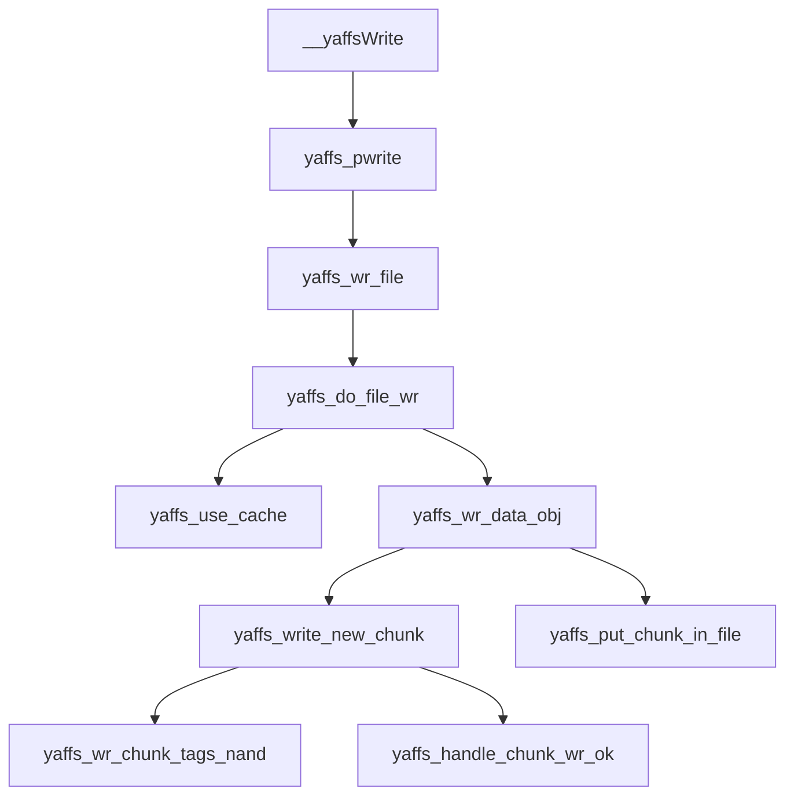
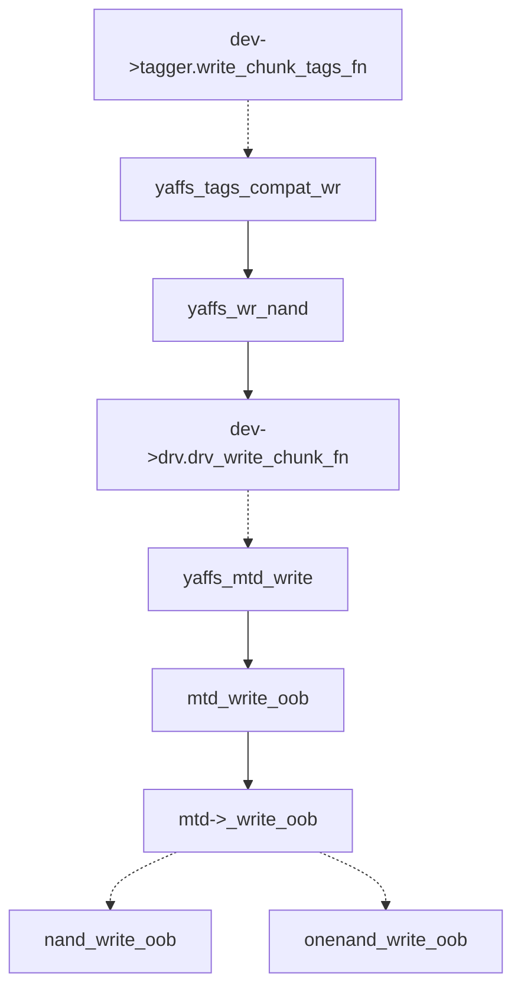

# SylixOS中MTD

## MTD与下层驱动的交互

[SylixOS中MTD调用底层接口流程分析](https://blog.csdn.net/zhywxyy/article/details/78896762)

值得关注的几点：

1. MTD通过nand_chip->cmdfunc向硬件设备发送指令（包括读写数据、reset等等基本命令）。
2. 系统一开始会用先给nand_chip中的各种接口函数设置一个默认函数（调用nand_set_defaults），只有那些与默认函数不符合的部分需要修改。
3. nand_chip->read_byte和nand_chip->write_byte来自于ARM的默认IO。

## MTD与上层文件系统的交互

### 结构图1



### yaffs_write_new_chunk

```c
static int yaffs_write_new_chunk(struct yaffs_dev *dev, const u8 *data, struct yaffs_ext_tags *tags, int use_reserver)
{
    int attempts = 0;
    int write_ok = 0;
    int chunk;

    yaffs2_checkpt_invalidate(dev);

    do {
        struct yaffs_block_info *bi = 0;
        int erased_ok = 0;

        chunk = yaffs_alloc_chunk(dev, use_reserver, &bi);             //申请一个chunk
        if (chunk < 0) {
            /* no space */
            break;
        }
        attempts++;

        if (dev->param.always_check_erased)
            bi->skip_erased_check = 0;

        if (!bi->skip_erased_check) {
            erased_ok = yaffs_check_chunk_erased(dev, chunk);        //1.检查这个chunk是否己擦除,即chunk中全是0xff
            if (erased_ok != YAFFS_OK) {              
                yaffs_chunk_del(dev, chunk, 1, __LINE__);            //经检查这个chunk没有被擦除,把这个chunk del
                yaffs_skip_rest_of_block(dev);                       //到下一次循环时重新申请一个chunk,再检查
                continue;
            }
        }

        write_ok = yaffs_wr_chunk_tags_nand(dev, chunk, data, tags);  //2.此时的chunk己擦除过的,就把tags写入到这个nand_flash中

        if (!bi->skip_erased_check)
            write_ok = yaffs_verify_chunk_written(dev, chunk, data, tags);

        if (write_ok != YAFFS_OK) {         
            yaffs_handle_chunk_wr_error(dev, chunk, erased_ok);
            continue;
        }

        bi->skip_erased_check = 1;
       
        yaffs_handle_chunk_wr_ok(dev, chunk, data, tags);            //3.把文件中的数据写入到nand_flash中

    } while (write_ok != YAFFS_OK && (yaffs_wr_attempts <= 0 || attempts <= yaffs_wr_attempts));

    if (!write_ok)
        chunk = -1;

    if (attempts > 1) {
        dev->n_retried_writes += (attempts - 1);
    }

    return chunk;
}
```

###  yaffs_wr_chunk_tags_nand 

​	线索到这里就断了，在yaffs_write_new_chunk中只有yaffs_wr_chunk_tags_nand 调用了yaffs_dev里面的操作函数，但并没有看到yaffs写入文件数据调用了哪个函数。上面说yaffs_handle_chunk_wr_ok用来写文件数据本身。但是它是一个没有实现的函数，所以里面也没有。

```c
int yaffs_wr_chunk_tags_nand(struct yaffs_dev *dev,
				int nand_chunk,
				const u8 *buffer, struct yaffs_ext_tags *tags)
{
	int result;
	int flash_chunk = apply_chunk_offset(dev, nand_chunk);

	dev->n_page_writes++;

	if (!tags) {
		yaffs_trace(YAFFS_TRACE_ERROR, "Writing with no tags");
		BUG();
		return YAFFS_FAIL;
	}

	tags->seq_number = dev->seq_number;
	tags->chunk_used = 1;
	yaffs_trace(YAFFS_TRACE_WRITE,
		"Writing chunk %d tags %d %d",
		nand_chunk, tags->obj_id, tags->chunk_id);

	result = dev->tagger.write_chunk_tags_fn(dev, flash_chunk,
							buffer, tags);//直接调用tagger.write_chunk_tags_fn写入

	yaffs_summary_add(dev, tags, nand_chunk);

	return result;
}
```


### tag操作函数的初始化

​	上面那个tagger.write_chunk_tags_fn以及其他操作函数的初始化会在yaffs_check_dev_fns函数中实现。

​	一共有两个函数会为其设置操作函数，yaffs_tags_compat_install和yaffs_tags_marshall_install。这个dev->tagger.write_chunk_tags_fn到最后也是调用了dev->drv.drv_write_chunk_fn。有两个文件初始化了drv_write_chunk_fn，分别是yaffs_mtdif_multi.c和yaffs_mtdif_single.c。但对于drv_write_chunk_fn他们俩都初始化为yaffs_mtd_write。

### 结构图2



### yaffs_wr_nand

```c
static int yaffs_wr_nand(struct yaffs_dev *dev,
			 int nand_chunk, const u8 *data,
			 struct yaffs_spare *spare)
{
	int data_size = dev->data_bytes_per_chunk;//一次写入一页数据

	return dev->drv.drv_write_chunk_fn(dev, nand_chunk,
				data, data_size,//data就是数据区
				(u8 *) spare, sizeof(*spare));//spare就是oob区
}
```


### yaffs_mtd_write（yaffs_mtdif_multi.c）

​	这一层基本上就是yaffs和MTD的交界处了，再往下就是MTD的代码。 

```c
static 	int yaffs_mtd_write(struct yaffs_dev *dev, int nand_chunk,
				   const u8 *data, int data_len,
				   const u8 *oob, int oob_len)
{
	struct mtd_info *mtd = yaffs_dev_to_mtd(dev);
	loff_t addr;
	struct mtd_oob_ops ops;	//mtd_oob_ops就是操作类型结构体，主要用来记录操作的模式（有三种模式）、读写数据的长度和缓冲区的地址等。
	int retval;

	yaffs_trace(YAFFS_TRACE_MTD,
			"yaffs_mtd_write(%p, %d, %p, %d, %p, %d)\n",
			dev, nand_chunk, data, data_len, oob, oob_len);

	if (!data || !data_len) {	//这两个判断在yaffs_mtdif_single.c中并没有
		data = NULL;
		data_len = 0;
	}

	if (!oob || !oob_len) {
		oob = NULL;
		oob_len = 0;
	}

	addr = ((loff_t) nand_chunk) * dev->param.total_bytes_per_chunk;
	memset(&ops, 0, sizeof(ops));
	ops.mode = MTD_OPS_AUTO_OOB;//mtd_oob_ops有三种模式：
    							//MTD_OPS_PLACE_OOB：在指定的偏移量写
    							//MTD_OPS_AUTO_OOB：自动写入空闲的区域，该区域由internal ecclayout来指定。
    							//MTD_OPS_RAW：和MTD_OPS_PLACE_OOB差不多，只是不用纠错。
	ops.len = (data) ? data_len : 0;//这里根据数据长度是否为零来判断是否需要写入数据。
	ops.ooblen = oob_len;
	ops.datbuf = (u8 *)data;
	ops.oobbuf = (u8 *)oob;

	retval = mtd_write_oob(mtd, addr, &ops);//这个函数里调用了MTD的_write_oob，_write_oob定义在libsylixos\SylixOS\include\linux\mtd\mtd.h中。
	if (retval) {
		yaffs_trace(YAFFS_TRACE_MTD,
			"write_oob failed, chunk %d, mtd error %d",c
			nand_chunk, retval);
	}
	return retval ? YAFFS_FAIL : YAFFS_OK;
}
```


### mtd->_write_oob

​	mtd->_write_oob在两个文件中都有初始化，这两个文件分别是nand_base.c和onenand_base.c中，估计是由硬件上只有单个flash还是拥有多个flash来决定用哪一个文件中的初始化。nand_base.c的初始化在nand_scan_tail中，onenand_base.c则是在onenand_probe中，这两个函数作用都是扫描MTD设备结构体（struct mtd_info），把未初始化的函数指针初始化为默认函数。


## 2440上的Nor flash

可以直接将其抽象成一个块设备(参考tpsfs)或者可参考(ramfs)	——蒋老师原话


