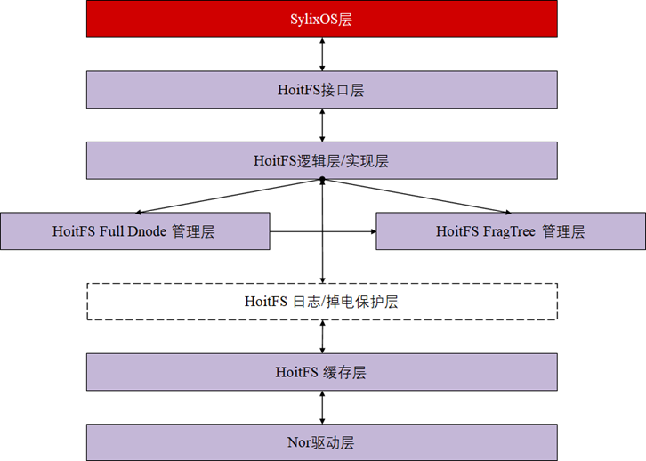

# 2021-04-07 ~ 2021-04-19 HoitFs 开发第二阶段

> 距离上次更新文档已经有一段日子了，这几天比较忙。4月7日到4月14日项目进展较小，仅做了简单的封装工作以及PPT的框架设计工作，项目进入中期[HoitFS中期答辩](../Files/PPT/hoitfs-middle-stage-presentation.pptx)。另外，架构做出了一定的调整，目前，GC逻辑将另增一个线程进行管理。
>
> 
>
> 
>
> 本周进入项目的联合调试阶段，本阶段的首要任务便是能够让HoitFs成功跑起来。
>
> 参考文献：
>
> 1. [Linux Flash FS BenchMarks 同文件系统在不同开发板上的对比](https://elinux.org/Flash_Filesystem_Benchmarks_Kernel_Evolution)
> 2. [文件系统测试约定](https://elinux.org/Flash_Filesystem_Benchmarks_Protocol)
> 3. [FFS BenchMarks](../Files/ffs-benchmark.pdf)
> 4. [Linux GC源码](https://code.woboq.org/linux/linux/fs/jffs2/gc.c.html#100)

## hoitFsTree API DOC（*代表可忽略部分）

> 本部分实现FragTree相关代码，与HoitFs的**普通文件**直接关联，上至逻辑层，下至物理层，是关键的数据结构。

### 构造函数

- PHOIT_FRAG_TREE_NODE **newHoitFragTreeNode**(PHOIT_FULL_DNODE `pFDnode`, UINT32 `uiSize`, UINT32 `uiOfs`, UINT32 `iKey`)

  **函数说明：**本函数为FragTreeNode的构造函数，能够根据PHOIT_FULL_DNODE**（逻辑层结构）**建立相应的`FragTree`节点；

  **参数说明：**

  1. `pFDnode`

     PHOIT_FULL_DNODE类型节点；

  2. `uiSize`

     节点映射到逻辑层的**大小**，单位为**字节**；

  3. `uiOfs`

     节点映射到逻辑层的**偏移**，单位为**字节**；

  4. `iKey`

     关键字，FragTree根据关键字构建红黑树结构，**常常以uiOfs作为关键字**

  **用例说明：**

  ```c
  PHOIT_INODE_INFO pNewInode  	= (PHOIT_INODE_INFO)__SHEAP_ALLOC(sizeof(HOIT_INODE_INFO));
  pNewInode->HOITN_rbtree 		= hoitInitFragTree(pfs);
  PHOIT_FULL_DNODE pTempDnode 	= pDnodeList;
  PHOIT_FULL_DNODE pTempNext  	= LW_NULL;
  
  PHOIT_FRAG_TREE_NODE pTreeNode  = newHoitFragTreeNode(pTempDnode, 
                                                        pTempDnode->HOITFD_length, 
                                                        pTempDnode->HOITFD_offset, 
                                                        pTempDnode->HOITFD_offset);
  ```

  

- *PHOIT_FRAG_TREE_LIST_NODE **newFragTreeListNode**(PHOIT_FRAG_TREE_NODE `pFTn`)

  **函数说明：**本函数为`FragTree`**链表**的构造函数，当我们想要搜集FragTree上的节点时，PHOIT_FRAG_TREE_LIST_NODE将是把这些节点串接起来的数据结构；

  **参数说明：**

  1. `pFTn`

     PHOIT_FRAG_TREE_NODE类型，即FragTree上的节点；

  **用例说明（外界基本不会用到）：**

  ```c
  pFTlistNode = newFragTreeListNode(pFTnRoot);
  ```

### 核心方法接口

- PHOIT_FRAG_TREE	**hoitInitFragTree**(PHOIT_VOLUME pfs)

  **函数说明：**根据文件头创建FragTree

  **参数说明：**`pfs` - 文件头

  **返回说明：**PHOIT_FRAG_TREE数据结构

  **用例说明：**

  ```c
  PHOIT_INODE_INFO pNewInode = (PHOIT_INODE_INFO)__SHEAP_ALLOC(sizeof(HOIT_INODE_INFO));
  pNewInode->HOITN_rbtree = hoitInitFragTree(pfs);
  ```

- PHOIT_FRAG_TREE_NODE     **hoitFragTreeInsertNode**(PHOIT_FRAG_TREE `pFTTree`, PHOIT_FRAG_TREE_NODE `pFTn`)

  **函数说明：**向FragTree中插入一个节点

  **参数说明：**

  `pFTTree` - 目标FragTree

  `pFTn` - 目标节点

  **返回说明：**返回插入的节点；

  **用例说明：**

  ```c
  略
  ```

- *PHOIT_FRAG_TREE_NODE     **hoitFragTreeSearchNode**(PHOIT_FRAG_TREE `pFTTree`, INT32 `iKey`)

  **函数说明：**在FragTree上搜索键值为iKey的节点；

  **参数说明：**

  `pFTTree` - 目标FragTree

  `iKey` - 键值

  **返回说明：**找到的FragTreeNode

  **用例说明：**

  ```c
  PHOIT_FRAG_TREE                     pFTTree;
  PHOIT_FRAG_TREE_NODE                pFTn;
  PHOIT_VOLUME                        pfs;
  
  pfs = (PHOIT_VOLUME)lib_malloc(sizeof(HOIT_VOLUME));
  pFTTree = hoitInitFragTree(pfs);
  
  pFTn = hoitFragTreeSearchNode(pFTTree, 7);
  printf("pFTn - uiOfs : %d\n", pFTn->uiOfs);
  printf("pFTn - uiSize: %d\n", pFTn->uiSize);
  printf("pFTn - iKey  : %d\n", FT_GET_KEY(pFTn));
  ```

- BOOL             **hoitFragTreeDeleteNode**(PHOIT_FRAG_TREE `pFTTree`, PHOIT_FRAG_TREE_NODE `pFTn`, BOOL `bDoDelete`)

  **函数说明：**在FragTree上删除某个节点，并删除其指向的FullDnode节点，并释放其内存，注意保存

  **参数说明：**

  `pFTTree` - 目标FragTree

  `pFTn` - 待删除节点

  `bDoDelete` - 是否彻底删除？即删除RawInfo结构？

  **返回说明：**删除成功返回LW_TRUE，否则返回LW_FALSE

  **用例说明：**

  ```c
  hoitFragTreeDeleteNode(pFTTree, pFTn, LW_FALSE);
  ```

- BOOL             **hoitFragTreeDeleteRange**(PHOIT_FRAG_TREE `pFTTree`, INT32 `iKeyLow`, INT32 `iKeyHigh`, BOOL `bDoDelete`)

  **函数说明：**在FragTree上**“删除”**某范围内的节点（**注：**如果删除位置位于某个节点中间，则按照FixUp的方法进行调整，详情见**实现说明部分**）

  **参数说明：**

  `pFTTree` - 目标FragTree

  `iKeyLow` - 低键值

  `iKeyHigh` - 高键值

  `bDoDelete` - 是否删除RawInfo，并标记RawNode为过期节点

  **返回说明：**删除成功返回LW_TRUE，否则返回LW_FALSE

  **用例说明：**

  ```c
  //删除所有节点，并删除RawInfo
  hoitFragTreeDeleteRange(pFTTree, INT_MIN, INT_MAX, LW_LW_TRUE);
  ```

- BOOL             **hoitFragTreeDeleteTree**(PHOIT_FRAG_TREE `pFTTree`, BOOL `bDoDelete`)

  **函数说明：**删除FragTree上的所有节点，并且删除FragTree数据结构；

  **参数说明：**

  `pFTTree` - 目标FragTree

  `bDoDelete` - 是否彻底删除？即删除RawInfo结构？

  **返回说明：**删除成功返回LW_TRUE，否则返回LW_FALSE

  **用例说明：**

  ```c
  hoitFragTreeDeleteTree(pFTTree, LW_FALSE);
  ```

- *VOID             **hoitFragTreeTraverse**(PHOIT_FRAG_TREE `pFTTree`, PHOIT_FRAG_TREE_NODE `pFTnRoot`)

  **函数说明：**中序遍历FragTree

  **参数说明：**

  `pFTTree` - 目标FragTree

  `pFTnRoot`- 根节点

  **返回说明：**无

  **用例说明：**

  ```c
  //注意指针强转
  hoitFragTreeTraverse(pFTTree, (PHOIT_FRAG_TREE_NODE)pFTTree->pRbTree->pRbnRoot);
  ```

- PHOIT_FRAG_TREE_LIST_HEADER  **hoitFragTreeCollectRange**(PHOIT_FRAG_TREE `pFTTree`, INT32 `iKeyLow`, INT32 `iKeyHigh`)

  **函数说明：**在FragTree上搜索键值在范围[x, y]的节点，其中，x <= iKeyLow，y >= iKeyHigh，返回链表；

  **参数说明：**

  `pFTTree` - 目标FragTree

  `iKeyLow` - 低键值

  `iKeyHigh` - 高键值

  **返回说明：**返回链表头

  **用例说明：**

  ```c
  printf("\n 3. [test collect range [-∞, +∞] ] \n");
  //收集FragTree上所有节点
  pFTlistHeader = hoitFragTreeCollectRange(pFTTree, INT_MIN, INT_MAX);
  pFTlistNode = pFTlistHeader->pFTlistHeader->pFTlistNext;
  while (pFTlistNode)
  {
      printf("Key: %d\n", FT_GET_KEY(pFTlistNode->pFTn));   
      pFTlistNode = pFTlistNode->pFTlistNext;
  }
  printf("range [%d, %d] \n", pFTlistHeader->uiLowBound, pFTlistHeader->uiHighBound);
  ```

### 高级方法接口

- BOOL **hoitFragTreeRead**(PHOIT_FRAG_TREE `pFTTree`, UINT32 `uiOfs`, UINT32 `uiSize`, PCHAR `pContent`)

  **函数说明：**在FragTree上搜索从uiOfs起，uiSize大小的节点，并通过`Cache`层读取相应内容

  **参数说明：**

  `pFTTree` - 目标FragTree

  `uiOfs` - 起始偏移

  `uiSize` - 内容大小

  `pContent` - 读取内容

  **返回说明：**读取成功返回LW_TRUE， 读取失败返回LW_FALSE

  **用例说明：**

  ```c
  略
  ```

- BOOL **hoitFragTreeOverlayFixUp**(PHOIT_FRAG_TREE pFTTree)

  **函数说明：**修复FragTree上重叠的节点

  **参数说明：**

  `pFTTree` - 目标FragTree

  **返回说明：**有修复输出LW_TRUE，否则输出LW_FALSE

  **用例说明：**

  ```c
  略
  ```

## 基于JFFS2的GC设计

> 老生常谈：工欲善其事，必先利其器。这里找到了一个很好的[Code Thru网站](https://code.woboq.org/linux/linux/fs/jffs2/nodelist.h.html#jffs2_eraseblock)，接下来的任务便是查看EraseBlock定义了。

学习GC的写法，其实最重要的是学习数据结构的定义，然后便能够通过该数据结构来揣测整个GC流程。以下是`jffs2_eraseblock`结构

```c
struct jffs2_eraseblock
{
	struct list_head list;
	int bad_count;
	uint32_t offset;		/* of this block in the MTD */
	uint32_t unchecked_size;
	uint32_t used_size;
	uint32_t dirty_size;
	uint32_t wasted_size;
	uint32_t free_size;	/* Note that sector_size - free_size
				   is the address of the first free space */
	uint32_t allocated_refs;
	struct jffs2_raw_node_ref *first_node;
	struct jffs2_raw_node_ref *last_node;
	struct jffs2_raw_node_ref *gc_node;	/* Next node to be garbage collected */
};
```

核心代码在`gc.c/jffs2_garbage_collect_pass`函数中。


## 联调问题记录

### 编译问题

1. 在`SylixOS/fs/mount/mount.c 133行`处加入：

   ```c
   if ((lib_strcmp(pcFs, __LW_MOUNT_NFS_FS) == 0) ||
       (lib_strcmp(pcFs, __LW_MOUNT_RAM_FS) == 0) ||
       (lib_strcmp(pcFs, __LW_MOUNT_HOIT_FS) == 0)) {                   /*  NFS 或者 RAM FS             */
       bNeedDelete = LW_FALSE;                                          /*  不需要操作 BLK RAW 设备     */
   } else {
       bNeedDelete = LW_TRUE;
   }
   ```

   注意自行定义__LW_MOUNT_HOIT_FS：

   ```c
   #define __LW_MOUNT_HOIT_FS          "hoitfs"                          /*  hoitfs挂载              */
   ```

   然后重新编译内核、BSP即可。
   
   

## 进一步探索

> 需要再寻找一些Solution + Bench Mark，两个目的
>
> 1. GC的实现、LOG的实现
> 2. 如何评估文件系统

### F2FS的Clean

Cleaning is a process to reclaim scattered and invalidated blocks, and secures free segments for further logging. Because cleaning occurs constantly once the underlying storage capacity has been filled up, limiting the costs related with cleaning is extremely important for the sustained performance of F2FS (and any LFS in general). In F2FS, cleaning is done in the unit of a section. F2FS performs cleaning in two distinct manners, foreground and background. Foreground cleaning is triggered only when there are not enough free sections, while a kernel thread wakes up periodically to conduct cleaning in background. A cleaning process takes three steps:


**Key:**

1. Foreground cleaning is triggered only when there are not enough free sections;

   对于HoitFS而言，我们需要设置一个阈值α，从底层检测到已占有空间＞α，那么启动强制GC；F2FS设置该阈值为5%；

   Greedy算法：The greedy policy selects a section with the smallest number of valid blocks. 

2. A kernel thread wakes up periodically to conduct cleaning in background;

   对于HoitFS而言，我们有一个间断性线程来帮助后台GC；

   Cost-Benefit算法：This policy selects a victim section not only based on its utilization but also its “age”；

```c
struct HOIT_SECTOR{
    PHOIT_SECTOR        HOITS_next;										/* 链表结构					   */
    UINT                HOITS_sno;                                      /* 块号Sector Number           */
    UINT                HOITS_addr;
    UINT                HOITS_length;
    UINT                HOITS_offset;                                   /* 当前在写物理地址=addr+offset  */
    
    /* 				可新添字段				 */
    UINT				HOITS_age;	
};
```

### JFFS2

#### 1. Improve Fault Tolerance

JFFS2 already has a primitive method of dealing with blocks for which errors are returned by the hardware driver it files them on a separate bad list and refuses to use them again until the next time the file system is remounted. This should be developed.

简单而言，坏块处理。—— 目前仅仅将坏块收集起来。

#### 2.  Garbage Collection Space Requirements

减小GC所需的空间至NorFlash中的1个块；

#### 3. **Transaction Support（LOG）

 For storing database information in JFFS2 file systems, it may beyo desirable to expose transactions to user space. It has been argued that user space can implement transactions itself, using only the file system functionality required by POSIX. This is true — but implementing a transaction-based system on top of JFFS2 would be far less efficient than using the existing journalling capability of the file system; for the same reason that emulating a block device and then using a standard journalling file system on top of that was considered inadequate.

1. 用户可利用POSIX提供的函数在JFFS2上实现Transaction。

2. 基于JFFS2的基于Transaction的文件系统效率会低；

3. 在此基础上模拟块设备然后使用标准日志文件系统也被认为是不够的；—— 意味着NorFlash设备最好以LFS结构构建文件系统。


**Another Future Work:**

```c
One oft-requested feature which is currently not
planned for development in JFFS2 is eXecute In
Place (XIP) functionality. When programs are run
from JFFS2, the executable code is copied from the
flash into RAM before the CPU can execute it. Likewise, even when the mmap() system call is used,
data are not accessed directly from the flash but
are copied into RAM when required.
```


**Key**

1. *坏块处理;
2. **日志、事务，以效率换掉电安全；
3. —— 跳过CPU，直接在NorFlash上执行；
4. write-behind cache（不能直接写穿）;
5. 加快Build速率，设置几个块，具有特殊`type`；

### SylixOS线程消息机制

```c
/*********************************************************************************************************
**
**                                    中国软件开源组织
**
**                                   嵌入式实时操作系统
**
**                                       SylixOS(TM)
**
**                               Copyright  All Rights Reserved
**
**--------------文件信息--------------------------------------------------------------------------------
**
** 文   件   名: ***
**
** 创   建   人: ***
**
** 文件创建日期: ** 年 ** 月 ** 日
**
** 描        述: 私有数据实现线程间通信
*********************************************************************************************************/
#include <SylixOS.h>
#include <stdio.h>
/*********************************************************************************************************
  全局变量定义
*********************************************************************************************************/
INT   iGlobal = 0;
/*********************************************************************************************************
** 函数名称: tTest
** 功能描述: 线程函数
** 输　入  : pvArg  传入参数
** 输　出  : NONE
** 全局变量:
** 调用模块:
*********************************************************************************************************/
PVOID  tTest (PVOID  pvArg)
{
    while (1) {
        fprintf(stdout, "tTest global value: %d\n", iGlobal);
        sleep(1);
    }

    return  (LW_NULL);
}
/*********************************************************************************************************
** 函数名称: main
** 功能描述: 主函数
** 输　入  : argc，argv
** 输　出  : ERROR
** 全局变量:
** 调用模块:
*********************************************************************************************************/
int main (int argc, char *argv[])
{
    LW_HANDLE  hId;

    hId = Lw_Thread_Create("t_test", tTest, NULL, NULL);
    if (hId == LW_HANDLE_INVALID) {
        return  (PX_ERROR);
    }

    if (Lw_Thread_VarAdd(hId, (ULONG *)&iGlobal) != 0) {
		return  (PX_ERROR);
	}
    INT i = 0;
    while (1) {
        i++;
        Lw_Thread_VarSet(hId, (ULONG *)&iGlobal, 55 + i);
        sleep(1);
    }

    Lw_Thread_Join(hId, NULL);

    return  (ERROR_NONE);
}
/*********************************************************************************************************
  END
*********************************************************************************************************/
```

### Evaluation

#### 方式一：针对两种评估场景

> 本部分主要参考自[FFS BenchMarks](../Files/ffs-benchmark.pdf)

1. S1

   > 测试了mount_time，read_time，file_create_time以及unmount_time

   - 准备装有Root FS所有文件及文件夹的文件系统镜像；

   - **挂载镜像；**

   - `LS -R /mnt/mntpoint`；

     > 查看所有文件信息；

   - `LS -R /mnt/mntpoint`；

     > 查看缓存效应

   - **创建一个文件树：**深度5、每个目录的文件数按照norm(4, 1)分布生成、每个目录文件的目录数量按照norm(3, 1)生成、文件的大小按照norm(1024, 64)生成；

   - `unmount`文件系统；

2. S2

   > 分区预热（把他弄脏）后，再测试mount，unmount，find，delete等

   - 擦除镜像上的所有信息；

   - **分区预热：**创建一个文件，随机填充整个flash设备；

   - 删除预热文件；（弄脏了）

   - **创建一个文件树：**深度5、每个目录由多个文件组成、每个文件大小为750B，每个生成的目录文件下有2个目录。

   - `unmount`文件系统；

   - `mount`文件系统；

   - `find NULL /mnt/mntpoint`；

     > 扫描整个目录；

   - 删除文件树;

   - `unmount`文件系统；

#### 方式二：针对主要参数 

> 本部分主要参考自[Wiki —— 文件系统测试约定](https://elinux.org/Flash_Filesystem_Benchmarks_Protocol)

1. `init_time` & `init_cpu_time`;

   > The init test consists of modprobing the filesystem driver.
   >
   > In the case of a filesystem on top of UBI, it also consists of modprobing ubi and attaching a device.
   >
   > Both time and memory consumption (with inconsitencies explained above) are measured.

   安装文件系统驱动所需要消耗的时间？

2. `init_mem`;

   安装文件系统驱动消耗的内存；

3. `mount_time` & `mount_cpu_time`;

   > This test simply consists of mounting a partition. (In the case of ubifs, attaching occured in the previous test)
   >
   > Both time and memory are measured.
   >
   > After the mount, a remount (`mount -o remount`) timing test is also performed when applicable (ie. not for read-only filesystems).
   >
   > The used space on flash is also measured, using `df`.

   挂载时间；

4. `mount_mem`;

   挂载消耗的内存；

5. `remount_time`;

   重新挂载耗时；

6. `used_space`;

   用`df`指令查看

7. `read_time` & `read_cpu_time`;

8. `write_time` & `write_cpu_time`;

   > The content of a folder - previously mounted in a tmpfs - is copied into the flash partition. When this partition is large, it is done several times until the partition is almost full: (size / 8) times

   先把内容写到tmpfs，再copy到目标文件系统中？

9. `video_write_time` & `video_write_cpu_time`;

   与基础写一致，但改成写入Video；

