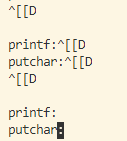

### Input: 以getchar引出的终端输入探究

到底什么才是输入？

##### 文件缓冲的提出：操作系统应该怎样看看待getchar

现实世界中已经工业化的linux的c库的现象，决定只在内核中实现带有缓冲区的getchar。实际上，在c语言中一种是有缓存的getchar，一种是没有缓存的getche（还有一种getch不会显示输入了什么），但是这些都并非是c语言标准库中的内容，而是属于conio.h，原因是这并非全平台兼容的库。

>`fgetc()` reads the next character from stream and returns it as an `unsigned char` cast to an `int`, or EOF on end of file or error.
>
>`getc()` is equivalent to `fgetc()` except that it may be implemented as a macro which evaluates stream more than once.
>
>`getchar()` is equivalent to `getc(stdin)`.

按照个人的理解，getchar天生就应该是带有缓存区的，进一步的说，输入输出都应该包含有缓存区。这个缓存区根据是否出现回车来打断缓冲，返回到用户调用处。

C语言中文件系统可分为两大类，一种是缓冲文件系统也称为标准文件系统，另一种是非缓冲文件系统。一般把带缓冲文件系统的输入输出称作标准输入输出（标准 I/O），而非缓冲文件系统的输入输出称为系统输入输出（系统 I/O）。ANSI C 标准中只采用缓冲文件系统。

缓冲文件系统：系统自动为每个打开的文件在内存开辟一块缓冲区，缓冲区的大小一般由系统决定。当程序向文件中输出（写入）数据时，程序先把数据输出到缓冲区，待缓冲区满或数据输出完成后，再把数据从缓冲区输出到文件；当程序从文件输入(读取)数据时，先把数据输入到缓冲区，待缓冲区满或数据输人完成后，再把数据从缓冲区逐个输入到程序。

##### 键盘左键和^[[D



现代操作系统处理输入的时候（除了shell这个应用程序），键盘的上下右左键是不会移动光标，反而会打印出类似^[[D这样的字符。这里面关键的奥妙在于，^[用来表示ctrl+[，这个表示CSI，也就是转义字符，CSI [ D代表左键。

其中关键的奥秘在于：

- "^[不是CSI"，他只是用来表示CSI，CSI是一个字符，而^[是两个字符。如果我们在命令行输入^[[D，输入程序是看得出来你没有按下键盘左键的，因为这是四个字符。

- 但是当你按下键盘右键的时候，却会出现^[[D，这个时候显示的东西和输入的东西不对应。如果你按下一下删除键，会变化成^[[，再按，^[，“再按”，注意，就全部没了，而不会变成^。
- 这也就是说这里面输入不是直接映射到输出上，而是自己做了可视化的操作，让他看起来像是展示出来了一样。这就是操作系统处理转义字符的奥秘。
- 当然，get string 得到的还是转义序列

##### 我们的实现

参考。因此我们要给每一个进程分配一个输入输出缓存。这个是非常有意义的，可以加速io处理速度，而不是每时每刻都要等待接受io，所以这个相当于是一个io处理的先驱形式的探索。在不断地对linux环境下c语言的printf和getchar的测试以及关于实现的思考之后，决定将stdio加入缓存，放置在用户区域。stdio相关的原理，以及文件和数据流还有很多东西要学习，但是暂且将其放在一边，摸着石头过河，先开发出有缓冲区的版本。

### 缓存区: 文件的read和write缓存了吗？

结论：不仅所有的文件（包括io）都缓存了，而且这些缓存都是放在用户空间，而不是放在内核。当用户接入了标准库，标准输入输出的库里面的缓存就会生效，如果用户不使用，就不会有缓存。这同时意味着，我们需要在用户态保有文件描述符，之前的实现是将文件描述符放在内核。

##### 为什么不在内核放置缓冲区？

内核的缓冲区应该放置在内核的堆上，这也就意味着每个进程有多个文件，多个缓存区，那么多个进程加起来将会是一笔非常大的开销，这就意味着内核堆必须要支持动态的增长，但是这样就必须破坏内核地址的一对一关系，这将会牵扯到相当多的附加问题。而如果我们将缓存区放在了用户，不仅这些问题消失了，而且在内核的抽象之上，也不会因为错误危害到内核，方便调试，同时也给了用户不使用缓存区的权利。

##### open与fopen的区别

1.层次不同
     open是系统调用,返回的是文件句柄，文件的句柄是文件在文件描述副表里的索引，
     fopen是ANSIC标准中的C语言库函数，返回的是一个指向文件结构的指针)。在不同的系统中应该调用不同的内核api。linux中的系统函数是open，fopen是其封装函数，fopen的实现要调用open。
2.fopen和open最主要的区别是是否有缓存
     fopen用户态下就有了缓存，它使用了FILE这个结构保存缓冲数据。在进行read和write的时候减少了用户态和内核态的切换。
     open没有缓存，每次读操作都直接从文件系统中获取数据。在进行read和write的时候每次都需要进行内核态和用户态的切换。
     表现为，如果顺序访问文件，fopen系列的函数要比直接调用open系列快；如果随机访问文件open要比fopen快。
3.一般用fopen打开普通文件，用open打开设备文件。

##### printf

```
1.缓冲区填满
2.写入的字符中有‘\n’ '\r'
3.调用fflush或stdout手动刷新缓冲区
4.调用scanf等要从缓冲区中读取数据时，也会将缓冲区内的数据刷新
5.程序结束时
```


##### 参考：

https://www.zhihu.com/question/21518507，https://blog.csdn.net/lws123253/article/details/79848373，https://zhuanlan.zhihu.com/p/54990226

### 操作系统：兼容性与用户库

首先，提出我们面临最重要的问题：操作系统如何支持外部应用程序在其上运行？

在之前操作系统的课程之中，我们会说：系统调用。但是实际上可能没有那么简单。我们看到，用户运行系统的时候，实际上是使用了标准库，而标准库是以c编写的，这也就是说，操作系统只能用c编写（mac os， windows 以及linux内核都是c），在提供了基本库的支持之后，才可以支持更换语言来编写应用程序或者是用户库。


- **unistd.h** ：C 和 [C++](https://baike.baidu.com/item/C%2B%2B) 程序设计语言中提供对 [POSIX](https://baike.baidu.com/item/POSIX) 操作系统 [API](https://baike.baidu.com/item/API) 的访问功能的[头文件](https://baike.baidu.com/item/头文件/10978258)的名称。该头文件由 POSIX.1 标准（可移植系统接口）提出，故所有遵循该标准的操作系统和[编译器](https://baike.baidu.com/item/编译器/8853067)均应提供该头文件（如 Unix 的所有官方版本，包括 [Mac OS X](https://baike.baidu.com/item/Mac OS X)、[Linux](https://baike.baidu.com/item/Linux) 等）。
  - POSIX：The **Portable Operating System Interface** (**POSIX**) is a family of [standards](https://en.wikipedia.org/wiki/Standardization) specified by the [IEEE Computer Society](https://en.wikipedia.org/wiki/IEEE_Computer_Society) for maintaining compatibility between [operating systems](https://en.wikipedia.org/wiki/Operating_system).[[1\]](https://en.wikipedia.org/wiki/POSIX#cite_note-1) POSIX defines the [application programming interface](https://en.wikipedia.org/wiki/Application_programming_interface) (API), along with command line [shells](https://en.wikipedia.org/wiki/Unix_shell) and utility interfaces, for software compatibility with variants of [Unix](https://en.wikipedia.org/wiki/Unix) and other operating systems.[[2\]](https://en.wikipedia.org/wiki/POSIX#cite_note-FAQ-2)[[3\]](https://en.wikipedia.org/wiki/POSIX#cite_note-IET-3)

  - unix的文件流到底是什么原理。http://c.biancheng.net/c/file/
  