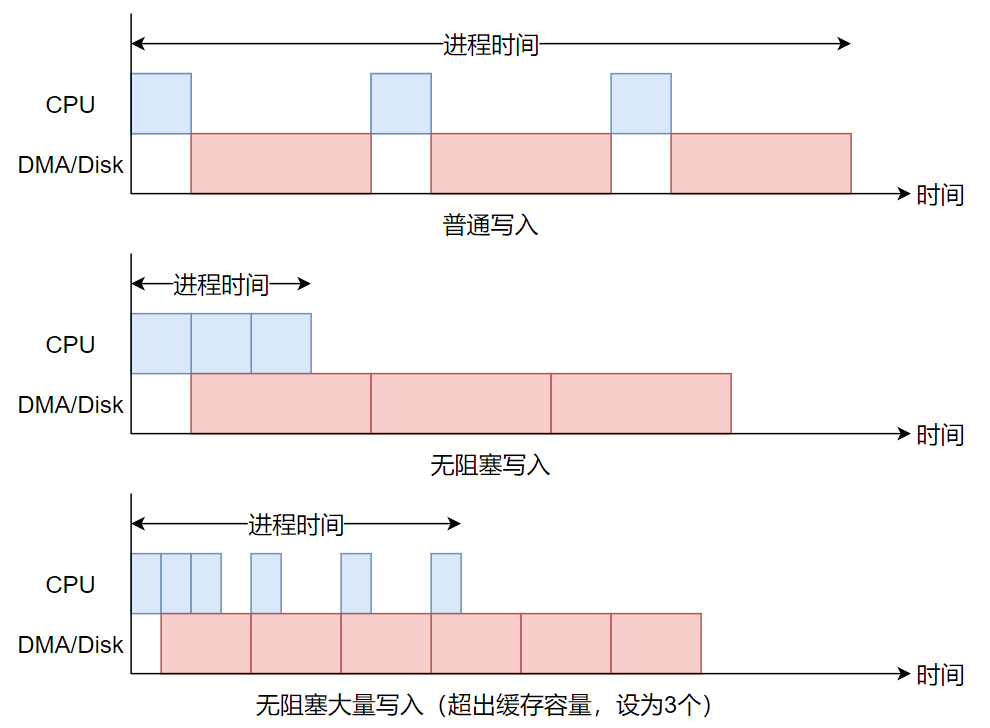

# **I/O策略**
文档编写：AtomHeartCoder
<br>
<br>

一直以来，我们只是对 FAT32 文件系统提供了逻辑功能的实现，还未考虑过这一层次上的优化。实际上，
文件 I/O 很容易成为系统性能的瓶颈，因此，一些优化还是很有必要的。本文档主要讨论我们在 xv6-k210 
上引入的针对文件系统相关 I/O 操作的优化策略与实现。

# FAT32 文件系统驱动层优化

## 1. 文件访问的优化
我们知道 FAT 文件系统是串联结构的，文件系统中的 FAT 表区中存放了各个簇之间的连接关系，文件目录项中，
只保存文件的首簇号。如果需要对文件进行反复的随机访问，那么也需要反复查询它的簇链。簇链实质上就是链表，
随机访问的性能并不好，如果每次查询都要读磁盘的话，性能则更为糟糕。

一个很自然的想法是，对已经获取过的簇链信息，我们把它以数组的形式缓存起来，这样不仅可以避免磁盘 I/O，
还可以通过偏移量很快地找到对应簇的簇号。如何保存这些簇号呢？我们期望使用数组，但数组也有明显的问题。
对于小文件，可能不占用几个簇，而大文件则可能有很多个簇，因此不好直接给定某一数组大小。除此之外，
文件还可以因为写入而增长，占用的簇增多，而数组无法直接扩展。

参考我们在文件描述符中的数据结构实现，我们可以以某一大小合适且固定的数组作为基本单位，当扩充时，
就增加这样的单元。在文件描述符结构的实现中，我们使用链表来管理这样的单元。但链表随机访问性能不佳，
在大文件的随机寻址上效果不好。就着刚刚用红黑树实现的 `mmap` 模块的手感，很自然地想到可以使用红黑树，
在此也十分感谢开源 Linux。于是，簇缓存节点就可以定型了：
```C
#define CLUS_TABLE_SIZE 32

struct clus_table {
    struct rb_node rb;              // 红黑树索引
    uint32 base;                    // 索引值
    uint32 num;                     // 该节点中的已缓存数
    uint32 clus[CLUS_TABLE_SIZE];   // 缓存数组
};
```
假设一个节点缓存 32 个簇号值，那么文件的第 x 个簇就存放在第 x / 32 个节点中（都是从零计数），x / 32 
也就是节点的 `base` 值。在建立新的节点时，还可以根据局部性原理，直接读取 FAT 表，争取将该节点填满。

链表随机访问的时间复杂度为 O(N)，使用红黑树则可以降到 O(log N)，对于小文件，两三个节点足以存放所有簇，
那么可以近乎享受到数组 O(1) 的低复杂度。实际上，红黑树并不是这一场景下的最佳方案，只是因为有轮子罢了。
红黑树多用于离散哈希的场景，而文件的簇链并不是离散的。举个例子，如果我们需要知道某文件第 100 个簇的簇号，
那么我们必须要读取 FAT 区，获得前 99 个簇号，实际上我们就有了从第 1 到第 100 个簇的连续信息，不是离散的。
这时，如果使用多层数组的形式，可以更快地定位所需要的簇。所谓多层的数组，虚实地址转换中的页表就可算作一种，
但由于每个节点大小相同，对不同大小的文件就会造成浪费或不够用的情况；灵活一点的方案，则可参考 System V 
文件系统的索引表结构。

## 2. FAT 表的缓存优化
加快经常性事件是我们设计系统的重要原则。FAT 表作为 FAT 文件系统的关键，会经常被访问。因此，单独对 FAT 
表做缓存是很有必要的。这里说单独做缓存，是因为磁盘之上还有一个缓冲层，但是它们会参与 LRU 淘汰机制，
我们不希望 FAT 表缓存参与其中，便将其独立出来。但 FAT 表缓冲层内部也是采用 LRU 规则，并通过计数器实现。
在缓冲的 FAT 表扇区中，有一个扇区作为分配扇区，FAT32 的 FS info 扇区中的 `next free` 对应的簇就在其中。
我们还需要尽可能地让簇相近地分配，分配扇区应当相对固定，不参与 LRU 的淘汰，当该扇区中的簇都被分配后，
就切换到其他缓存的 FAT 表扇区作为新的分配扇区。相关结构定义如下，可直接放置在 FAT32 的超级块中。
```C
#define SECSZ           512
#define FAT_CACHE_NSEC  (PGSIZE / SECSZ)

struct {
    char    *page;                  // 缓冲页
    int     allocidx;               // 分配扇区的下标
    uint32  fatsec[FAT_CACHE_NSEC];	// 扇区号
    uint32  lrucnt[FAT_CACHE_NSEC]; // LRU 计数
    int8    dirty[FAT_CACHE_NSEC];	// 脏标记
} fatcache;
```

<br>

# 磁盘缓冲与 I/O 机制
磁盘 I/O 是系统的瓶颈，缓冲机制则可以平缓磁盘与 CPU 之间的速度差异。原版的 xv6 中实现了一个简单的缓冲层，
很基础，但也足够了。不过，在此基础上还是可以做些文章的。在 qemu 上，xv6 使用 virtio 虚拟磁盘，在 k210 上，
我们则使用 SD 卡。从材料结构上看，它们并非真正的“磁盘”，不需要操作系统考虑磁头移动方向、块读写顺序等问题。
我们主要关心其他问题。

## 1. 缓冲块的查找
原版 xv6 通过正向遍历 LRU 链表来查询某一块号是否被缓存，我们则使用哈希查询。此外，出于方便实现的角度考虑，
我们按扇区号作为索引值。如果哈希查找失败，则逆向取 LRU 链表的第一个节点，即尾节点，也是最不常用的节点，
替换成所需扇区，并更新哈希索引。这一过程需要原子地进行，以防止某一扇区缓冲被多次加入哈希表。

当拿到所需的缓冲块后，将其从 LRU 链表中取出，这样，当在使用中的块就不可能被淘汰。如果某个缓冲块被多次引用，
则第一个拿到该块的进程负责将其移除，最后一个使用该块的进程将其放回 LRU 链表的队首。若一个缓冲块被取出 LRU 
队列，那么我们就可以将它插到其他队列中，这也是后续工作的基础。但哈希使用的节点域是另外的，无论缓冲块在哪，
都可被找到。取出缓冲块后，如果块内容有效，则可直接使用，否则需要读取磁盘。缓冲块结构如下：
```C
struct buf {
    uint32              dev;        // 块设备号
    uint32              sectorno;   // 扇区号
    uint32              refcnt;
    uint16              valid;      // 内容是否有效
    uint8               dirty;      // 是否脏
    uint8               disk;       // 是否正在进行 I/O
    struct d_list       list;       // 双向链表节点
    list_node_t         hash;       // 哈希链表节点
    struct sleeplock    lock;
    uchar               data[BSIZE];
};
```

## 2. 多块 I/O
多块 I/O 通常会更快，我们为 qemu 使用的 `virtio` 模块和 k210 使用的 `sdcard` 模块都实现了多块读功能。
我们也使用了多块写，但对于写磁盘，我们还使用了额外的策略。多块操作与驱动相关，这里就不讨论了。

## 3. 无阻塞的磁盘写入策略
首先说明，无阻塞的实现依赖于缓冲层，如果缓冲块不足，则会阻塞等待可用的缓冲块，否则只需写入缓冲区即可返回。
在原 xv6 的实现中，读写磁盘都会产生阻塞。对于读操作，进程被阻塞是合情合理的，因为没有内容就无法正确进行；
但对于写操作，进程是不关心这个过程的，因为缓冲块中的内容必然是最新值，可读可写。虽然进程被阻塞挂起后，
CPU 可以执行其他进程，并没有太多浪费，但是从该进程的角度来看，它没有用完时间片就被切出，无法执行其他操作。
如果进程需要反复写磁盘，则会被反复阻塞切出，若此时没有别的进程可以执行，那就会产生 CPU 资源的浪费了。

实际上，写磁盘的过程并不影响用户程序的后续运行，对此，可以采用写回法，即进程写完缓冲块后，不马上写入磁盘。
可以选择适当的时机将脏块写回，比如淘汰时写回，或是定期写回。如果采用淘汰时写回，那么在磁盘 I/O 高峰时，
会浪费大量时间等待脏块的写回才能使用这些缓冲块；如果采用定期写回，如何选择时机呢？还有别的策略吗？
当然是有的。

首先，观察到磁盘写入大致是这样的过程：
1. CPU 操作相关硬件接口开启 I/O 过程；
2. 随后，由 DMA 进行数据传输；
3. 传输完毕后，DMA 给 CPU 发送中断信号；
4. CPU 操作相关硬件接口结束 I/O 过程。

在 xv6 实现的写磁盘过程中，进程需要负责第 1 和第 4 步，第 2 步和第 3 步时进程处于睡眠状态。在第 3 步中，
中断处理函数会将进程唤醒。但仔细想想就可以发现，用户程序的运行并不依赖第 4 步操作（这与读操作不同），
如果将第 4 步操作交给第 3 步中的中断处理函数，进程不就可以在第 1 步结束后直接返回而无需被阻塞了吗？
这就是所谓无阻塞写入的原理。

在实际实现中，由于 CPU 的速度远大于磁盘，如果需要反复写磁盘，第 1 步的操作会因为磁盘正忙而无法进行。
得益于缓冲块，我们可以对这个过程再做一些修改：
1. 进程将缓冲块提交到写出队列，若磁盘空闲则开启传输，随后立即返回；
2. 由 DMA 进行传输数据，传输完毕后发送中断信号；
3. 在中断处理函数中完成上一次写操作的后续工作，并检查写出队列，有内容则开启下一次传输。

这样，就可以实现一个无阻塞的磁盘写入策略，其实有些类似于异步 I/O 思路。当缓冲块写出完毕后，若不再被引用，
则可以将其放回 LRU 队列。形象地看，各种写入方式的过程可以用下图表示，当然这只是较为理想化的示意。



可以看到，在缓冲块充足时，程序执行得很快；缓冲块不足后，进程必须等待缓冲块的释放，但磁盘写入一直在进行，
衔接的较为紧密。需要说明的是，当进程尝试获取一个缓冲块以进行写入时，如果将写入的内容完全覆盖了整个扇区，
则可无需从磁盘中读取原内容，如果只是写一部分，则需要读出原内容再写回。上图中都是完全覆盖的情况，否则，
读操作会打断写入过程。

在 virtio 中，读写似乎是可以并行的，但在 k210 上，SD 卡显然无法做到。由于读操作会阻塞用户程序的运行，
在该机制下，读操作的优先级应高于写操作。在写入过程中发现有读者等待时，写操作应当适时停止，让出控制权。