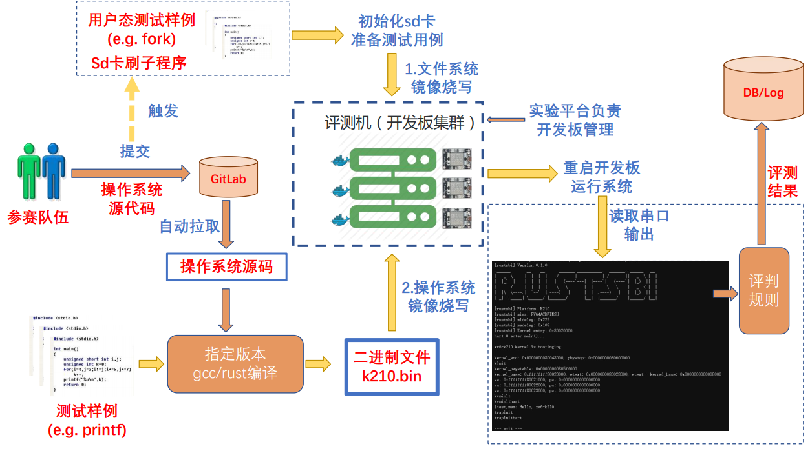

## 决赛测试

测试程序有提供两个阶段：一是功能测试，二是性能测试。他们都要求在qemu和k210实机上运行。功能测试为运行busybox和lua。busybox相当于一个shell，测试用例就是不同的shell指令，看是否能够运行预期的结果。lua是一种shell脚本语言，其依赖于busybox，意味着我们需要对busybox系统调用进行完整的支持。

性能测试则使用了lmbench，截至6月29日尚未放出测试方法，需要再7月21日再放出最终的方法。但是根据使用手册，需要测量读写文件、内存以及进程通讯、系统调用速度等定量性能，估计会据此进行排名。

#### lmbench支持

为了进一步明白系统调用使用的目的和意义，我们准备粗略的了解整个lmbench的执行流程。

lmbench_all只会根据命令分发给对应的程序，也就是只判定参数，不做实际的逻辑，下面我们以lat_syscall为例，进行解析逻辑步骤。

大体上，lat_syscall是重复执行给定的syscall，然后取调用时间的平均值。
- 解析给定的参数，确定附加功能
- 进入benchmp函数进行syscall执行
- 初始化时间，开始执行，直到时间足够长为止。（这时候程序将会空转执行，直到时间到达设定值为止）

正式执行流程如下：

- 测试指令指定的parallel为1，不会执行并行。
- 注册4个pipe：response，start_signal，result_signal，exit_signal
- fork
- 子进程：
  - 关闭管道的一半端口（分别保留为写，读，读，读）
  - 进入benchmp_child函数
  - 退出
- 父进程
  - 关闭管道的一半端口（分别保留为读，写，写，写）
  - 进入benchmp_parent函数
  - 清理子进程：为了防止子进程不自行退出，设置超时时间，等待一段时候，杀死子进程。（做法：设置一个alarm定时，然后wait子进程，alarm先到，杀死子进程。wait先到，关闭alarm）

总体上来说，子进程负责执行，父进程负责获取子进程的初始化和完成信号，以计时。

#### 测试平台

示例程序的运行环境是Debian on Qemu RV64，在下载相应的镜像文件之后，我们还需要安装必须的linux头文件，然后编译busybox和lua以及lmbench。测试提供了测试脚本，能够自动运行。

对应的镜像文件安装好对应的环境之后，只有对应的二进制busybox和lua程序。如果要编译的话需要我们自行放进去。我们选择放置sh脚本和lua脚本。但是这样我们仍然无法正常运行。在运行test.sh的时候，我们用的不是bash（自带shell），而是busybox的shell，在debian运行我们要指定sh所用的shell为busybox的，因此在test.sh的首行我们改为
> #!./busybox sh

这表示我们将使用另一个shell。我们也可以用命令行实现
> ./busybox sh 
> 
> echo hello

这样，我们就进入了busybox的shell。

#### 如何评测

对于busybox，每条shell命令一分。

对于lua，每条命令一分。

对于每个命令，都应该要单独运行一次。

#### 如何在UltraOS上运行

##### 文件系统中含有的测试程序和数据

- 程序：busybox与lua以及lmbench
- 脚本：busybox与lua的sh脚本
- lua脚本： lua脚本文件名将作为参数传送给lua以运行对应的命令，不同命令存储在不同的脚本文件中。
- busybox脚本： 每个命令都放在一个文件中，每行一个命令

##### 运行测试用例

正常运行逻辑：运行sh脚本即可。

我们没有支持完整的shell，所以只能够对应的sh脚本解析成对应的代码，来模拟对应的运行逻辑。但是我们选择了更好的办法，busybox自举。但是，要想完全支持busybox的sh，我们需要花费非常多的代价，事实上，我们最后也没有办法做到这种程度，因此我们选择了使用自己的shell来完成对应的工作。

##### busybox自举（未实现）

busybox就是一个shell，那我们为什么不直接进入busybox sh来解析对应的脚本文件呢？因此，只要我们首先能够支持busybox的sh运行，接下来就可以一帆风顺了。

## 初赛测试

测试程序有提供两个步骤：一是将源码编译成可执行文件，可以自己配看本地效果。二是把这个文件复制在官方提供的标准os跑，看效果。当然最终都是要提交到测试平台去做测试。

#### 生成测试文件

将交叉编译链（用k210官方提供的）的路径放在path中，然后运行user文件下的build脚本（也可以在makefile中更改一些参数跑单个用例）。该脚本就是调用makefile指令，然后使用cmake来建立对应的文件，再实现一些文件的移动操作。

#### 官方示例

官方示例将自己准备文件系统的镜像，然后用虚拟机（riscv linux）跑自己的文件系统（里头含有测试文件）。

运行make的时候会出现一些问题，首先是linux很大，需要保证足够的build空间，还有就是缺少src/riscv-pk（berkeley bootloader），需要在github上下载下来。

在虚拟机跑起来后，就可以用下面命令来登录它。

>ssh root@192.168.100.2

之后就可以用对应的账户密码登录对应的qemu虚拟机，将对应的文件系统挂载到.mnt上，在交叉编译完测试用例之后（这个需要自己编译完得到结果），通过scp程序将其传入qemu虚拟机，就可以开始跑了。

#### 如何在UltraOS上运行

##### 运行测试程序

测试程序都已经放在了SD卡中的FAT32文件系统之中。一共有两种文件：可执行文件和sh文件。这就以为着我们必须还要额外支持sh文件的shell命令解析。sh文件有两个：

##### 测试流程

从这里可以看出评判系统的评判是被动评判，评判系统不会有串口的输入，程序必须自行运行所有的测试程序，这意味着UltraOS需要自行导入与测试程序无关的初始程序，以便能够运行接下来的程序。同时，在运行完所有的程序之后，关机。

##### 完整的适配评测系统的流程

将shell和init_proc两个程序放在内存中，操作系统一运行，先不打开双核（假设我们是双核方案），然后加载初始进程，将初始进程加载后开始运行（同时放行另一个核）。它自身会加载shell，但是我们在exec判断是shell后不从文件系统寻找对应程序而是从内存把shell加载进来。

shell程序的设定也有改变，不会再等待串口（设置一个常量，评测系统里用就不等待串口，否则还是等待用户的输入）。Shell machine将直接导入run-all.sh 的sh解析，然后解析出对应的指令，并执行。

##### EXT2文件系统运行测试样例

由于给定的测试要求在FAT32文件系统中使用，但是当前的设计仅仅是EXT2，在文件系统没有经过完整的测试的情况之下，我们需要先将其移植至EXT2中，让其能够很好的兼容，先运行相应的程序。

#### Shell

从评测系统的要求看来，虽然不要求实现重定向，但是却要求支持shell变量存储。这样做的工作量飞铲大噶，步子迈大了，我们直接手动实现对应的要求，也就是在shell防止一个命令，直接初始就按照shell命令所示，运行所有的程序。

