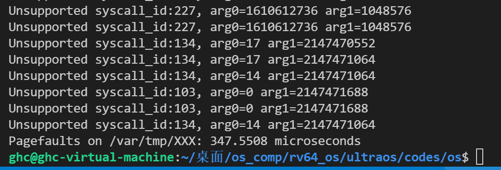
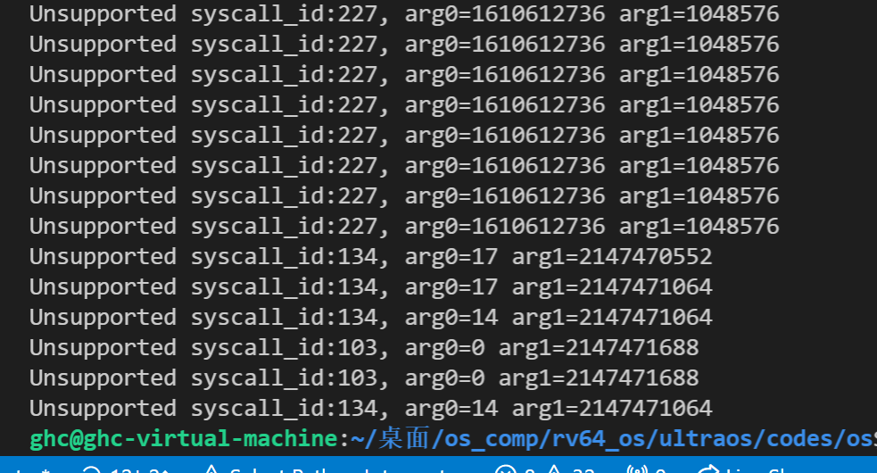
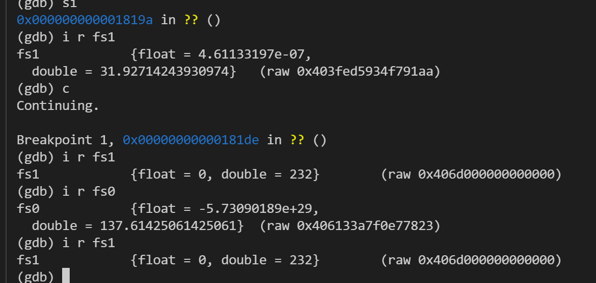

### Busybox访问0

出错指令地址：0x1326ae
执行流如下：

```assembly
  108b90: b3 07 80 40  	neg	a5, s0
  108b94: 33 85 84 00  	add	a0, s1, s0
  108b98: e3 e5 f4 fc  	bltu	s1, a5, -54 <.text+0xf8762>
  
  cb626: ef 00 60 29  	jal	662 <.text+0xbb4bc>
  |
  cba26: 01 45        	mv	a0, zero
  cba28: ef a0 f4 2e  	jal	305902 <.text+0x106116>
  |
  116516: 79 71        	addi	sp, sp, -48
  116518: 26 ec        	sd	s1, 24(sp)
  11651a: 01 46        	mv	a2, zero
  11651c: 2c 00        	addi	a1, sp, 8
  11651e: aa 84        	add	s1, zero, a0
  116520: 01 45        	mv	a0, zero
  116522: 06 f4        	sd	ra, 40(sp)
  116524: 22 f0        	sd	s0, 32(sp)
  116526: ef 00 70 22  	jal	2598 <.text+0x106b4c>
  
  cb940: 13 89 fb ff  	addi	s2, s7, -1
  cb944: b3 57 a9 03  	<unknown>
  cb948: 6e 99        	add	s2, s2, s11
  cb94a: 33 8c a7 03  	<unknown>
  cb94e: 62 e4        	sd	s8, 8(sp)
  cb950: 03 b5 81 d9  	ld	a0, -616(gp)
  cb954: 36 e0        	sd	a3, 0(sp)
  cb956: 13 05 05 71  	addi	a0, a0, 1808
  cb95a: 6e 95        	add	a0, a0, s11
  cb95c: 66 95        	add	a0, a0, s9
  cb95e: 62 95        	add	a0, a0, s8
  
  #here
  cb960: ef d0 c3 1d  	jal	250332 <.text+0xf873c>
  |
  108b3c: 01 11        	addi	sp, sp, -32
  108b3e: 4a e0        	sd	s2, 0(sp)
  108b40: 26 e4        	sd	s1, 8(sp)
  108b42: 83 b4 81 3c  	ld	s1, 968(gp)
  108b46: 22 e8        	sd	s0, 16(sp)
  108b48: 06 ec        	sd	ra, 24(sp)
  108b4a: 2a 84        	add	s0, zero, a0
  108b4c: 95 c8        	beqz	s1, 52 <.text+0xf8780>
  |
  108b80: 01 45        	mv	a0, zero
  108b82: ef 90 92 30  	jal	170760 <.text+0x12228a>
  |
  13268a: aa 87        	add	a5, zero, a0
  13268c: 93 08 60 0d  	addi	a7, zero, 214
  132690: 73 00 00 00  	ecall	
  132694: 23 b4 a1 3c  	sd	a0, 968(gp)
  132698: 63 64 f5 00  	bltu	a0, a5, 8 <.text+0x1222a0>
  13269c: 01 45        	mv	a0, zero
  13269e: 82 80        	ret
  |
  108b86: 63 4f 05 00  	bltz	a0, 30 <.text+0xf87a4>
  108b8a: 83 b4 81 3c  	ld	s1, 968(gp)
  108b8e: d9 b7        	j	-58 <.text+0xf8754> 
  |
  108b54: 19 cc        	beqz	s0, 30 <.text+0xf8772>
  108b56: 63 5d 80 02  	blez	s0, 58 <.text+0xf8790>
  108b5a: 33 85 84 00  	add	a0, s1, s0
  108b5e: 63 7f 95 02  	bgeu	a0, s1, 62 <.text+0xf879c>
  |
  108b9c: ef 90 f2 2e  	jal	170734 <.text+0x12228a>
  |
  1326a0: 97 a7 07 00  	auipc	a5, 122   #a5 = 0x1ac6a0
  1326a4: 83 b7 07 56  	ld	a5, 1376(a5)  #addr = 0x1acc00
  1326a8: 31 47        	addi	a4, zero, 12
  1326aa: 7d 55        	addi	a0, zero, -1
  1326ac: 92 97        	add	a5, a5, tp
  1326ae: 98 c3        	sw	a4, 0(a5)     # crash here
  1326b0: 82 80        	ret
```

0x1acc00位于 .got段，该段用于存储全局变量的地址


.got和.data实际上都有数据，但是gdb发现，程序运行时这段内存没数据。

在from_elf插桩如下：

```rust
if let Some(sec) = elf.find_section_by_name(".got"){
    println!("{:#?}", sec.raw_data(&elf));  //打印.got的数据
}
```

发现存在数据且正确，证明ELF无误，且被载入内存。

继续插桩，发现向用户map的时候，复制了elf.input的[0x0 .. 0x10BE68]，以及[0x10cd10 .. 0x110500]，.got位于elf.input的[0x110328 .. 0x110328+0x1d8]


有一点需要注意，got恰好在最后

.got实际上在 0x121328

进一步插桩，copy_data时第二段的虚地址范围是 0x11DD10..0x122D18，

检查发现，写入的虚拟页框包括11d，11e，11f，120，并没有121

0x122D18-0x11DD10 = 0x5008， 0x110500 - 0x10cd10  = 0x37F0

二者不一致，说明存在间隙，写虚拟页框使用了后者(即长度0x37F0)，未能覆盖到121页框。

阅读代码发现，copy_data默认对齐页框：

```rust
	pub fn copy_data(&mut self, page_table: &mut PageTable, data: &[u8]) {
        assert_eq!(self.map_type, MapType::Framed);
        let mut start: usize = 0;
        //start实际上描述了长度，是页对齐的，但是data并不是页对齐的
        let mut current_vpn = self.vpn_range.get_start();
        let len = data.len();
        loop { 
            let src = &data[start..len.min(start + PAGE_SIZE)];
            let dst = &mut page_table  //这里写数据是页对齐的
                .translate(current_vpn)
                .unwrap()
                .ppn()
                .get_bytes_array()[..src.len()];
            dst.copy_from_slice(src);
            start += PAGE_SIZE;
            if start >= len { 
                break;
            }
            current_vpn.step();
        }
    }
```

这就导致，整段程序都放偏了。

解决方案很简单，在copy_data加一个offset参数，以支持非对齐的情形。


### 8.2 lmbench_all飞到0

```assembly
   6f6de: ee 97        	add	a5, a5, s11  # a5=0x10cdb0
   6f6e0: 98 6b        	ld	a4, 16(a5)
   6f6e2: 63 0f 57 07  	beq	a4, s5, 126 <__run_exit_handlers+0x134>
   6f6e6: e3 1d 27 fb  	bne	a4, s2, -70 <__run_exit_handlers+0x74>
   6f6ea: 98 6f        	ld	a4, 24(a5)   #0x10cdc8:0x0006afcc, in bss
   6f6ec: 88 73        	ld	a0, 32(a5)
   6f6ee: 23 b8 07 00  	sd	zero, 16(a5)
   6f6f2: da 85        	add	a1, zero, s6
   6f6f4: 02 97        	jalr	a4       # not gg
```

__libc_csu_fini

0x6afcc

...

```assembly
   6f6de: ee 97        	add	a5, a5, s11  # a5=0x10cd90
   6f6e0: 98 6b        	ld	a4, 16(a5)
   6f6e2: 63 0f 57 07  	beq	a4, s5, 126 <__run_exit_handlers+0x134>
   6f6e6: e3 1d 27 fb  	bne	a4, s2, -70 <__run_exit_handlers+0x74>
   6f6ea: 98 6f        	ld	a4, 24(a5)   #0x10cda8:0x00000001, in bss
   6f6ec: 88 73        	ld	a0, 32(a5)
   6f6ee: 23 b8 07 00  	sd	zero, 16(a5)
   6f6f2: da 85        	add	a1, zero, s6
   6f6f4: 02 97        	jalr	a4         # a4 = 1, crash

#正常是直接执行这段，然后0x10cd90的地址就是0x0006afcc
```

经过gdb检查，发现__internal_atexit把这个地址的值改了

\_\_cxa_atexit调用了  \__internal_atexit，功能为注册析构函数 exit时执行

追踪返回地址，发现 LIBC_START_MAIN 调用了\_\_cxa_atexit，

```assembly
   6ab7a: 81 45        	mv	a1, zero
   6ab7c: 4a 85        	add	a0, zero, s2  #a0 == 1
   6ab7e: ef 40 50 61  	jal	19988 <__cxa_atexit>  #此处调用
```

上述调用以a0传参，__cxa_atexit的第一个参数为函数地址，也就导致之后跳转到这个地址

进一步追踪，s2实际上就是LIBC_START_MAIN 的第六个参数，由a5传递给S2

LIBC_START_MAIN 由_start调用，也就是程序的入口，发现\_start中，a0被传递给a5

```assembly
   105d4: aa 87        	add	a5, zero, a0  # a0 == 1
```

这里的a0实际上由syscall返回时将返回值填于用户上下文，而这个返回值就是sys_exec的返回值，之前的处理是返回参数个数，也就是1。

将返回值改为0，成功运行。


### 无尽的pselect

在调试lmbench_all lat_syscall -P 1 null时，遇到了非常奇怪的问题

在测试程序中，子进程通过管道向父进程发送ready的信号，父进程读取

经过插桩发现，子进程写了，父进程也读了，但是pipe.read一直未返回

分析代码，如下：

```rust
		loop {
            let mut ring_buffer = self.buffer.lock();
            let loop_read = ring_buffer.available_read();
            if loop_read == 0 {
                if ring_buffer.all_write_ends_closed() {
                    return read_size;  
                }
				//一直在打印这个
                gdb_print!(SYSCALL_ENABLE,"[pipe] try read");
                drop(ring_buffer);
                suspend_current_and_run_next();
                continue;
            } 
            for i in 0..loop_read {  // loop_read == 1
                if let Some(byte_ref) = buf_iter.next() {
                    unsafe { *byte_ref = ring_buffer.read_byte(); }
                    read_size += 1;
                } else {
                    return read_size;// 始终没有运行到这里，因此一直不返回
                }
            }
            // 执行完这个循环后，available_read()将返回0，之后就一直被挂
        }
```

解决方案比较简单：对于read，不管buffer还有没有剩余，读了多少返回多少；但是对于write，必须要全部写完。如果read的大小取决于buffer ( len>1 )，但只write一个字节，就会陷入无尽的等待。


### 无法去除的sfence.vma ？

sfence.vma因为需要由RustSBI代理，所以代价会非常大

经过李sir的测试，如果去除不必要的sfence.vma，性能可以提升数(数十)倍

但是，即便我们修改了地址空间，让用户和内核的地址错开，依然无法去除sfence.vma

之后，我们尝试了以下模式：

- trap的时候一律sfence.vma，trap_ret一律不用
- trap_ret的时候一律sfence.vma，trap一律不用

以上两种设置都是可行的

但是如果按以下的模式，不可行：

- trap的时候一律不用sfence.vma，trap_ret的时候，如果和trap的进程不一致，则用

并不可行

以及，我们尝试用sfence.vm代替，依旧不行


我们尝试根据异常的类型fence，试图做到精准刷表。

首先，在异常粒度测试了以下的刷新组合

| trap granularity |      |      |      |        |      |
| ---------------- | ---- | ---- | ---- | ------ | ---- |
| syscall          | T    | T    | T    | T      | F    |
| IIL Fault        | T    | T    | T    | F      | F    |
| SSL Fault        | F    | T    | T    | F      | F    |
| cow              | F    | T    | F    | T      | T    |
| IlleagalIns      | T    | T    | T    | F      | F    |
| Timer            | F    | F    | F    | F      | F    |
| Switch           | T    | T    | T    | T      | T    |
| Ret(satp changed | F    | F    | F    | F      | F    |
| Crash            | T    | F    | T    | F      | T    |
| Time(ms)         |      |      |      | 5.1412 |      |

发现，只要cow, switch和sys_call刷了就没问题，这可能暗示了一些内在机理

但是，系统调用实际上是大头，尤其是sys_getppid，qemu下调用了万次，如果可以减少syscall的fence次数，性能会大大提升。

之后，我们对指定范围的syscall进行了fence，如下：

| syscall range to fence |       |
| ---------------------- | ----- |
| >62                    | OK    |
| >62 && != 173          | crash |
| !=173                  | crash |
| eq 173                 | OK    |

似乎只要sys_getppid被刷新，就可以通过。QEMU上不fence sys_getppid 也可以通过，第一个测试会提升至1.6ms。但是K210不可以。

比较遗憾的是，在一些特定的情况下，只fence入口或出口也会出错，因此该优化工作暂时搁置。


### lat_pipe无法结束

进行测试时，读方一直尝试读，写方却不再写

查看源码，该测试有一项名为cleanup的函数，其中向子进程发送了kill，该函数会在cooldown阶段执行：

```C
if (state->cleanup) {
	if (benchmp_sigchld_handler == SIG_DFL)
		signal(SIGCHLD, SIG_DFL);
	(*state->cleanup)(0, state->cookie);
}
```

我们的系统在以下位置阻塞：

```C
static void
writer(register int w, register int r)
{
	char		c;
	register char	*cptr = &c;

	for ( ;; ) {
		if (read(r, cptr, 1) != 1 ||
			write(w, cptr, 1) != 1) {
			    perror("(w) read/write on pipe");
		}
	}
}

```

以上函数如何退出，就是我们的关键点

分析源码，这个死循环应该在4号进程，查看trace，发现确实有进程向4号进程发SIGKILL

Unsupported syscall_id:129, arg0=4 arg1=9

两个父进程都在wait，于是就卡住了


### lat_pagefault

父进程一直在调用p_select，等待子进程回复，子进程因LoadFault被杀，地址有些诡异

kstat结构错误，，，


### lat_sig Crash

[kernel] Exception(StoreFault) in application, bad addr = 0x60000000, bad instruction = 0x18d48, core dumped. 访问了MMAP ?

崩溃位置：

```C
static void
do_prot(iter_t iterations, void* cookie)
{
	struct _state* state = (struct _state*)cookie;
	n = iterations;
	caught = 0;
	/* start the first timing interval */
	start(0);
	/* trigger the page fault, causing us to jump to prot() */
	*state->where = 1;
}
```

最后一条语句，确实触发了StoreFault，但是我们直接把它杀了

理论上，它需要收到一条SIGSEGV /* Invalid access to storage. */

测试程序在初始化阶段注册了prot函数为handler，收到SIGSEGV 后会调用prot。


### lat_fs

报错tempnam failed，

newfstatat之后出错，查看了glibc的源码，发现需要查看/var/tmp或/tmp是否可用(是否存在且为目录)，调用的就是newfstatat。但是问题是，不同的文档里，对于stat的定义都不相同，这就导致，即便我们的fs里/var/tmp或/tmp都存在，程序却认为不存在或者不是目录。我们尝试了多种结构，都不行。

以及，stat结构体在不同架构下大小也不一样

通过考察debian的strace，得到了stat的结构，发现没问题

于是只能gdb，发现，st_mod=40777，而实际上应该等于040777

查阅资料发现，Rust的8进制表示为0o，和C在前面加一个0并不一样。。。

吐槽：这么致命的问题为何lat_syscall的stat没测出


这之后又发生了新的错误：

[kernel] Exception(StoreFault) in application, bad addr = 0x7ffdd928, bad instruction = 0x8fbba, core dumped.

栈又不够了。。。。。。。。。。。。。0x7ffff000 - 0x7ffdd928 = 33 > 20

现在给分40个page


### 额外的问题

#### 堆不足

合并lazy_stack后，[handle_alloc_error]: May have no enough heap memory!

严重不足，翻倍依然不够


#### lat_pagefault再次出现奇怪的LoadFault

合并后的版本在k210非常快就结束，没有打印结果。qemu和k210表现不一致，出现了堆不足的情况。

切换回没有lazy stack/mmap的版本，可以出结果，并且要跑很久，但打印nan

修正newStat后，k210什么都不打印。尝试在qemu运行，表现一致。

尝试断点调试，发现又出结果了：



再次qemu，又不行了



阅读源码，发现lib_timing.c有如下一段：

```C
void
micro(char *s, uint64 n)
{
	struct timeval td;
	double	micro;

	tvsub(&td, &stop_tv, &start_tv);
	micro = td.tv_sec * 1000000 + td.tv_usec;
	micro /= n;
	if (micro == 0.0) return; //maybe problem is here
	if (!ftiming) ftiming = stderr;
	fprintf(ftiming, "%s: %.4f microseconds\n", s, micro);

}
```

通过gdb追踪，如果最后有结果，会执行fprintf，无结果的话不会执行。因此无结果的情况为计算出micro==0。

只有两种可能，要么时间为0，要么n过大。

调用micro的参数为：

```c
micro(buf, state.npages * get_n());
```

汇编就是：

```assembly
   18218: 84 43        	lw	s1, 0(a5)       #s1 = npages == 256 right
   1821a: ef 20 c4 00  	jal	270348 <get_n>  #a0 = get_n == 1 or 2  ？
   1821e: b3 85 a4 02  	<unknown>           #calculate a1 == 512
   18222: 22 85        	add	a0, zero, s0
   18224: ef 20 24 6c  	jal	272066 <micro>
```

通过gdb追踪，发现micro的值异常小，为0或1，因此怀疑时间出问题。多次运行后，发现k210有时能出结果，有时又不能。

不过旧版本的qemu可以运行，说明lazy stack/mmap会严重影响内核堆空间，尝试在合并后的分支关闭lazy_mmap和lazy_stack：qemu可以运行，能出结果，但确实，结果的值非常小，这可能导致k210上结果为0而不打印。打开lazy_stack，可行，说明lazy_stack不会增加过多的堆开销（因为地址连续无碎片）。而单独打开lazy_mmap是不可行的，可能是因为不连续访问造成的碎片化。


继续分析源码，mircro由stop_time和start_time作差得到，stop_time由settime设置

```c
/*in lat_pagefault.c*/
	benchmp(initialize, benchmark_mmap, cleanup, 0, parallel, 
		warmup, repetitions, &state);
	t_mmap = gettime() / (double)get_n();

	benchmp(initialize, benchmark, cleanup, 0, parallel, 
		warmup, repetitions, &state);
	t_combined = gettime() / (double)get_n();
	settime(get_n() * (t_combined - t_mmap)); //set stop time
	sprintf(buf, "Pagefaults on %s", state.file);
	micro(buf, state.npages * get_n());

```

gettime()是一个函数，其将stop_time和start_time作差

```c
uint64 gettime(void) {
	return (tvdelta(&start_tv, &stop_tv));
}
```

start则在一开始得到：

```C
void start(struct timeval *tv)
{
	if (tv == NULL) {
		tv = &start_tv;
	}
#ifdef	RUSAGE
	getrusage(RUSAGE_SELF, &ru_start);
#endif
	(void) gettimeofday(tv, (struct timezone *) 0);
}
```

qemu也存在无结果的情况，继续追踪：

```
   5a908: 82 67        	ld	a5, 0(sp)     # a5 = td.tv_sec
   5a90a: 37 47 0f 00  	lui	a4, 244       
   0x5a90e:     addi    a4,a4,576         # a4 = 820 ?
   0x5a912:     mul     a5,a5,a4          # a5 = a5*a4
   0x5a916:     ld      a4,8(sp)          # a4 = td.tv_usec
=> 0x5a918:     add     a5,a5,a4          
   0x5a91a:     fcvt.d.l        fa5,a5    
   0x5a91e:     fcvt.d.lu       fa4,s0    # fa4 = n
   0x5a922:     fdiv.d  fa5,fa5,fa4       # micro /= n
   0x5a926:     fmv.d.x fa4,zero          # fa4 = 0
   0x5a92a:     feq.d   a5,fa5,fa4        # a5 = (fa5 == fa4)    
   0x5a92e:     bnez    a5,0x5a954
```

非常令人震惊的是，td.tv_sec和td.tv_usec都为0。。。。

只能继续追踪tvsub

发现传入的start和end都是0，start可能是因为**settime的时候将其清零了**

继续向前追踪，发现：

```
   #t_mmap = gettime() / (double)get_n()
=> 0x1818e:     fcvt.d.lu       fs0,s0 #time
   0x18192:     fcvt.d.lu       fs1,a0 #n
   0x18196:     fdiv.d  fs1,fs0,fs1    
   0x1819a:     mv      a7,s1
   0x1819c:     mv      a6,s9
   0x1819e:     mv      a5,s8
   0x181a0:     mv      a4,s5
   0x181a2:     li      a3,0
   0x181a4:     auipc   a2,0x0
   0x181a8:     addi    a2,a2,-806
   
   ...
   0x181ca:     fcvt.d.lu       fs0,s0
   0x181ce:     fcvt.d.lu       fa5,a0
   0x181d2:     fdiv.d  fs0,fs0,fa5   #fs0 = 3062.4414168937328
   0x181d6:     jal     ra,0x5a226    #to get_n
   0x181da:     fcvt.d.lu       fa5,a0
   0x181de:     fsub.d  fs0,fs0,fs1      #fs0 = -177.27420888762208 !!!
   0x181e2:     fmul.d  fs0,fa5,fs0      
   0x181e6:     fcvt.lu.d       a0,fs0,rtz  #a0 = 0
   0x181ea:     jal     ra,0x5a230    #to settime
```

此处对应main的最后，调用micro之前。两次时间的差值为负，但理应后一次的差值更大。

进一步分析源码的benchmark_mmap和benchmark，前者先调用，后者再调用。后者会访问mmap的页，如果产生缺页，那么时间会更长（实际上，即便不缺，也应当更长。。。）。为了验证，我们将mmap再度设为Lazy，以提高访问代价，然后堆直接不够了，大四倍都不够。

发现一个大问题：lazy_mmap使用chunk追踪未分配的地址范围，每个MemorySet使用一个chunks向量维护，但是unmap的时候没有释放chunks

解决这个问题之后，依然没有出结果，并且差距还放大了：89.36132445809865 - 341.72466798372216 = -252.36334352562352


在k210上跑，确实很快，仿佛没把文件都进来一样

在map_file处插桩，发现读文件的offset为：18446744073708965888，这远远超出了文件的大小

进一步，发现lazy_map_page的offset计算错误：let offset: usize = self.offset + self.oaddr.0 - page_start.0;

这导致导致向下溢出（产生非常大的数）

将其修正为：let offset: usize = self.offset - self.oaddr.0 + page_start.0;

结果直接trap到M，trap发生在map_file过程中，在translated_byte_buffer中插桩，发现vpn = 0x60000被翻译为ppn = 0

事实上，访问的是0x60058，检查map_file，发现读文件的代码出错：

​          let read_len = f.read(UserBuffer::new(translated_byte_buffer(token, self.oaddr.0 as *const u8, len)));

将self.oaddr.0改为va_start.0，至此可以正常实现lazy_mmap。

但是，关闭插桩后，又过不了了:



结合上文的汇编，可以发现过程中fs1被篡改

尝试在debian下使用gdb，但是也跑不出来...

可以确认的是，调用benchcmp的时候fs1被修改

最后，发现benchmp_interval的保存了fs1寄存器，说明其会使用fs1，但同时，子进程也在该函数内调用exit退出。这表明，子进程退出后，保存在栈中的fs1并不会恢复。因为我们的内核还未保存浮点寄存器作为上下文，所以浮点寄存器相当于在不同进程间共享，这就导致了泄露。在trampoline增加保存浮点寄存器的指令后，通过测试。


#### 带宽测试异常

newStat结构问题。不同文档对stat结构都有不同的描述，甚至libc里的定义都因平台而异，这非常棘手。至此，我们应该逆向工程出了准确的结构：

```rust
pub struct NewStat{
    /* the edition that can pass bw_test */
    st_dev  :u64,   /* ID of device containing file */
    st_ino  :u64,   /* Inode number */
    st_mode :u32,   /* File type and mode */
    st_nlink:u32,   /* Number of hard links */
    st_uid  :u32,
    st_gid  :u32,
    st_blksize   :u64,    /* Block size for filesystem I/O */
    st_blocks    :u64,    /* Number of 512B blocks allocated */
    pub st_size  :u64,         /* Total size, in bytes */
    st_atime_sec :i64,    
    st_atime_nsec:i64,  
    st_mtime_sec :i64,  
    st_mtime_nsec:i64,   
    st_ctime_sec :i64,  
    st_ctime_nsec:i64,
}
```


#### lat_fs出现trap_from_kernel

0klazy_stack_page: VA:0x7ffdd928
        1       5lazy_stack_page: VA:0x7ffdd828
        10
1klazy_stack_page: VA:0x7ffdd928
        1       1lazy_stack_page: VA:0x7ffdd828
        7
4klazy_stack_page: VA:0x7ffdd928
[rustsbi] panicked at 'invalid instruction! mepc: 000000008002f560, instruction: 71190000', platform/k210/src/main.rs:502:17

进一步调试，发现是调用了write，访问了0，这是因为内核访问了还未分配给用户的lazystack

关闭lazy_stack，出现了另一个错误：

[kernel] Panicked at src/mm/page_table.rs:121 cal)` on a `None` value

出现在：

```rust
let frame = frame_alloc().unwrap();
```

内存还是不足，将堆的大小调整为0x80个page（减小一半），可以通过

注意，因为之前的调试，此时已经关闭lazy_mmap


