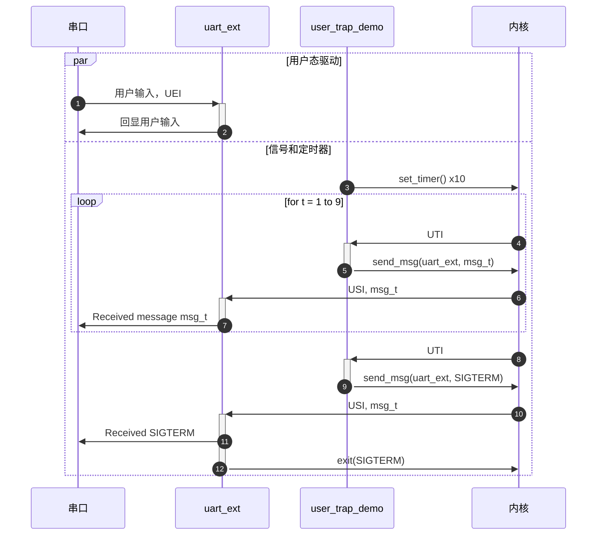

# demo seq

```mermaid
sequenceDiagram
    autonumber

    par 用户态驱动
    串口 ->>+ uart_ext: 用户输入，UEI
    uart_ext ->>- 串口: 回显用户输入

    and 信号和定时器
        user_trap_demo ->> 内核: set_timer() x10
        loop for t = 1 to 9
        内核 ->>+ user_trap_demo: UTI
        user_trap_demo ->>- 内核: send_msg(uart_ext, msg_t)
        内核 ->>+ uart_ext: USI, msg_t
        uart_ext ->>- 串口: Received message msg_t
        end
        内核 ->>+ user_trap_demo: UTI
        user_trap_demo ->>- 内核: send_msg(uart_ext, SIGTERM)
        内核 ->>+ uart_ext: USI, msg_t
        uart_ext ->> 串口: Received SIGTERM
        uart_ext ->>- 内核: exit(SIGTERM)
    end

```
