# 用户态中断与异常的处理流程

## 中断的产生

与 M 态和 S 态类似，中断分为软件中断 (Software Interrupt)、时钟中断 (Timer Interrupt) 和外部中断 (External Interrupt)。

> 方便起见，三类中断会简称为 xSI、xTI、xEI，其中 x 为特权级。

硬件或软件将 `uip.UXIP` (X 表示中断种类) 置为 1 ，硬件检测发现 `uip` 非零，进入中断的判断流程。

首先检查该中断是否被委托给用户态处理，即 `sideleg` 寄存器中对应的位是否为 1；如果为真，检查用户态全局中断使能是否为真，即 `ustatus.UIE` 是否为 1 ；若仍为真，再检查该中断是否被使能，即 `uie.UXIE` 是否为 1 ；如果还为真，则触发中断处理的流程。

> **注意**
>
> 上述寄存器中，`uie` `uip` 为 `mie` `mip` 的子集，即读写会同时作用于所有的 `xip` `xie` 或它们本就是同一寄存器。而 `ustatus` 至少 `UIE` 和 `UPIE` 与 `mstatus` 中的相同位相同。
>
> 虽然上述中断产生的流程中有判断次序，实际实现中一般使用组合逻辑，将寄存器值进行位与来判断，可以认为是同时判断的。

## 异常的产生

当异常发生时，硬件只检查 `sedeleg` 寄存器中对应的位是否为 1，若为真则触发异常的处理流程。

在 RISC-V 中，中断和异常的处理流程是统一的，下面出于描述简单考虑，多数情况下围绕中断进行描述。

## 中断的处理

在上述的产生流程后，处理器开始进行一些预处理：

- 设置 `ustatus.UPIE` 为 `ustatus.UIE` 的值，并置 `ustatus.UIE` 为 0
- 根据中断类型设置 `ucause`
- 设置 `uepc` 为发生中断或异常时的 `pc`
- (可选) 设置 `utval`
- 根据 `utvec` 的最低二位和高位的基地址，跳转到设置好的中断处理程序

中断处理程序需要完成以下工作：

- 保存现场
- 如果 `utvec` 为 direct 模式，根据 `ucause` 执行相应的处理程序
- 如果 `utvec` 为 vector 模式，执行处理程序
- 恢复现场

中断处理程序通常需要保存和恢复的现场有：

- x1-x31 通用寄存器 (如果确定中断处理程序中不会使用到某些寄存器，可以省去保存和恢复)
- `ustatus` (可能需要通过修改 `ustatus` 来改变 CPU 状态)
- `uepc` (可能需要通过修改进一步触发 S 态的中断/异常)
- **我们尚未注意到的但需要保存和恢复的寄存器**

