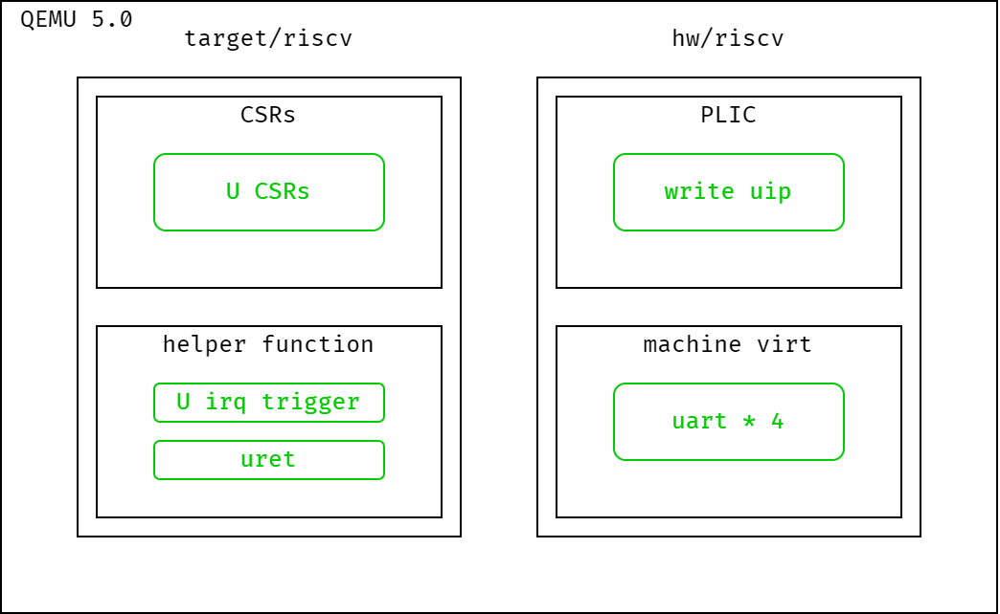
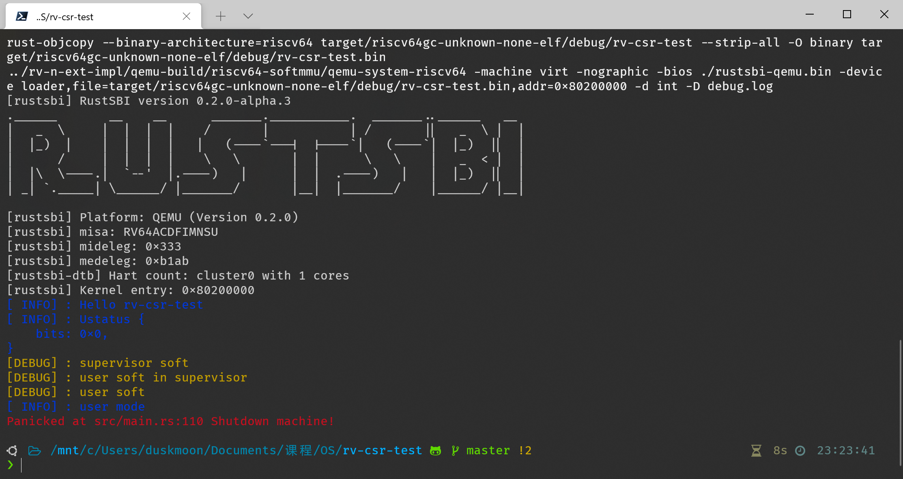

# 硬件与模拟器

> 本节介绍硬件与模拟器中实现的主要特性
>
> 可以在 [N 扩展规范草案](ch1_n_ext_spec.md) 一节看到完整的 N 扩展及相关寄存器描述。在 [用户态中断的使用](ch1_use_of_user_mode_trap.md) 一节中看到关于用户态中断使用的描述。

## QEMU with extension N

出于稳定性考虑，我们选择以 [QEMU 的 5.0 稳定分支](https://github.com/qemu/qemu/tree/stable-5.0) 为基础，添加用户态中断所需的寄存器和相应的中断处理函数。

- 添加寄存器 `ustatus` `uip` `uie` `sideleg` `sedeleg` `uepc` `utvec` `ucause` `utval` `uscratch`
- 添加用户态中断的触发部分：符合条件时使上述处理器进入中断状态
- 实现 `uret` 指令
- 修改 PLIC 以支持用户态外部中断
- 添加串口用于测试

一个使用修改后的 QEMU 进行的用户态中断的简单测试结果：

图中的 `user soft` 为用户态的中断处理程序接收到 `user soft interrupt` 后输出的信息，`user mode` 为用户态程序输出的信息。

## Labeled RISC-V-N

标签化 RISC-V 架构为中科院计算所包云岗老师团队的研究成果，通过给硬件资源请求附加标签，强化对系统中非托管共享资源（如 LLC、内存带宽等）的控制，降低资源争用时带来的性能波动。该系统使用的 CPU 核心为 Rocket Core，我们在此基础上添加了 N 扩展所需的寄存器、控制逻辑、指令和 PLIC 上下文，但并未使用和修改标签相关的部分；这些修改应当也可以平移到原版的 Rocket Core 中。

硬件平台使用赛灵思的 ZCU102 开发板，搭载 ZynqMP XCZU9EG 处理芯片。该芯片分为处理系统（PS）和可编程逻辑（PL）两部分，前者具有四个 Arm A53 核心，运行 Linux 系统，我们使用这一部分烧写比特流、将 RISC-V 部分的操作系统和启动器二进制文件加载到 DRAM 中、复位启动 RISC-V 核心。在后者上我们实例化了四个 Rocket Core，支持 RV64IMACN 指令集、MMU、CLINT 和 PLIC，时钟频率 100MHz，具有 2MB 共享 L2 缓存和 2GB DRAM。此外还加入了若干个串口用于与 RISC-V 部分交互以及用户态驱动的演示。

硬件系统架构图如下：

