# 内核对用户态中断的管理

## 与其他特权级中断的比较

RISC-V 特权级指令架构规范中已经规定了机器态（M）和内核态（S）的中断规范，以及二者之间的互动机制，如特权级屏蔽、中断委托等。设计用户态（U）中断时，我们在一定程度上参照了现有的 S 态中断机制，并将 M 和 S 之间的关系平移到了 S 和 U 上，以保持整个中断架构的一致性。三种中断的完整处理流程图如下：


在同时实现了 M 、S 和 U ，且没有实现 H 扩展的系统上，在 M 态运行的通常只有一个启动器（或者称为 SEE、SBI），且只在启动、发生 SBI 调用和处理部分中断时才执行代码；在 S 态运行的只有一个内核，一部分系统服务的代码可能在处理器上执行较长时间；这两个特权级只需要各自有一个陷入处理函数即可。

而在 U 态运行的通常有大量的用户程序，以时间片的方式轮流占用处理器执行。对于同步异常而言，这通常不构成问题，因为同步异常一定发生在某个程序执行自己的指令时触发；但对于异步中断，其来源往往无法知晓用户进程的状态，后者可能正在运行、处在调度队列中、进入睡眠甚至已经结束，如何确保进程收到自己想要的中断，同时不会错误地收到本应由其他进程处理的中断，就成了使用用户态中断时面临的核心问题。

## 用户态中断上下文

为了解决上述问题，我们提出了“用户态中断上下文”的概念。用户态中断上下文包括各中断寄存器、外部中断映射和待处理中断记录。进程切换时，内核保存当前进程的用户态中断上下文，恢复下一进程的上下文，从而确保在多核、多进程环境下，进程的中断执行流仍然可以正常运行。

### 中断记录

在 RISC-V 规范中，中断的原因存储于 xcause 寄存器中。但在多进程环境下，我们还需要对中断源进行区分，如发出信号的源进程、外部中断对应的外设编号等。我们在内核中加入了 UserTrapRecord 结构体实现这一目标：

```rust
#[repr(C)]
#[derive(Copy, Clone)]
pub struct UserTrapRecord {
    pub cause: usize,
    pub message: usize,
}
```

cause 中存储的内容基本与 xcause 寄存器保持一致，如对于 UTI 有 cause=4 ，对于 UEI cause=8 。对于 USI ，由于信号本身的值需要填入 message ，我们将源进程的 PID 编入 cause 中。标准的 xcause 编号为 0~15，只需 4 位，故我们令 cause=PID<<4 。

### 中断缓冲区

当用户进程被调度离开硬件线程时，仍然有可能产生该进程需要处理的中断，此时由内核将中断记录暂存入该进程的中断缓冲区，待该进程再次被调度运行时进行处理。为了减少数据复制，我们将中断缓冲区设计为一个由进程和内核共享的完整的内存页，大小为 4KB ，在内核中仅记录该页的物理页号，而在用户地址空间中该页有固定的虚拟地址。内核还需要记录缓冲区中已有中断记录的数量，在返回用户进程时传递给用户态的中断处理程序。

理想情况下缓冲区应当实现为一个无锁的、多生产者、多消费者的环形队列，但现在为了简单起见，内核只根据 status.UIE 位来判断用户进程是否开启中断，如果为否，则不会写入新的中断记录。当用户进程进入中断处理程序时，硬件会自动将 ustatus.UIE 位清零，并从缓冲区中读取记录进行处理。

### 外设中断使能

内核需要记录用户进程申请了哪些外设中断，以及相应设备在 PLIC 中是否启用，以便在进程调度切换时进行配置。

## 进程切换流程

rCore-N 中进程切换基本流程为暂停当前进程——加入就绪队列——切换到调度器上下文——调度器选择下一个就绪进程——切换到该进程上下文——恢复运行。中断寄存器的保存和恢复以汇编形式加入任务上下文的切换代码中。即在任务切换时，`uie` `uip` `uepc` `utvec` `utval` `ucause` 六个寄存器也被存放到栈上，等待下一次被调度时用于恢复状态。

当进程被暂停时，对于其申请的每一个外设，在**当前**硬件线程的 U 态 PLIC 上下文中将其禁用；如果用户进程启用了该外设中断，则在**当前**硬件线程的 S 态 PLIC 上下文中启用，否则禁用。当进程恢复运行时，将外设在**所有**硬件线程的 S 态上下文中禁用，如果该外设中断被启用，则在**当前**硬件线程的 U 态上下文中启用，否则禁用。

进程退出时，内核在**所有**硬件线程的 U 态上下文中领取并完成该进程申请的每个外设的中断，将其在 U 态上下文中禁用，并在 S 态上下文中启用，从外设中断映射表中移除该外设。

当从内核态返回用户态（由于进程切换或系统调用）时，内核读取该进程的用户态中断上下文，若缓冲区不为空，则将缓冲区中的中断数量写入 `uscratch` 寄存器，同时置位 `sip.USIP` ，返回用户态。

PLIC 的上下文机制具体设计较为复杂，详见 [外部中断与 PLIC](ch2_3_external_interrupt_and_plic.md) 一节。

进程切换的流程图如下：



## 中断转发和注入

### 软件中断与信号

RISC-V 规范中对于软件中断有如下描述：

> Interprocessor interrupts at supervisor level are implemented through implementation-specific mechanisms, e.g., via calls to an SEE, which might ultimately result in a machine-mode write to the receiving hart’s MSIP bit.
> We allow a hart to directly write only its own SSIP bit, not those of other harts, as other harts might be virtualized and possibly descheduled by higher privilege levels. We rely on calls to the SEE to provide interprocessor interrupts for this reason. Machine-mode harts are not virtualized and can directly interrupt other harts by setting their MSIP bits, typically using uncached I/O writes to memory-mapped control registers depending on the platform specification.

跨核软中断需要通过 SBI call ，由 SBI 经 CLINT 置位目标核上的 `mip.MSIP` 位，而程序只能写入本核的 `mip.SSIP` 位，因为 S 态程序可能运行在虚拟核上；出于同样的理由，我们应当限制程序只能写入本核的 `xip.USIP` 位。

用户进程可以通过 `send_msg()` 系统调用，向目标进程发送一条 `usize` 大小的信息，内核将该信息转为一条中断记录写入目标进程的中断缓冲区中。这样实现了类似信号的机制。

发送流程如下：



### 时钟中断与虚拟定时器

在 RISC-V 特权级规范中，对于时钟中断有如下描述：

> A machine timer interrupt becomes pending whenever `mtime` contains a value greater than or equal to `mtimecmp`, treating the values as unsigned integers.
> Lower privilege levels do not have their own `timecmp` registers. Instead, machine-mode software can implement any number of virtual timers on a hart by multiplexing the next timer interrupt into the `mtimecmp` register.

硬件总是产生 M 态的时钟中断，当 M 态没有使用时钟中断的需求时，可以在 M 态的中断处理程序中无条件转发时钟中断到 S 态（置位 `mip.STIP` 并清除 `mie.MTIE` ）；在 S 态内核为每个硬件线程维护一个计时器队列，记录到期时刻和请求源（内核或某个进程），队列按照到期时刻由早到晚排序。

设置定时器时，将到期时间和进程 PID 写入队列中；对于内核设置的定时器，使用 0 号 PID （实际上在 rCore 中 0 号 PID 对应 initproc，但该进程不会设置定时器；或许更好的设计是使用 `usize::MAX` 指代内核）。若请求的时刻早于队列中已有的所有时刻，则（通过 SBI call ）将其写入 `mtimecmp` 。

内核接收到时钟中断时，将队首元素取出，判断定时器源，并更新 `mtimecmp`。若源为内核，则添加下一次调度中断，并暂停当前进程，进入调度器；若源为当前进程，则置位 `sip.UTIP` 并返回用户态（返回后将进入用户态中断处理函数）；若源为另一进程，则构造一条记录（message 内容为当前时间），放入目标进程的中断缓冲区中，并返回。

通过上述方法实现虚拟定时器后，可以更好地支持用户态线程调度器、[可抢占函数调用](https://www.usenix.org/conference/atc20/presentation/boucher)等功能。

时钟中断的处理流程图如下：



### 外部中断与用户态驱动

由前述的进程切换流程，若某个进程正在某个硬件线程上运行，此时该进程所属的外设产生中断可以直接由 PLIC 转为 UEI 在用户态处理，而无需经过内核转发；若该进程未在运行，则 PLIC 会产生 SEI 进入内核，内核从 PLIC 领取外设编号（领取后 PLIC 会屏蔽该外设中断源信号，直至该中断被处理完成），判断应该由内核还是某个进程处理；若为后者，则向其缓冲区中写入一条中断记录并返回。用户进程的中断处理函数可以在自己的上下文中向 PLIC 提交中断完成信息，解除 PLIC 对该中断源的屏蔽。

外部中断处理流程图如下：


