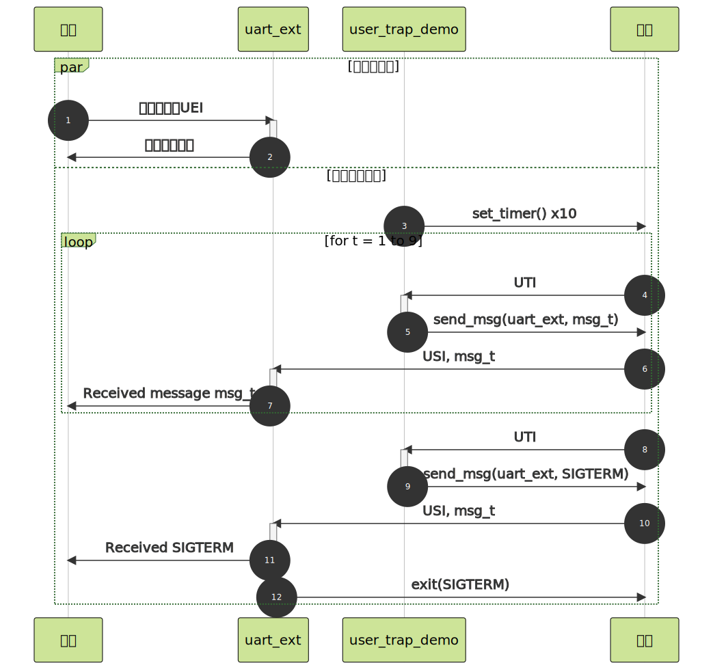

# 系统测试与演示程序

## 用户态中断测试

本项目中的 rv-csr-test 子模组是一个基本的 N 扩展寄存器行为测试程序，运行在 S 态，通过软件中断检查中断处理流程、中断委托和 `URET` 指令能否正常执行。程序需要 SBI 将 S 态和 U 态的中断委托给 S 态，默认入口点为 0x80200000 ，与 rCore-N 和 rustsbi-qemu 中的配置一致。

该程序首先在不开启委托的情况下将 `sip.SSIP` 和 `sip.USIP` 置位，检查能否正确进入中断处理函数，如果成功则会在终端输出 "supervisor soft" 和 "user soft in supervisor" ，验证了非委托情况下用户态中断会由更高特权级程序处理的设计。

随后会将软件中断委托给用户态，构造一个用户态执行上下文，并通过 `URET` 返回用户态。进入用户态后，将用户态中断处理函数入口写入 `utvec` ，将 `uie.USIE` 和 `uip.USIP` 置位，检查是否进入用户态中断处理函数，如果进入会在终端输出 "user soft" ，证明委托机制行为符合预期。

在该模组的 lrv-fpga 分支上，还有用于 FPGA 平台上、针对 PLIC 和 AXI UartLite 的测试，具体方法为初始化 PLIC 和串口，并启用串口中断，向串口写入大量数据，并读取串口状态。当串口发送缓冲区为空时会产生中断，此时检查能否从 PLIC 中领取和完成相应中断。

## 用户态串口驱动库

我们将内核中使用的、基于中断的 16550 串口驱动（包括 QEMU 上模拟的串口和 FPGA 上使用的 AXI 16550）代码几乎原封不动复制到了用户运行库中，供用户程序使用。这样做一方面是为了简单，另一方面也是为了更好地验证用户态的外部中断能够正常运行。

## 用户态中断演示程序

用户态中断演示程序运行在 rCore-N 中，主要包括两个程序：uart_ext 和 user_trap_demo 。前者为一个简单的串口回显终端，使用前述串口驱动库从串口读取用户输入，存入缓冲区中，并从终端输出；当用户输入回车时，会将缓冲区内容再次从终端输出，并清空缓冲区；当缓冲区中内容为 "exit" 时，程序退出。此外，该程序在进入外部中断处理函数以及收到消息时，会在内核终端中输出相应内容；收到的消息为 15 时（对应 SIGTERM 的编号），程序退出。

后者为时钟中断和信号的演示程序，程序启动时设置 10 个间隔一秒的定时器，并启动 uart_ext 进程；在时钟中断处理函数中，将 0xdeadbeef00 + t（t 为中断次数）作为消息内容发送给 uart_ext 进程；在最后一次中断时，向 uart_ext 发送 15，同时自己退出。

二者运行序列图如下：

