# 软硬协同的用户态中断

## 目标

本项目在现有 [RISC-V 用户态中断扩展规范草案](https://five-embeddev.com/riscv-isa-manual/latest/n.html) 的基础上将其进一步完善，提出一种符合该规范的模拟器和 FPGA 实现，并基于用户态中断在内核中实现优化的信号机制，在用户态实现一个硬件驱动，展示其设计和性能优势。

## 系统设计

系统整体架构设计如下：



- 模拟器：修改 QEMU 5.0，在其中添加 N 扩展支持
- FPGA：基于中科院计算所的[标签化 RISC-V 架构](https://github.com/LvNA-system/labeled-RISC-V/tree/master/fpga)，添加 N 扩展支持
- 启动器与 SBI：在 FPGA 平台上使用基于 RustSBI 开发的 [lrv-rust-bl](https://github.com/Gallium70/lrv-rust-bl) ，在 QEMU 上使用修改过的 [RustSBI-QEMU](https://github.com/duskmoon314/rustsbi-qemu/tree/legacy-multicore) 以提供多核启动支持
- 操作系统：[rCore-N](https://github.com/duskmoon314/rCore-N)，能够在多核环境下运行，演示程序也在该仓库中

### 仓库目录和结构

```
.
├── README.md
├── docs                docs in mdbook structure
├── Labeled-RISC-V-N    Labeled RISC-V with N extension, FPGA code
├── lrv-rust-bl         Labeled RISC-V fpga bootloader based on RustSBI
├── qemu                qemu modified by Campbell He
├── qemu-build          folder holding qemu build artifacts
├── rCore-N             rCore with N extension
├── rustsbi-qemu        rustsbi-qemu with legacy IPI and multicore boot support
└── rv-csr-test         N extension simple test program
```

## 部分开发进展

### QEMU 与 FPGA

- [x] 在 QEMU 中添加 N 扩展支持
- [x] 在 FPGA 开发板上部署标签化 RISC-V 架构
- [x] 在标签化 RISC-V 架构中添加 N 扩展支持
  - [x] 通过基本测试
  - [x] 单核情况下正常运行 rCore-N
  - [x] 多核启动和运行
- [x] 在 QEMU 和 FPGA 中添加额外的串口供用户态程序使用

### 操作系统

- [x] 实现对用户态中断的管理
- [x] 适配 FPGA 平台
- [x] 多核支持
- [x] 实现信号机制

### 应用程序

- [x] 验证 N 扩展正常工作
- [x] 信号机制演示程序
- [x] 用户态串口驱动程序
- [ ] 性能测试
